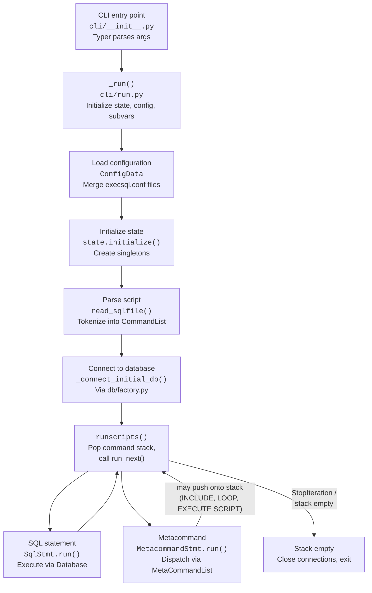
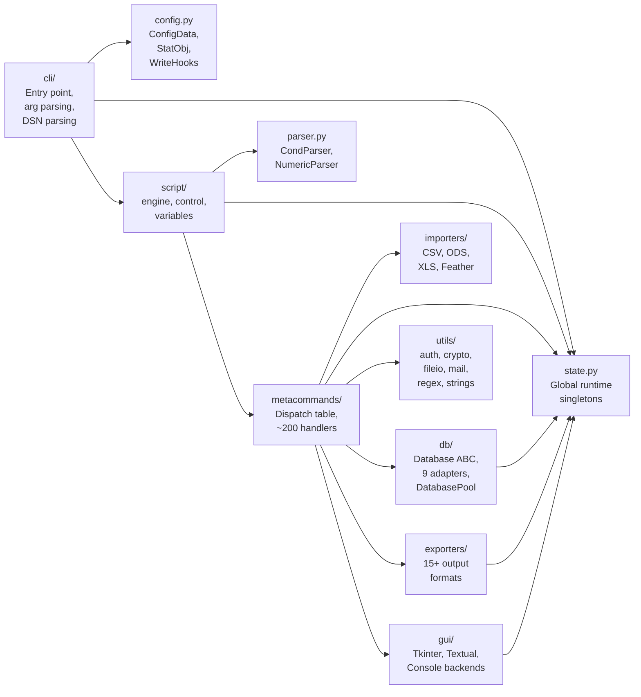
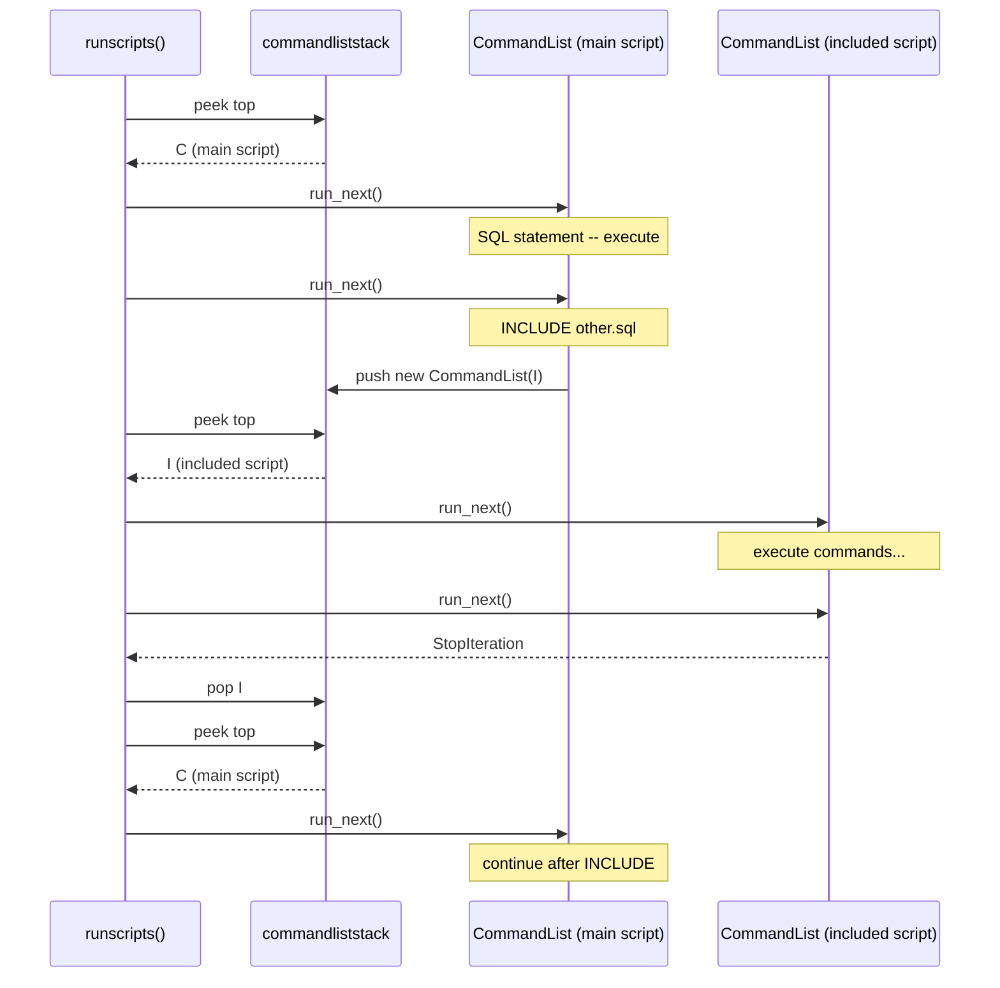

# Architecture & Design Guide

This document describes the internal architecture of execsql2 for developers who want to understand the codebase, debug issues, or contribute changes. It covers the execution flow, module organization, and the key subsystems that make execsql work.

______________________________________________________________________

## Overview

execsql2 is a CLI tool that runs SQL scripts against multiple database backends (PostgreSQL, SQLite, MariaDB/MySQL, DuckDB, Firebird, MS-Access, MS-SQL Server, Oracle, ODBC DSN). Beyond raw SQL execution, it provides a metacommand language embedded in SQL comments (`-- !x! COMMAND`) for control flow, data import/export, substitution variables, conditional execution, and GUI prompts.

The codebase was refactored from a 16,600-line monolith into a modular package under `src/execsql/`. The importable module is `execsql` (the PyPI package name is `execsql2`).

______________________________________________________________________

## Execution Flow

When a user runs `execsql2 script.sql mydb.sqlite -t l`, the following sequence occurs:



### Key stages

1. **CLI parsing** (`cli/__init__.py`) -- Typer validates arguments and delegates to `_run()`.
1. **Configuration** (`cli/run.py`) -- `_run()` creates `SubVarSet`, seeds system variables (`$DATE_TAG`, `$USER`, etc.), loads `ConfigData` from `execsql.conf` files, and applies CLI flag overrides.
1. **State initialization** (`state.initialize()`) -- Creates the runtime singletons: `DatabasePool`, `IfLevels`, `CounterVars`, `Timer`, `TempFileMgr`, `ExportMetadata`, and wires up the dispatch tables.
1. **Script parsing** (`read_sqlfile()` / `read_sqlstring()`) -- Reads the `.sql` file, tokenizes lines into `ScriptCmd` objects (each wrapping either a `SqlStmt` or `MetacommandStmt`), and pushes the resulting `CommandList` onto `commandliststack`.
1. **Database connection** (`_connect_initial_db()`) -- Uses `db/factory.py` to instantiate the correct `Database` subclass based on `db_type`.
1. **Execution loop** (`runscripts()`) -- Pops the top `CommandList` from the stack, calls `run_next()` until `StopIteration`, then pops and continues with the next stack entry. This loop is the heart of execution.

______________________________________________________________________

## Module Map



### Package summary

| Package         | Purpose                                                                                          |
| --------------- | ------------------------------------------------------------------------------------------------ |
| `cli/`          | Typer app, `_run()` orchestration, DSN URL parsing, Rich help output                             |
| `config.py`     | `ConfigData` (INI merging), `StatObj` (runtime flags), `WriteHooks` (stdout/stderr redirection)  |
| `state.py`      | Module-level global runtime store -- all shared mutable state lives here                         |
| `script/`       | `CommandList`, `MetaCommandList`, `SubVarSet`, `ScriptFile`, `runscripts()`                      |
| `metacommands/` | `build_dispatch_table()`, all `x_*` handlers, `build_conditional_table()`, all `xf_*` predicates |
| `db/`           | `Database` ABC, `DatabasePool`, 9 adapter modules (postgres, sqlite, duckdb, mysql, etc.)        |
| `exporters/`    | `ExportRecord`, `ExportMetadata`, `WriteSpec`, 15+ format writers (CSV, JSON, XML, HTML, etc.)   |
| `importers/`    | `CsvFile`, `OdsFile`, `XlsFile`, `FeatherFile` -- data import backends                           |
| `gui/`          | `GuiBackend` ABC, `TkinterBackend`, `TextualBackend`, `ConsoleBackend`                           |
| `utils/`        | Shared utilities: file I/O, encryption, mail, regex helpers, string manipulation, timers         |
| `parser.py`     | Recursive-descent parsers for conditional (`IF`) and arithmetic (`SET`) expressions              |
| `types.py`      | `DataType` subclasses and `DbType` per-DBMS type dialect mappings                                |
| `models.py`     | `Column`, `DataTable`, `JsonDatatype`                                                            |
| `exceptions.py` | `ExecSqlError` base, `ErrInfo`, `ConfigError`, `DataTypeError`, `DbTypeError`, etc.              |
| `plugins.py`    | Entry-point plugin discovery for metacommands, exporters, and importers                          |

______________________________________________________________________

## AST Parser and Executor

In addition to the legacy flat command-list engine, execsql2 includes an AST-based parser and executor:

- **`script/ast.py`** -- Defines 11 AST node types (`SqlStatement`, `MetaCommandStatement`, `IfBlock`, `LoopBlock`, `BatchBlock`, `ScriptBlock`, `SqlBlock`, `IncludeDirective`, `Comment`) plus `SourceSpan` for source locations and `ConditionModifier` for ANDIF/ORIF.
- **`script/parser.py`** -- `parse_script()` / `parse_string()` produce a `Script` tree. Unlike the legacy parser, all block structures (IF/LOOP/BATCH/SCRIPT/SQL) are resolved at parse time into nested nodes.
- **`script/executor.py`** -- `execute(script, ctx=)` walks the AST tree. IF conditions, LOOP iteration, and BATCH boundaries are driven by tree structure rather than runtime state flags (`if_stack`, `compiling_loop`). SQL and metacommands delegate to the existing dispatch table. INCLUDE'd files are parsed by the AST parser and executed natively (no fallback to the legacy engine). Circular INCLUDE references are detected and reported. Named SCRIPT blocks are stored on `ctx.ast_scripts` (instance-scoped, not module-level). ON ERROR_HALT / ON CANCEL_HALT EXECUTE SCRIPT deferred scripts execute natively through the AST executor.
- **`cli/lint_ast.py`** -- AST-based linter that walks the tree for variable and INCLUDE checks. Structural validation (unmatched blocks) is handled by the parser itself.

The AST executor is the only execution engine. Use `--parse-tree` to visualize the AST without executing.

### RuntimeContext Isolation

The executor accepts an explicit `RuntimeContext` parameter (`ctx`). The `active_context()` context manager in `state.py` installs a context as the active global so all metacommand handlers and database adapters automatically resolve against it. This enables isolated execution for the library API. The RuntimeContext carries AST-specific state: `ast_scripts` (script block registry) and `include_chain` (circular include detection).

______________________________________________________________________

## Plugin System

execsql supports plugins via Python entry points. Plugins can register custom metacommands, export formats, and import formats.

- **Entry point groups**: `execsql.metacommands`, `execsql.exporters`, `execsql.importers`
- **Discovery**: `plugins.discover_metacommand_plugins()` is called during `state.initialize()`. Exporter/importer plugins are discovered via `discover_exporter_plugins()` / `discover_importer_plugins()`.
- **Error handling**: Broken plugins are logged and skipped -- they cannot prevent execsql from starting.
- **Template**: `extras/plugin-template/` provides a starting point for creating plugins.

See `--list-plugins` to view discovered plugins.

______________________________________________________________________

## The Command Stack

The command stack is the central execution mechanism. It is a list of `CommandList` objects stored in `_state.commandliststack`.

### Core types

- **`ScriptCmd`** -- Pairs a statement (`SqlStmt` or `MetacommandStmt`) with its source file name and line number.
- **`CommandList`** -- An ordered list of `ScriptCmd` objects with a forward-only cursor (`cmdptr`). Each `CommandList` also carries its own `LocalSubVarSet` for `~`-prefixed local variables.
- **`CommandListWhileLoop`** / **`CommandListUntilLoop`** -- Subclasses that override iteration to repeat until a condition changes.

### How the stack works



### What pushes onto the stack

| Metacommand                   | Effect                                                                                                   |
| ----------------------------- | -------------------------------------------------------------------------------------------------------- |
| `INCLUDE`                     | Parses the included file into a new `CommandList` and pushes it                                          |
| `EXECUTE SCRIPT`              | Looks up a named script from `_state.savedscripts` and pushes a copy                                     |
| `LOOP ... END LOOP`           | Compiles enclosed commands into a `CommandListWhileLoop` or `CommandListUntilLoop` and pushes it         |
| `BEGIN SCRIPT ... END SCRIPT` | Parses commands but does **not** push -- stores them in `_state.savedscripts` for later `EXECUTE SCRIPT` |

### Loop compilation

When the parser encounters a `LOOP` metacommand:

1. `_state.compiling_loop` is set to `True`.
1. Subsequent commands are appended to a `CommandList` on `_state.loopcommandstack` instead of being executed.
1. Nested `LOOP`/`END LOOP` pairs are tracked via `_state.loop_nest_level`.
1. When the matching `END LOOP` is reached, `_state.endloop()` pushes the compiled loop onto `commandliststack` and sets `compiling_loop = False`.

______________________________________________________________________

## Metacommand Dispatch

Metacommands are lines in SQL scripts prefixed with `-- !x!`. At import time, `metacommands/__init__.py` calls `build_dispatch_table()`, which populates a `MetaCommandList` with all `mcl.add()` registrations (~205 regex patterns). This singleton is stored as `_state.metacommandlist`.

### How dispatch works

1. `MetacommandStmt.run()` calls `_state.metacommandlist.eval(cmd_str)`.
1. `MetaCommandList.eval()` extracts the leading keyword from the command string and looks up candidate `MetaCommand` entries via a keyword index (reducing the search space from ~205 to typically 1-5 entries).
1. Each candidate's compiled regex is tested against the full command string.
1. On a match, the handler function is called with all named regex groups as keyword arguments, plus `metacommandline` (the original unmodified line).
1. On success, the matched entry's hit counter is incremented.

### Handler conventions

- `x_*` functions are metacommand handlers (e.g., `x_export`, `x_connect_pg`).
- `xf_*` functions are conditional test predicates (e.g., `xf_tableexists`, `xf_contains`).
- All handlers accept `**kwargs` -- keys come from named regex groups.
- Handlers raise `ErrInfo` for expected failures; the dispatch layer handles error propagation based on `halt_on_metacommand_err`.

For a step-by-step guide to adding a new metacommand, see [Adding Metacommands](adding_metacommands.md).

______________________________________________________________________

## Conditional Expressions

The `IF`/`ELSEIF`/`ELSE`/`ENDIF` metacommands control conditional execution via a stack-based model.

### The IF stack

`_state.if_stack` is an `IfLevels` instance (defined in `script/control.py`) that tracks nested conditional blocks. Each level records whether its condition is true or false. The engine checks `_state.if_stack.all_true()` before executing any command -- commands are skipped when the condition is false, unless the metacommand has `run_when_false=True` (which is set for `ELSE`, `ELSEIF`, and `ENDIF` so they can manipulate the stack itself).

### CondParser

The `CondParser` class in `parser.py` is a recursive-descent parser that evaluates boolean expressions in `IF` and `ELSEIF` metacommands. It builds an AST of `CondAstNode` objects supporting `AND`, `OR`, `NOT`, and conditional-test leaves.

Each conditional leaf is matched against the conditional dispatch table (`_state.conditionallist`), which works identically to the metacommand dispatch table but contains `xf_*` predicates that return `bool`.

### xf\_\* predicates

Conditional test functions live in `metacommands/conditions.py`. Examples:

- `xf_tableexists` -- checks if a table exists in the database
- `xf_fileexists` -- checks if a file exists on disk
- `xf_contains` -- string containment test
- `xf_equals`, `xf_greaterthan` -- comparison tests
- `xf_startswith` -- string prefix test

These are registered in `build_conditional_table()` with `category="condition"` for keyword introspection.

______________________________________________________________________

## Substitution Variables

Substitution variables allow dynamic values in SQL and metacommand text. They are managed by `SubVarSet` (in `script/variables.py`) and stored in `_state.subvars`.

### Variable syntax

| Syntax      | Type                                  | Example                      |
| ----------- | ------------------------------------- | ---------------------------- |
| `!!name!!`  | Regular variable                      | `!!my_var!!`                 |
| `!!$name!!` | System variable (read-only)           | `!!$DATE_TAG!!`, `!!$USER!!` |
| `!!&name!!` | Environment variable                  | `!!&HOME!!`                  |
| `!!@name!!` | Column variable (from query results)  | `!!@column_name!!`           |
| `!!~name!!` | Local variable (per-script scope)     | `!!~counter!!`               |
| `!!#name!!` | Parameter variable (script arguments) | `!!#param1!!`                |
| `!{name}!`  | Deferred substitution                 | `!{my_var}!`                 |

### How substitution works

Before a command is executed, `substitute_vars()` in `engine.py` replaces all `!!var!!` patterns with their current values from `_state.subvars`. Deferred substitution (`!{var}!`) is only expanded at the point of use, not at parse time -- this is essential for variables inside loops where the value changes on each iteration.

### Variable scoping

- **`SubVarSet`** -- Global scope, shared across all scripts.
- **`LocalSubVarSet`** -- Each `CommandList` carries its own local variable overlay for `~`-prefixed variables. These are pushed/popped with the command stack.
- **`ScriptArgSubVarSet`** -- Per-script `#`-prefixed argument variables, set when `EXECUTE SCRIPT` passes parameters.
- **`CounterVars`** -- Auto-incrementing `$COUNTER_N` variables managed by `_state.counters`.

______________________________________________________________________

## Database Abstraction

### Database ABC

`db/base.py` defines the `Database` abstract base class. Every DBMS adapter subclasses it and implements:

- `open_db()` -- Establish the connection using the appropriate driver.
- `exec_cmd()` -- Execute a stored procedure or function.
- Driver-specific overrides for `table_exists()`, `get_table_list()`, `role_exists()`, etc.

The base class provides shared implementations for `execute()`, `select_data()`, `select_rowsource()`, `select_rowdict()`, `commit()`, `rollback()`, and `populate_table()`.

### DatabasePool

`DatabasePool` is a dict-like container mapping string aliases to open `Database` instances. It is the canonical `_state.dbs` object. Key operations:

- `add(alias, db)` -- Register a connection (the first one becomes `initial` and `current`).
- `current()` -- Return the active database.
- `make_current(alias)` -- Switch the active database (via `USE` metacommand).
- `disconnect(alias)` -- Close and remove a connection.
- `closeall()` -- Roll back and close everything at exit.

### Adapter loading

`db/factory.py` provides convenience constructors (`db_Postgres`, `db_SQLite`, `db_DuckDB`, etc.) that are called from `_connect_initial_db()` in `cli/run.py` based on the `db_type` flag. Additional connections are created by `CONNECT` metacommands at runtime.

For a step-by-step guide to adding a new database adapter, see [Adding Database Adapters](adding_db_adapters.md).

______________________________________________________________________

## Export/Import Pipeline

### Export flow

1. An `EXPORT` metacommand is parsed and dispatched to `x_export` (in `metacommands/data.py`).
1. The handler determines the output format from the metacommand arguments.
1. It calls `select_data()` or `select_rowsource()` on the current database to fetch results.
1. The appropriate exporter module (e.g., `exporters/delimited.py`, `exporters/json.py`) formats and writes the output.
1. File writing is asynchronous via `FileWriter`, a background process that serializes writes through a shared queue.

### Import flow

1. An `IMPORT` metacommand is dispatched to the appropriate handler.
1. The handler instantiates the correct importer (e.g., `importers/csv.py`, `importers/ods.py`) based on the file type.
1. The importer reads the file and yields rows.
1. `Database.populate_table()` bulk-inserts the rows using `executemany()`, with optional progress bars.

### Export metadata

`ExportMetadata` (in `exporters/base.py`) tracks metadata about exports -- file names, row counts, timestamps -- accessible via `$LAST_EXPORT_*` system variables.

For guides on extending these pipelines, see [Adding Exporters](adding_exporters.md) and [Adding Importers](adding_importers.md).

______________________________________________________________________

## GUI Subsystem

execsql supports three GUI backends for interactive prompts (password dialogs, pause screens, data displays, console windows):

| Backend          | Module           | When used                                                      |
| ---------------- | ---------------- | -------------------------------------------------------------- |
| `TkinterBackend` | `gui/desktop.py` | Default when `--gui-framework tkinter` or Tkinter is available |
| `TextualBackend` | `gui/tui.py`     | When `--gui-framework textual` is specified                    |
| `ConsoleBackend` | `gui/console.py` | Fallback when no GUI framework is available                    |

All backends implement the `GuiBackend` ABC (`gui/base.py`), which defines a `dispatch()` method that routes `GuiSpec` requests to type-specific handlers (`show_msg`, `show_pause`, `show_credentials`, `show_entry_form`, etc.).

### GUI manager thread

When `--visible-prompts` is set to level 1 or higher, a GUI manager thread (`_state.gui_manager_thread`) runs alongside the script execution thread. GUI requests are sent via `_state.gui_manager_queue` and responses are returned synchronously. The `utils/gui.py` module provides the public API (`gui_connect`, `gui_console_on`, `gui_console_off`, etc.) that metacommand handlers call.

______________________________________________________________________

## Global State

`state.py` is the shared mutable state store for the entire runtime. All other modules access it via:

```python
import execsql.state as _state
```

This import pattern (always as `_state`, always accessed inside function/method bodies) avoids circular imports at load time. The module declares all globals at the top level and provides two management functions:

- **`initialize(config, dispatch_table, conditional_table)`** -- Called once from `_run()` to create runtime singletons (`DatabasePool`, `IfLevels`, `CounterVars`, etc.).
- **`reset()`** -- Tears down all state for test isolation.

### Key state variables

| Variable           | Type                     | Purpose                               |
| ------------------ | ------------------------ | ------------------------------------- |
| `conf`             | `ConfigData`             | Merged configuration                  |
| `subvars`          | `SubVarSet`              | Global substitution variables         |
| `commandliststack` | `list[CommandList]`      | The execution stack                   |
| `savedscripts`     | `dict[str, CommandList]` | Named scripts from `BEGIN/END SCRIPT` |
| `dbs`              | `DatabasePool`           | Open database connections             |
| `metacommandlist`  | `MetaCommandList`        | Metacommand dispatch table            |
| `conditionallist`  | `MetaCommandList`        | Conditional predicate dispatch table  |
| `if_stack`         | `IfLevels`               | Nested IF/ELSE condition state        |
| `counters`         | `CounterVars`            | Auto-incrementing counters            |
| `filewriter`       | `FileWriter`             | Background file-writing process       |
| `exec_log`         | `Logger`                 | Execution log                         |

______________________________________________________________________

## Configuration

### ConfigData

`ConfigData` (in `config.py`) reads INI-format `execsql.conf` files from four locations (in order, later values override earlier):

1. System-wide (platform-dependent)
1. User home directory
1. Script file directory
1. Current working directory

It exposes all recognized options as attributes (`db_type`, `server`, `db`, `db_file`, `username`, `script_encoding`, `output_encoding`, etc.).

### CLI flag precedence

CLI flags (`-t`, `-u`, `-p`, `--dsn`, etc.) override config-file values. The `--dsn` connection string is parsed first and provides defaults that individual flags can further override. This precedence chain is implemented in `_run()`:

```
execsql.conf (system) < execsql.conf (user) < execsql.conf (script dir)
    < execsql.conf (cwd) < --dsn < individual CLI flags
```

### CONFIG metacommands

At runtime, scripts can modify configuration via `CONFIG` metacommands (e.g., `CONFIG TRIM_STRINGS ON`, `CONFIG SCAN_LINES 200`). These modify `_state.conf` attributes directly and take effect for all subsequent commands.

______________________________________________________________________

## Further Reading

- [Adding Metacommands](adding_metacommands.md) -- Step-by-step guide for new metacommands
- [Adding Exporters](adding_exporters.md) -- How to add a new export format
- [Adding Database Adapters](adding_db_adapters.md) -- How to support a new DBMS
- [Adding Importers](adding_importers.md) -- How to add a new import format
