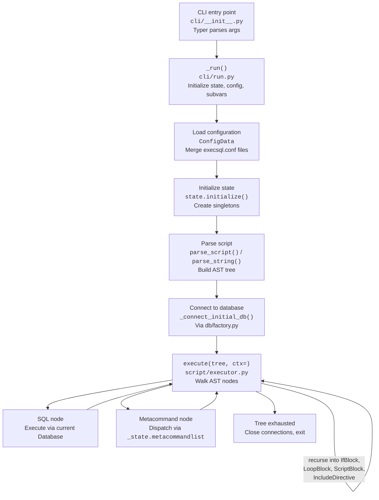
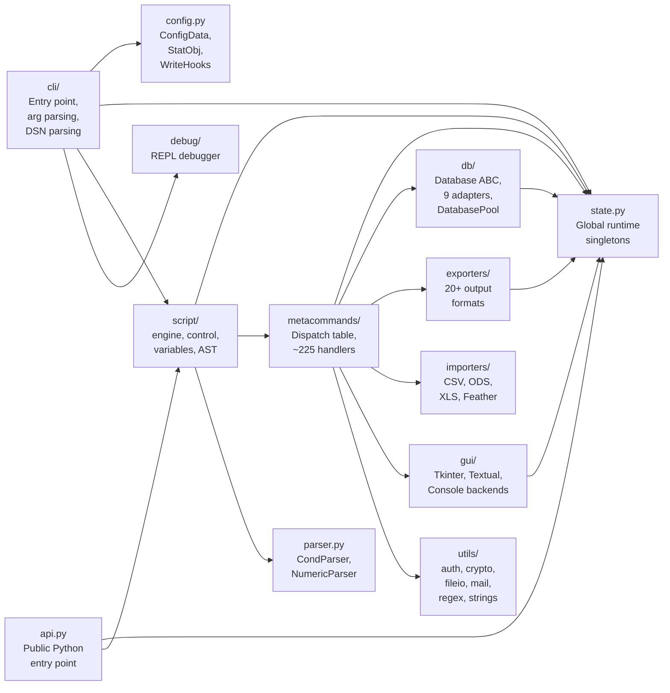

# Architecture & Design Guide

This guide describes the internals of `src/execsql/` for contributors. The codebase was refactored from a 16,600-line monolith into a modular package; the importable module is `execsql`, the PyPI distribution is `execsql2`.

______________________________________________________________________

## Execution Flow

When a user runs `execsql2 script.sql mydb.sqlite -t l`, the following sequence occurs:


```mermaid
flowchart TD
    CLI["CLI entry point<br/><code>cli/__init__.py</code><br/>Typer parses args"]
    RUN["<code>_run()</code><br/><code>cli/run.py</code><br/>Initialize state, config, subvars"]
    CONF["Load configuration<br/><code>ConfigData</code><br/>Merge execsql.conf files"]
    INIT["Initialize state<br/><code>state.initialize()</code><br/>Create singletons"]
    PARSE["Parse script<br/><code>parse_script()</code> / <code>parse_string()</code><br/>Build AST tree"]
    CONNECT["Connect to database<br/><code>_connect_initial_db()</code><br/>Via db/factory.py"]
    EXEC["<code>execute(tree, ctx=)</code><br/><code>script/executor.py</code><br/>Walk AST nodes"]
    SQL["SQL node<br/>Execute via current Database"]
    META["Metacommand node<br/>Dispatch via <code>_state.metacommandlist</code>"]
    DONE["Tree exhausted<br/>Close connections, exit"]

    CLI --> RUN
    RUN --> CONF
    CONF --> INIT
    INIT --> PARSE
    PARSE --> CONNECT
    CONNECT --> EXEC
    EXEC --> SQL
    EXEC --> META
    EXEC -->|"recurse into IfBlock,<br/>LoopBlock, ScriptBlock,<br/>IncludeDirective"| EXEC
    SQL --> EXEC
    META --> EXEC
    EXEC --> DONE
```

`execute()` recursively walks the AST via `_execute_nodes()` / `_execute_node()`. Each node type has dedicated handling: SQL statements run on the current `Database`; metacommands dispatch through `_state.metacommandlist`; `IfBlock` / `LoopBlock` drive their bodies based on tree structure; `IncludeDirective` parses and recurses into the included file; `ScriptBlock` registers a named script on `ctx.ast_scripts` for later `EXECUTE SCRIPT` lookup.

______________________________________________________________________

## Module Map


```mermaid
flowchart LR
    CLI["cli/<br/>Entry point,<br/>arg parsing,<br/>DSN parsing"]
    API["api.py<br/>Public Python<br/>entry point"]
    CONFIG["config.py<br/>ConfigData,<br/>StatObj,<br/>WriteHooks"]
    STATE["state.py<br/>Global runtime<br/>singletons"]
    SCRIPT["script/<br/>engine, control,<br/>variables, AST"]
    META["metacommands/<br/>Dispatch table,<br/>~225 handlers"]
    DB["db/<br/>Database ABC,<br/>9 adapters,<br/>DatabasePool"]
    EXPORT["exporters/<br/>20+ output<br/>formats"]
    IMPORT["importers/<br/>CSV, ODS,<br/>XLS, Feather"]
    GUI["gui/<br/>Tkinter, Textual,<br/>Console backends"]
    UTILS["utils/<br/>auth, crypto,<br/>fileio, mail,<br/>regex, strings"]
    PARSER["parser.py<br/>CondParser,<br/>NumericParser"]
    DEBUG["debug/<br/>REPL debugger"]

    CLI --> CONFIG
    CLI --> STATE
    CLI --> SCRIPT
    CLI --> DEBUG
    API --> STATE
    API --> SCRIPT
    SCRIPT --> STATE
    SCRIPT --> META
    META --> STATE
    META --> DB
    META --> EXPORT
    META --> IMPORT
    META --> GUI
    META --> UTILS
    DB --> STATE
    EXPORT --> STATE
    GUI --> STATE
    SCRIPT --> PARSER
```

### Package summary

| Package         | Purpose                                                                                                                       |
| --------------- | ----------------------------------------------------------------------------------------------------------------------------- |
| `cli/`          | Typer app, `_run()` orchestration, DSN URL parsing, Rich help output, `--lint` entry points                                   |
| `api.py`        | Public `execsql.run()` Python entry point for notebooks, pipelines, and library use                                           |
| `config.py`     | `ConfigData` (INI merging), `StatObj` (runtime flags), `WriteHooks` (stdout/stderr redirection)                               |
| `state.py`      | Thread-local runtime store — all shared mutable state lives here, isolated per-thread                                         |
| `script/`       | AST parser/executor, `CommandList`, `MetaCommandList`, `SubVarSet`, `ScriptFile`                                              |
| `metacommands/` | `build_dispatch_table()`, all `x_*` handlers, `build_conditional_table()`, all `xf_*` predicates                              |
| `db/`           | `Database` ABC, `DatabasePool`, 9 adapter modules (postgres, sqlite, duckdb, mysql, sqlserver, oracle, firebird, access, dsn) |
| `exporters/`    | `ExportRecord`, `ExportMetadata`, `WriteSpec`, 20+ format writers (CSV, JSON, XML, HTML, etc.)                                |
| `importers/`    | `CsvFile`, `OdsFile`, `XlsFile`, `FeatherFile` — data import backends                                                         |
| `gui/`          | `GuiBackend` ABC, `TkinterBackend`, `TextualBackend`, `ConsoleBackend`                                                        |
| `utils/`        | Shared utilities: file I/O, encryption, mail, regex helpers, string manipulation, timers                                      |
| `parser.py`     | Recursive-descent parsers for conditional (`IF`) and arithmetic (`SET`) expressions                                           |
| `types.py`      | `DataType` subclasses and `DbType` per-DBMS type dialect mappings                                                             |
| `models.py`     | `Column`, `DataTable`, `JsonDatatype`                                                                                         |
| `format.py`     | `execsql-format` CLI — opinionated formatter for execsql scripts                                                              |
| `exceptions.py` | `ExecSqlError` base, `ErrInfo`, `ConfigError`, `DataTypeError`, `DbTypeError`, etc.                                           |
| `plugins.py`    | Entry-point plugin discovery for metacommands, exporters, and importers                                                       |
| `debug/`        | Interactive REPL debugger for stepping through script execution                                                               |
| `data/`         | Bundled package data (`execsql.conf.template` powers `--init-config`)                                                         |

______________________________________________________________________

## AST Parser and Executor

execsql2 parses scripts into an AST and walks the tree to execute. There is no separate flat-command-list engine; the AST executor is the only path.

- **`script/ast.py`** — defines 9 `Node` subclasses (`SqlStatement`, `MetaCommandStatement`, `Comment`, `IfBlock`, `LoopBlock`, `BatchBlock`, `ScriptBlock`, `SqlBlock`, `IncludeDirective`) plus the `Script` root and supporting types (`SourceSpan` for source locations, `ConditionModifier` for ANDIF/ORIF, `ElseIfClause`, `ParamDef`).
- **`script/parser.py`** — `parse_script(path)` / `parse_string(text)` produce a `Script` tree. All block structures (IF/LOOP/BATCH/SCRIPT/SQL) are resolved at parse time into nested nodes; the parser also reports structural errors (unmatched blocks).
- **`script/executor.py`** — `execute(tree, ctx=)` walks the tree via `_execute_nodes()` / `_execute_node()`. SQL and metacommands delegate to the existing dispatch tables. INCLUDE'd files are parsed and recursed into natively; circular INCLUDE references are detected via `ctx.include_chain` and reported. Named SCRIPT blocks register in `ctx.ast_scripts` (instance-scoped) for later `EXECUTE SCRIPT` lookup. `ON ERROR_HALT` / `ON CANCEL_HALT EXECUTE SCRIPT` deferred scripts also run through the AST executor.
- **`cli/lint_ast.py`** — AST-based linter for variable and INCLUDE checks; structural validation lives in the parser.

Use `--parse-tree` to print the AST without executing.

### RuntimeContext

`RuntimeContext` (in `state.py`) holds the per-run mutable state. `execute()` accepts an explicit `ctx`; the `active_context()` context manager installs one as the active thread-local so metacommand handlers and database adapters resolve against it automatically. Each thread gets its own context via `threading.local()`, enabling concurrent `execsql.run()` calls. The context carries the AST script registry (`ast_scripts`), the include cycle detector (`include_chain`), and the unified execution stack (`ast_exec_stack`) — a list of `ExecFrame` records describing every active scope, IF/LOOP/BATCH block, and INCLUDE'd file. Scope frames (`kind="main"` / `kind="script"`) hold the active `localvars` and `paramvals`; block frames cache a `scope_ref` to the enclosing scope for O(1) variable lookup. `current_script_line()` reads `ctx.last_command`, which the executor updates per statement.

______________________________________________________________________

## Plugin System

execsql supports plugins via Python entry points. Plugins can register custom metacommands, export formats, and import formats.

- **Entry point groups**: `execsql.metacommands`, `execsql.exporters`, `execsql.importers`
- **Discovery**: `plugins.discover_metacommand_plugins()` is called during `state.initialize()`. Exporter/importer plugins are discovered via `discover_exporter_plugins()` / `discover_importer_plugins()`.
- **Error handling**: Broken plugins are logged and skipped -- they cannot prevent execsql from starting.
- **Template**: `extras/plugin-template/` provides a starting point for creating plugins.

See `--list-plugins` to view discovered plugins.

______________________________________________________________________

## Metacommand Dispatch

Metacommands are lines in SQL scripts prefixed with `-- !x!`. At import time, `metacommands/__init__.py` calls `build_dispatch_table()`, which populates a `MetaCommandList` with all `mcl.add()` registrations (~225 regex patterns). This singleton is stored as `_state.metacommandlist`.

### How dispatch works

`MetacommandStmt.run()` delegates to `_state.metacommandlist.eval(cmd_str)`. The dispatcher extracts the leading keyword, narrows ~225 entries to a small candidate set via a keyword index, then tests each candidate's compiled regex against the full command. The matched handler is called with the regex's named groups as keyword arguments plus `metacommandline` (the original unmodified line), and its hit counter is incremented.

### Handler conventions

- `x_*` functions are metacommand handlers (e.g., `x_export`, `x_connect_pg`).
- `xf_*` functions are conditional test predicates (e.g., `xf_tableexists`, `xf_contains`).
- All handlers accept `**kwargs` -- keys come from named regex groups.
- Handlers raise `ErrInfo` for expected failures; the dispatch layer handles error propagation based on `halt_on_metacommand_err`.

For a step-by-step guide to adding a new metacommand, see [Adding Metacommands](adding_metacommands.md).

______________________________________________________________________

## Conditional Expressions

The `IF`/`ELSEIF`/`ELSE`/`ENDIF` metacommands control conditional execution structurally — they are parsed into `IfBlock` AST nodes by `script/parser.py` and dispatched by `_execute_if()` in `script/executor.py`.

### How IF blocks execute

`_execute_if()` evaluates the IF condition (and any ANDIF/ORIF modifiers) via `CondParser`, then walks the chosen branch (the IF body, one of the ELSEIF clauses, or the ELSE body). For tracking and REPL introspection it pushes a non-scope `ExecFrame` (`kind="if"`/`"elseif"`/`"else"`) onto `ctx.ast_exec_stack` whose `scope_ref` points at the enclosing SCRIPT/main scope; the frame is popped when the branch finishes.

Because branching is structural, the legacy `_state.if_stack` / `IfLevels` machinery and the `run_when_false` flag on metacommand handlers are no longer in use; the dispatch handlers for `IF` / `ELSEIF` / `ELSE` / `ENDIF` / `ANDIF` / `ORIF` / `BREAK` / `BEGIN BATCH` / `END BATCH` remain registered as `ErrInfo` stubs so a parser regression that bypassed the AST would fail loudly instead of silently.

### CondParser

The `CondParser` class in `parser.py` is a recursive-descent parser that evaluates boolean expressions in `IF` and `ELSEIF` metacommands. It builds an AST of `CondAstNode` objects supporting `AND`, `OR`, `NOT`, and conditional-test leaves.

Each conditional leaf is matched against the conditional dispatch table (`_state.conditionallist`), which works identically to the metacommand dispatch table but contains `xf_*` predicates that return `bool`.

### xf\_\* predicates

Conditional test functions live in `metacommands/conditions.py`. Examples:

- `xf_tableexists` -- checks if a table exists in the database
- `xf_fileexists` -- checks if a file exists on disk
- `xf_contains` -- string containment test
- `xf_equals`, `xf_isgt`, `xf_isgte` — comparison tests
- `xf_startswith` -- string prefix test

These are registered in `build_conditional_table()` with `category="condition"` for keyword introspection.

______________________________________________________________________

## Substitution Variables

`SubVarSet` (in `script/variables.py`) holds substitution variables in `_state.subvars`. Before each command runs, `substitute_vars()` in `engine.py` replaces all `!!var!!` patterns with their current values. The deferred form `!{var}!` is expanded at the point of use rather than at parse time, which is essential inside loops where the value changes on each iteration. See [Substitution Variables](../reference/substitution_vars.md) for user-facing syntax and types.

### Scoping classes

- **`SubVarSet`** — global scope, shared across all scripts.
- **`LocalSubVarSet`** — per-`ExecFrame` overlay for `~`-prefixed variables; lives on the active SCRIPT/main scope frame and is freed when the frame is popped. Retrieved via `_state.current_localvars()`.
- **`ScriptArgSubVarSet`** — per-script `#`-prefixed arguments set by `EXECUTE SCRIPT`; lives on the SCRIPT-kind `ExecFrame`. Retrieved via `_state.current_paramvals()`.
- **`CounterVars`** — auto-incrementing `$COUNTER_N` variables on `_state.counters`.

______________________________________________________________________

## Database Abstraction

### Database ABC

`db/base.py` defines the `Database` abstract base class. Every DBMS adapter subclasses it and implements:

- `open_db()` -- Establish the connection using the appropriate driver.
- `exec_cmd()` -- Execute a stored procedure or function.
- Driver-specific overrides for `table_exists()`, `get_table_list()`, `role_exists()`, etc.

The base class provides shared implementations for `execute()`, `select_data()`, `select_rowsource()`, `select_rowdict()`, `commit()`, `rollback()`, and `populate_table()`.

### DatabasePool

`DatabasePool` is a dict-like container mapping string aliases to open `Database` instances. It is the canonical `_state.dbs` object. Key operations:

- `add(alias, db)` -- Register a connection (the first one becomes `initial` and `current`).
- `current()` -- Return the active database.
- `make_current(alias)` -- Switch the active database (via `USE` metacommand).
- `disconnect(alias)` -- Close and remove a connection.
- `closeall()` -- Roll back and close everything at exit.

### Adapter loading

`db/factory.py` provides convenience constructors (`db_Postgres`, `db_SQLite`, `db_DuckDB`, etc.) that are called from `_connect_initial_db()` in `cli/run.py` based on the `db_type` flag. Additional connections are created by `CONNECT` metacommands at runtime.

For a step-by-step guide to adding a new database adapter, see [Adding Database Adapters](adding_db_adapters.md).

______________________________________________________________________

## Export/Import Pipeline

### Export flow

1. An `EXPORT` metacommand is parsed and dispatched to `x_export` (in `metacommands/data.py`).
1. The handler determines the output format from the metacommand arguments.
1. It calls `select_data()` or `select_rowsource()` on the current database to fetch results.
1. The appropriate exporter module (e.g., `exporters/delimited.py`, `exporters/json.py`) formats and writes the output.
1. File writing is asynchronous via `FileWriter`, a background process that serializes writes through a shared queue.

### Import flow

1. An `IMPORT` metacommand is dispatched to the appropriate handler.
1. The handler instantiates the correct importer (e.g., `importers/csv.py`, `importers/ods.py`) based on the file type.
1. The importer reads the file and yields rows.
1. `Database.populate_table()` bulk-inserts the rows using `executemany()`, with optional progress bars.

### Export metadata

`ExportMetadata` (in `exporters/base.py`) tracks per-export metadata — file names, row counts, timestamps. The `$SHEETS_*` system variables surface multi-sheet `IMPORT` results; see [Substitution Variables](../reference/substitution_vars.md#system_vars) for the full list.

For guides on extending these pipelines, see [Adding Exporters](adding_exporters.md) and [Adding Importers](adding_importers.md).

______________________________________________________________________

## GUI Subsystem

execsql supports three GUI backends for interactive prompts (password dialogs, pause screens, data displays, console windows):

| Backend          | Module           | When used                                                      |
| ---------------- | ---------------- | -------------------------------------------------------------- |
| `TkinterBackend` | `gui/desktop.py` | Default when `--gui-framework tkinter` or Tkinter is available |
| `TextualBackend` | `gui/tui.py`     | When `--gui-framework textual` is specified                    |
| `ConsoleBackend` | `gui/console.py` | Fallback when no GUI framework is available                    |

All backends implement the `GuiBackend` ABC (`gui/base.py`), which defines a `dispatch()` method that routes `GuiSpec` requests to type-specific handlers (`show_msg`, `show_pause`, `show_credentials`, `show_entry_form`, etc.).

### GUI manager thread

When `--visible-prompts` is set to level 1 or higher, a GUI manager thread (`_state.gui_manager_thread`) runs alongside the script execution thread. GUI requests are sent via `_state.gui_manager_queue` and responses are returned synchronously. The `utils/gui.py` module provides the public API (`gui_connect`, `gui_console_on`, `gui_console_off`, etc.) that metacommand handlers call.

______________________________________________________________________

## Global State

`state.py` is the thread-local mutable state store for the runtime. All other modules access it via:

```python
import execsql.state as _state
```

This import pattern (always as `_state`, always accessed inside function/method bodies) avoids circular imports at load time. The module stores all mutable state in a `threading.local()` instance, so each thread gets its own isolated `RuntimeContext`. The module provides two management functions:

- **`initialize(config, dispatch_table, conditional_table)`** -- Called once from `_run()` to create runtime singletons (`DatabasePool`, `CounterVars`, `BatchLevels`, etc.).
- **`reset()`** -- Tears down all state for test isolation.

### Key state variables

| Variable          | Type                     | Purpose                                                          |
| ----------------- | ------------------------ | ---------------------------------------------------------------- |
| `conf`            | `ConfigData`             | Merged configuration                                             |
| `subvars`         | `SubVarSet`              | Global substitution variables                                    |
| `ast_exec_stack`  | `list[ExecFrame]`        | Unified execution stack (scopes + IF/LOOP/BATCH/INCLUDE)         |
| `ast_scripts`     | `dict[str, ScriptBlock]` | Named scripts from `BEGIN/END SCRIPT` (AST registry)             |
| `last_command`    | `ScriptCmd \| None`      | Most-recently-executed statement; powers `current_script_line()` |
| `dbs`             | `DatabasePool`           | Open database connections                                        |
| `metacommandlist` | `MetaCommandList`        | Metacommand dispatch table                                       |
| `conditionallist` | `MetaCommandList`        | Conditional predicate dispatch table                             |
| `counters`        | `CounterVars`            | Auto-incrementing counters                                       |
| `filewriter`      | `FileWriter`             | Background file-writing process                                  |
| `exec_log`        | `Logger`                 | Execution log                                                    |

______________________________________________________________________

## Configuration

### ConfigData

`ConfigData` (in `config.py`) reads INI-format `execsql.conf` files from four locations (in order, later values override earlier):

1. System-wide (platform-dependent)
1. User home directory
1. Script file directory
1. Current working directory

It exposes all recognized options as attributes (`db_type`, `server`, `db`, `db_file`, `username`, `script_encoding`, `output_encoding`, etc.).

### CLI flag precedence

CLI flags (`-t`, `-u`, `-p`, `--dsn`, etc.) override config-file values. The `--dsn` connection string is parsed first and provides defaults that individual flags can further override. This precedence chain is implemented in `_run()`:

```
execsql.conf (system) < execsql.conf (user) < execsql.conf (script dir)
    < execsql.conf (cwd) < --dsn < individual CLI flags
```

### CONFIG metacommands

At runtime, scripts can modify configuration via `CONFIG` metacommands (e.g., `CONFIG TRIM_STRINGS ON`, `CONFIG SCAN_LINES 200`). These modify `_state.conf` attributes directly and take effect for all subsequent commands.

______________________________________________________________________

## Further Reading

- [Adding Metacommands](adding_metacommands.md) -- Step-by-step guide for new metacommands
- [Adding Exporters](adding_exporters.md) -- How to add a new export format
- [Adding Database Adapters](adding_db_adapters.md) -- How to support a new DBMS
- [Adding Importers](adding_importers.md) -- How to add a new import format
