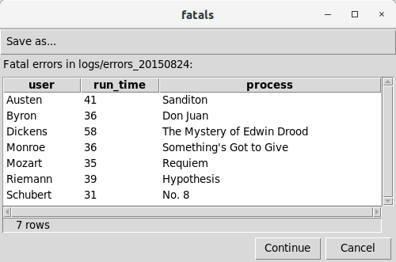
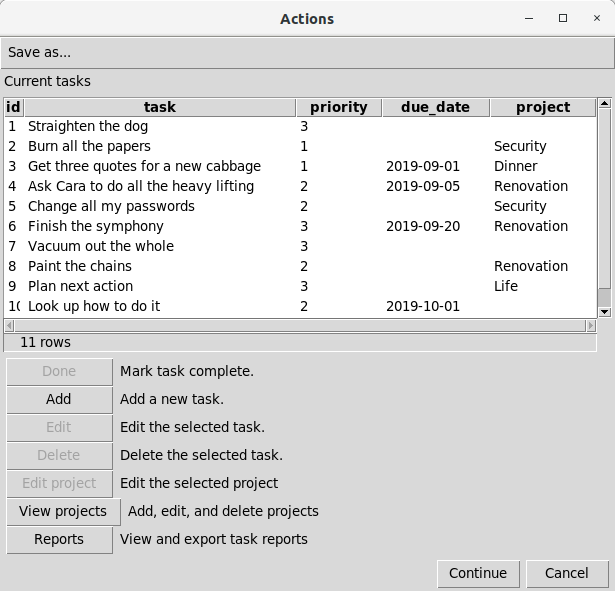
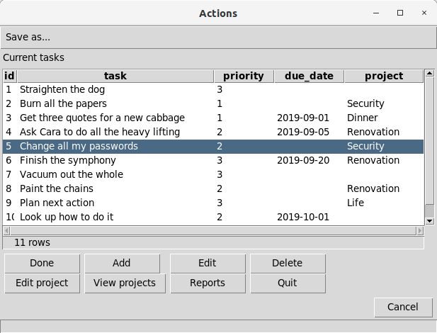
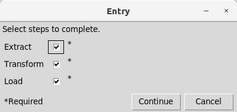

# Examples

The following examples illustrate some of the features of execsql.

## **Example 1:** A Simple Illustration of Metacommands and Substitution Variables { #example1 }

The following code illustrates the use of metacommands and substitution variables. Lines starting with "-- !x!" are metacommands that implement *execsql*-specific features. Identifiers enclosed in pairs of exclamation points (!!) are substitution variables that have been defined with the SUB metacommand. The "$date_tag" variable is a [substitution variable](../reference/substitution_vars.md#substitution_vars) that is defined by *execsql* itself rather than by the user.

``` sql
-- ==== Configuration ====
-- Put the (date-tagged) logfile name in the 'inputfile' substitution variable.
-- !x! SUB inputfile logs/errors_!!$date_tag!!
-- Ensure that the export directory will be created if necessary.
-- !x! CONFIG MAKE_EXPORT_DIRS Yes

-- ==== Display Fatal Errors ====
-- !x! IF(file_exists(!!inputfile!!))
    -- Import the data to a staging table.
    -- !x! IMPORT TO REPLACEMENT staging.errorlog FROM !!inputfile!!
    -- Create a view to display only fatal errors.
    create temporary view fatals as
        select user, run_time, process
        from   staging.errorlog
        where  severity = 'FATAL';
    -- !x! IF(HASROWS(fatals))
        -- Export the fatal errors to a dated report.
        -- !x! EXPORT fatals TO reports/error_report_!!$date_tag!! AS CSV
        -- Also display it to the user in a GUI.
        -- !x! PROMPT MESSAGE "Fatal errors in !!inputfile!!:" DISPLAY fatals
    -- !x! ELSE
        -- !x! WRITE "There are no fatal errors."
    -- !x! ENDIF
-- !x! ELSE
    -- !x! WRITE "There is no error log."
-- !x! ENDIF
drop table if exists staging.errorlog cascade;
```

The [IMPORT](../reference/metacommands.md#import) metacommand reads the specified file of error messages and loads the data into the target (staging) table, automatically choosing appropriate data types for each column. The [EXPORT](../reference/metacommands.md#export) metacommand saves the data in a CSV file that can be used by other applications. The [PROMPT](../reference/metacommands.md#prompt) metacommand produces a GUI display of the data like the following:



## **Example 2:** Use Temporary Queries to Select and Summarize Data in Access { #example2 }

This example illustrates a script that makes use of several temporary queries to select and summarize data, and a final query that prepares the data for export or further use. The SQL in this example is specific to MS-Access.

``` sql
-- --------------------------------------------------------------------
-- Get result records that meet specific selection criteria.
-- --------------------------------------------------------------------
create temporary view v_seldata as
select
  smp.sys_sample_code, rs.test_surrogate_key,
  rs.cas_rn, tst.lab_anl_method_name,
  if(rs.detect_flag='N', rs.method_detection_limit, rs.result_value) as conc,
  rs.detect_flag='Y' as detected,
  rs.lab_qualifiers like '*J*' as estimated,
  if(rs.detect_flag='N', rs.detection_limit_unit, rs.result_unit) as unit
from
  ((((dt_result as rs
  inner join dt_test as tst on tst.test_surrogate_key=rs.test_surrogate_key)
  inner join dt_sample as smp on smp.sys_sample_code=tst.sys_sample_code)
  inner join dt_field_sample as fs on fs.sys_sample_code=smp.sys_sample_code)
  inner join dt_location as loc on loc.sys_loc_code=fs.sys_loc_code)
  inner join rt_analyte as anal on anal.cas_rn=rs.cas_rn
where
  (loc.loc_name like 'SG*' or loc.loc_name like 'SC*')
  and smp.sample_type_code='N'
  and smp.sample_matrix_code='SE'
  and anal.analyte_type in ('ABN', 'PEST', 'PCB', 'LPAH', 'HPAH')
  and rs.reportable_result='Yes'
  and not (rs.result_value is null and rs.method_detection_limit is null);

-- --------------------------------------------------------------------
-- Summarize by sample, taking nondetects at half the detection limit.
-- --------------------------------------------------------------------
create temporary view v_samp as
select
  sys_sample_code, cas_rn, lab_anl_method_name,
  Avg(if(detected, conc, conc/2.0)) as concentration,
  Max(if(detected is null, 0, detected)) as detect,
  Min(if(estimated is null, 0, estimated)) as estimate,
  unit
from
  v_seldata
group by
  sys_sample_code, cas_rn, lab_anl_method_name, unit;

-- --------------------------------------------------------------------
-- Pull in sample location and date information, decode analyte,
-- and reconstruct qualifiers.
-- --------------------------------------------------------------------
select
  loc.loc_name, fs.sample_date, fs.start_depth, fs.end_depth, fs.depth_unit,
  smp.sample_name, anal.chemical_name, dat.lab_anl_method_name,
  if(dat.detect, concentration, concentration/2.0) as conc,
  (if(detect, "", "U") & if(estimate, "J", "")) as qualifiers,
  unit
from
  (((v_samp as dat
  inner join dt_sample as smp on dat.sys_sample_code=smp.sys_sample_code)
  inner join dt_field_sample as fs on fs.sys_sample_code=smp.sys_sample_code)
  inner join dt_location as loc on loc.sys_loc_code=fs.sys_loc_code)
  inner join rt_analyte as anal on anal.cas_rn=dat.cas_rn;
```

During the execution of this script with Access, the temporary queries will be created in the database. When the script concludes, the temporary queries will be removed. Nothing except the data itself need be kept in the database to use a script like this one.

## **Example 3:** Execute a Set of QA Queries and Capture the Results { #example3 }

This example illustrates a script that creates several temporary queries to check the codes that are used in a set of staging tables against the appropriate dictionary tables, and, if there are unrecognized codes, writes them out to a text file.

``` sql
create temporary view qa_pty1 as
select distinct stage_party.party_type
from   stage_party
       left join e_partytype
         on stage_party.party_type=e_partytype.party_type
where  e_partytype.party_type is null;

-- !x! if(hasrows(qa_pty1))
-- !x!   write "Unrecognized party types:" to Staging_QA_!!$DATE_TAG!!.txt
-- !x!   export qa_pty1 append to Staging_QA_!!$DATE_TAG!!.txt as tab
-- !x! endif

create temporary view qa_prop1 as
select distinct stage_property.property_type
from   stage_property
       left join e_propertytype
         on stage_property.property_type=e_propertytype.property_type
where  e_propertytype.property_type is null;

-- !x! if(hasrows(qa_prop1))
-- !x!   write "Unrecognized property types:" to Staging_QA_!!$DATE_TAG!!.txt
-- !x!   export qa_prop1 append to Staging_QA_!!$DATE_TAG!!.txt as tab
-- !x! endif

create temporary view qa_partyprop1 as
select distinct stage_partyprop.property_rel
from   stage_partyprop
       left join e_partyproprel
         on stage_partyprop.property_rel=e_partyproprel.property_rel
where  e_partyproprel.property_rel is null;

-- !x! if(hasrows(qa_partyprop1))
-- !x!   write "Unrecognized party-property relationship types:" to Staging_QA_!!$DATE_TAG!!.txt
-- !x!   export qa_partyprop1 append to Staging_QA_!!$DATE_TAG!!.txt as tab
-- !x! endif
```

## **Example 4:** Execute a Set of QA Queries and Display the Results with a Prompt { #example4 }

This example illustrates a script that compiles the results of several QA queries into a single temporary table, then displays the temporary table if it has any rows (i.e., any errors were found), and prompts the user to cancel or continue the script.

``` sql
create temporary table qa_results (
  table_name varchar(64) not null,
  column_name varchar(64) not null,
  severity varchar(20) not null,
  data_value varchar(255) not null,
  description varchar(255) not null,
  time_check_run datetime not null
  );

insert into qa_results
  (table_name, column_name, severity, data_value, description, time_check_run)
select distinct
       'stage_party',
       'party_type',
       'Fatal',
       stage_party.party_type,
       'Unrecognized party type',
       cast('!!$CURRENT_TIME!!' as datetime)
from   stage_party
       left join e_partytype
         on stage_party.party_type=e_partytype.party_type
where  e_partytype.party_type is null;

insert into qa_results
  (table_name, column_name, severity, data_value, description, time_check_run)
select distinct
      'stage_property',
      'property_type',
      'Fatal',
      stage_property.property_type,
      'Unrecognized property type',
      cast('!!$CURRENT_TIME!!' as datetime)
from  stage_property
      left join e_propertytype
        on stage_property.property_type=e_propertytype.property_type
where e_propertytype.property_type is null;

insert into qa_results
  (table_name, column_name, severity, data_value, description, time_check_run)
select distinct
      'stage_partyprop',
      'property_rel',
      'Fatal',
      stage_partyprop.property_rel,
      'Unrecognized property relationship type',
      cast('!!$CURRENT_TIME!!' as datetime)
from  stage_partyprop
      left join e_partyproprel
        on stage_partyprop.property_rel=e_partyproprel.property_rel
where  e_partyproprel.property_rel is null;

-- !x! if(hasrows(qa_results))
```

## **Example 5:** Include a File if a Table Exists { #example5 }

This example illustrates how a script file can be included if a database table exists. This might be used when carrying out quality assurance checks of data sets that have optional components. In this case, if an optional component has been loaded into a staging table, the script to check that component will be included.

``` sql
-- !x! if(table_exists(staging.bioaccum_samp))
```

## **Example 6:** Looping Using Tail Recursion { #example6 }

Looping can be performed using the [LOOP](../reference/metacommands.md#loop) metacommand or the WHILE and UNTIL clauses of the [EXECUTE SCRIPT](../reference/metacommands.md#executescript) metacommand. In addition, looping can be performed using the [IF](../reference/metacommands.md#if_cmd) metacommand and tail recursion to repeatedly execute a block of commands that is either defined with the [BEGIN/END SCRIPT](../reference/metacommands.md#beginscript) metacommands or included with the [INCLUDE](../reference/metacommands.md#include) metacommand. This example demonstrates the third of these techniques.

To implement tail recursion, the block of commands that is to be repeatedly executed should end with another [INCLUDE](../reference/metacommands.md#include) or [EXECUTE SCRIPT](../reference/metacommands.md#executescript) metacommand to continue the loop. If this metacommand is not executed (ordinarily as the result of a conditional test), the loop will be exited.

The following code example illustrates the technique. Either a single-line IF metacommand can be used, as shown here, or the script's recursive invocation of itself can be contained within a block IF statement.

Commands to initiate a loop, where the commands to be repeatedly executed are in a separate script file, would invoke the loop script as follows:

``` sql
-- !x! write "Before looping starts, we can do some stuff."
-- !x! include loop_inner.sql
-- !x! write "After looping is over, we can do more stuff."
```

In this example, the commands to be repeated are contained in a script file named `loop_inner.sql`. The loop script should have a structure like:

``` sql
-- !x! write "Loop iteration number !!$counter_1!!"
-- !x! prompt ask "Do you want to loop again?" sub loop_again
-- !x! if(equals("!!loop_again!!", "Yes"))
```

The IF statement on the last line controls whether the loop is repeated or exited. In this case, termination of the loop is controlled by the user's response to the prompt. Termination of the loop can also be controlled by some data condition instead of by an interactive prompt to the user. For example, you could loop for as many times as there are rows in a table by using the [SUBDATA](../reference/metacommands.md#subdata) metacommand to get a count of all of the rows in a table, and then use the [IF(EQUALS())](../reference/metacommands.md#equals) conditional test to terminate the loop when a counter variable equals the number of rows in the table.

## **Example 7:** Nested Variable Evaluation { #example7 }

This example illustrates nested evaluation of substitution variables, using scripts that print out all of the substitution variables that are assigned with the "-a" command-line option.

Because there may be an indefinite number of command-line variable assignments, a looping technique is used to evaluate them all. The outer level script that initiates the loop is simply:

``` sql
-- !x! include arg_vars_loop.sql
```

The script that is called, `arg_vars_loop.sql`, is:

```
-- !x! sub argvar $ARG_!!$counter_1!!
-- !x! if(sub_defined(!!argvar!!))
-- !x!   write "Argument variable !!argvar!! is: !!!!argvar!!!!"
-- !x!   include arg_vars_loop.sql
-- !x! endif
```

On line 3 of this script the substitution variable argvar is first evaluated to generate a name for a command-line variable, consuming the inner pair of exclamation points. The resulting variable (which will take on values of "\$ARG_1", "\$ARG_2", etc.) will then be evaluated, yielding the value of the command-line variable assignment.

## **Example 8:** Prompt the User to Choose an Option { #example8 }

This example illustrates how the [PROMPT SELECT_SUB](../reference/metacommands.md#prompt_selsub) metacommand can be used to prompt the user to select among several options. In this example, the options allow the user to choose a format in which to (export and) view a data table or view. For this example, there must be a data table or view in the database named some_data.

``` sql
drop table if exists formats;
create temporary table formats ( format varchar(4) );
insert into formats (format)
values ('csv'), ('tsv'), ('ods'), ('html'), ('txt'), ('pdf'), ('GUI');

-- !x! sub data_table some_data
-- !x! prompt select_sub formats message "Choose the output format you want."
-- !x! if(equals("!!@format!!", "GUI"))
-- !x!   prompt message "Selected data." display !!data_table!!
-- !x! else
-- !x!   sub outfile outfile_!!$DATETIME_TAG!!.!!@format!!
-- !x!   if(equals("!!@format!!", "pdf"))
-- !x!     sub txtfile outfile_!!$DATETIME_TAG!!.txt
-- !x!     write "# Data Table" to !!txtfile!!
-- !x!     export !!data_table!! append to !!txtfile!! as txt
-- !x!     system_cmd(pandoc !!txtfile!! -o !!outfile!!)
-- !x!   else
-- !x!     export !!data_table!! to !!outfile!! as !!@format!!
-- !x!   endif
-- !x!   system_cmd(xdg-open !!outfile!!)
-- !x! endif
```

This example also illustrates that, because the text ("txt") output format of the [EXPORT](../reference/metacommands.md#export) metacommand creates a Markdown-compatible table, this type of text output can be combined with output of [WRITE](../reference/metacommands.md#write) metacommands and converted to Portable Document Format (PDF). This example also illustrates how the [SYSTEM_CMD](../reference/metacommands.md#system_cmd) metacommand can be used to immediately open and display a data file that was just exported. (Note that the `xdg-open` command is available in most Linux desktop environments. In Windows, the `start` command is equivalent.)

This example also illustrates how substitution variables can be used to parameterize code to support modularization and code re-use. In this example the substitution variable data_table is assigned a value at the beginning of the script. Alternatively, this variable might be assigned different values at different locations in a main script, and the commands in the remainder of this example placed in a second script that is INCLUDEEd where appropriate to allow the export and display of several different data tables or views. [Example 10](#example10) illustrates this usage.

## **Example 9.** Using Command-Line Substitution Variables { #example9 }

This example illustrates how substitution variables that are assigned on the command line using the "-a" option can be used in a script.

This example presumes the existence of a SQLite database named todo.db, and a table in that database named todo with columns named todo and date_due. The following script allows a to-do item to be added to the database by specifying the text of the to-do item and its due date on the command line:

``` sql
-- !x! if(sub_defined($arg_1))
-- !x!   if(sub_defined($arg_2))
insert into todo (todo, date_due) values ('!!$arg_1!!', '!!$arg_2!!');
-- !x!   else
insert into todo (todo) values ('!!$arg_1!!');
-- !x! endif
```

This script can be used with a command line like:

``` sql
execsql -tl -a "Share your dog food" -a 2015-11-21 add.sql todo.db
```

## **Example 10:** Using CANCEL_HALT to Control Looping with Dialogs { #example10 }

This example illustrates the use of the [CANCEL_HALT](../reference/metacommands.md#cancel_halt) metacommand during user interaction with dialogs. Ordinarily when a user presses the "Cancel" button on a dialog, execsql treats this as an indication that a necessary response was not received, and that further script processing could have adverse consequences---and therefore execsql halts script processing. However, there are certain cases when the "Cancel" button is appropriately used to terminate a user interaction without stopping script processing.

The scripts in this example presents the user with a list of all views in the database, allows the user to select one, and then prompts the user to choose how to see the data. Three scripts are used:

> - `view_views.sql`: This is the initial script that starts the process. It turns the [CANCEL_HALT](../reference/metacommands.md#cancel_halt) flag off at the start of the process, and turns it back on again at the end.
> - `view_views2.sql`: This script is included by view_views.sql, and acts as an inner loop, repeatedly presenting the user with a list of all the views in the database. The "Cancel" button on this dialog is used to terminate the overall process. If the user selects a view, rather than canceling the process, then the choose_view.sql script is [INCLUDEEd](../reference/metacommands.md#include) to allow the user to choose how to see the data.
> - `choose_view.sql`: This script presents the dialog that allows the user to choose how to see the data from the selected view. This is the same script used in [Example 8](#example8), except that the data_table variable is defined in the `view_views2.sql` script instead of in `choose_view.sql`.

`view_views.sql` :

``` sql
create temporary view all_views as
select table_name from information_schema.views;

-- !x! cancel_halt off
-- !x! include view_views2.sql
-- !x! cancel_halt on
```

`view_views2.sql` :

``` sql
-- !x! prompt select_sub all_views message "Select the item you would like to view or export; Cancel to quit."
-- !x! if(sub_defined(@table_name))
-- !x!    sub data_table !!@table_name!!
-- !x!    include choose_view.sql
-- !x!    include view_views2.sql
-- !x! endif
```

The `choose_view.sql` script can be seen in [Example 8](#example8).

The CONTINUE keyword of the [PROMPT SELECT_SUB](../reference/metacommands.md#prompt_selsub) metacommand can also be used to close the dialog without canceling the script.

## **Example 11:** Output Numbering with Counters { #example11 }

This example illustrates how counter variables can be used to automatically number items. This example shows automatic numbering of components of a Markdown document, but the technique can also be used to number database objects such as tables and views.

This example creates a report of the results of a set of QA checks, where the information about the checks is contained in a table with the following columns:

> - `check_number`: An integer that uniquely identifies each QA check that is conducted.
> - `test_description`: A narrative description of the scope or operation of the check.
> - `comment_text`: A narrative description of the results of the check.

The results of each check are also represented by tabular output that is saved in a table named qa_tbl_x where x is the check number.

``` sql
-- !x! sub section !!$counter_1!!
-- !x! sub check_no !!$counter_3!!
-- !x! write "# Section !!section!!. QA Check !!check_no!!" to !!outfile!!
-- !x! reset counter 2
-- !x! write "## Subsection !!section!!.!!$counter_2!!. Test" to !!outfile!!
create or replace temporary view descript as
select test_description from qa_results where check_number = !!check_no!!;
-- !x! export descript append to !!outfile!! as plain
-- !x! write "## Subsection !!section!!.!!$counter_2!!. Results" to !!outfile!!
create or replace temporary view comment as
select comment_text from qa_results where check_number = !!check_no!!;
-- !x! export comment append to !!outfile!! as plain
-- !x! write "Table !!check_no!!." to !!outfile!!
-- !x! write "" to !!outfile!!
-- !x! export qa_tbl_!!check_no!! append to !!outfile!! as txt-and
-- !x! write "" to !!outfile!!
```

A script like this one could be [INCLUDEEd](../reference/metacommands.md#include) as many times as there are sets of QA results to report.

This example also illustrates how the value of a counter variable can be preserved for repeated use by assigning it to a user-defined substitution variable.

## **Example 12:** Customize the Table Structure for Data to be Imported { #example12 }

This example illustrates how the structure of a table that would be created by the [IMPORT](../reference/metacommands.md#import) metacommand can be customized during the import process. Customization may be necessary because the data types that are automatically selected for the columns of the new table need to be modified. This may occur when:

> - A column is entirely null. In this case, execsql will create the column with a text data type, whereas a different data type may be more appropriate.
> - A column contains only integers of 1 and 0; execsql will create this column with a Boolean data type, whereas an integer type may be more appropriate.
> - A column contains only integers, whereas a floating-point type may be more appropriate.

The technique shown here first writes the CREATE TABLE statement to a temporary file, and then opens that file in an editor so that you can make changes. After the file is edited and closed, the file is [INCLUDEEd](../reference/metacommands.md#include) to create the table structure, and then the data are loaded into that table.

``` sql
-- !x! sub input_file storm_tracks.csv
-- !x! sub target staging.storm_data

-- !x! sub_tempfile tmpedit
-- !x! write create_table !!target!! from !!input_file!! comment "Modify the structure as needed." to !!tmpedit!!
-- !x! system_cmd(vim !!tmpedit!!)
-- !x! include !!tmpedit!!
-- !x! import to !!target!! from !!input_file!!
```

Changes to data types that are incompatible with the data to be loaded will result in an error during the import process. Changes to column names will also prevent the data from being imported.

Although this example shows this process applied to only a single file/table, multiple CREATE TABLE statements can be written into a single file and edited all at once.

This example illustrates the use of a temporary file for the CREATE TABLE statement, although you may wish to save the edited form of this statement in a permanent file to keep a record of all data-handling operations.

## **Example 13:** Import All the CSV Files in a Directory { #example13 }

When a group of related data files are to be loaded together into a database, they can all be loaded automatically with this script if they are first placed in the same directory. This example script operates by:

> - Prompting for the directory containing the CSV files to load.
> - Creating a text file with the names of all of the CSV files in that directory.
> - Importing the text file into a database table.
> - Adding columns to that table for the name of the table into which each CSV file is imported and the time of import. The main file name of each CSV file is used as the table name.
> - Looping over the list of CSV files, choosing one that does not have an import time, importing that file, and setting the import time.

This process uses a script defined with the [BEGIN/END SCRIPT](../reference/metacommands.md#beginscript) metacommand to import each individual CSV file. This script is run repeatedly using the [EXECUTE SCRIPT...WHILE](../reference/metacommands.md#executescript) metacommand. Before calling this script, the process imports the list of CSV files into the control table and creates a view that will return the name of one CSV file that has not yet been imported. The main script looks like this:

``` sql
-- !x! prompt directory sub dir
-- !x! sub_tempfile csvlist
-- !x! write "csvfile" to !!csvlist!!
-- !x! system_cmd(sh -c "ls !!dir!!/*.csv >>!!csvlist!!")
-- !x! import to replacement staging.csvlist from !!csvlist!!

alter table staging.csvlist
    add tablename character varying(64),
    add import_date timestamp with time zone;

update staging.csvlist
set tablename = replace(substring(csvfile from E'[^/]+\.csv$'), '.csv', '');

create temporary view unloaded as
select * from staging.csvlist
where import_date is null
limit 1;

-- !x! write "Importing CSV files from !!dir!!"
-- !x! execute script import_csv while (hasrows(unloaded))
```

The 'import_csv' script looks like this:

``` sql
-- !x! begin script import_csv
    -- !x! select_sub unloaded
    -- !x! write "    !!@tablename!!"
    -- !x! import to replacement staging.!!@tablename!! from !!@csvfile!!
    update staging.csvlist
    set import_date = current_timestamp
    where tablename = '!!@tablename!!';
-- !x! end script import_csv
```

This example is designed to run on a Linux system with PostgreSQL, but the technique can be applied in other environments and with other DBMSs.

## **Example 14:** Run a Script from a Library Database { #example14 }

Despite the advantages of storing scripts on the file system, in some cases storing a set of scripts in a library database may be appropriate. Consider a table named scriptlib that is used to store SQL scripts, and that has the following columns:

> - `script_name`: A name used as a unique identifier for each script; the primary key of the table.
> - `script_group`: A name used to associate related scripts.
> - `group_master`: A Boolean used to flag the first script in a group that is to be executed.
> - `script_text`: The text of the SQL script.

A single script from such a library database can be run using another script like the following:

``` sql
-- !x! sub_tempfile scriptfile
create temporary view to_run as
select script_text from scriptlib
where script_name = 'check_sdg';
-- !x! export to_run to !!scriptfile!! as plain
-- !x! include !!scriptfile!!
```

This technique could be combined with a prompt for the script to run, using the method illustrated in [Example 8](#example8), to create a tool that allows interactive selection and execution of SQL scripts.

This technique can be extended to export all scripts with the same script_group value, and then to run the master script for that group. To use this approach, the filename used with the [IMPORT](../reference/metacommands.md#import) metacommand in each script must be a substitution variable that is to be replaced with the name of a temporary file created with the [SUB_TEMPFILE](../reference/metacommands.md#sub_tempfile) metacommand.

## **Example 15:** Prompt for Multiple Values { #example15 }

The [PROMPT SELECT_SUB](../reference/metacommands.md#prompt_selsub) metacommand allows the selection of only one row of data at a time. Multiple selections can be obtained, however, by using the [PROMPT SELECT_SUB](../reference/metacommands.md#prompt_selsub) metacommand in a loop and accumulating the results in another variable or variables.

This example illustrates that process, using a main script that [INCLUDEEs](../reference/metacommands.md#include) another script, `choose2.sql`, to present the prompt and accumulate the choices in the desired form.

The main script looks like this:

``` sql
-- !x! sub prompt_msg Choose a sample material, or Cancel to quit.
create or replace temporary view vw_materials as
select sample_material, description from e_sampmaterial;
-- !x! cancel_halt off
-- !x! include choose2.sql
-- !x! cancel_halt on
-- !x! if(sub_defined(in_list))
           create or replace temporary view sel_samps as
           select * from d_sampmain
           where sample_material in (!!in_list!!);
-- !x!     prompt message "Selected samples." display sel_samps
-- !x! endif
```

The script that is included, `choose2.sql`, looks like this:

``` sql
-- !x! prompt select_sub vw_materials message "!!prompt_msg!!"
-- !x! if(sub_defined(@sample_material))
-- !x!     if(not sub_defined(in_list))
-- !x!         sub in_list '!!@sample_material!!'
-- !x!         sub msg_list !!@sample_material!!
-- !x!     else
-- !x!         sub in_list !!in_list!!, '!!@sample_material!!'
-- !x!         sub msg_list !!msg_list!!, !!@sample_material!!
-- !x!     endif
           create or replace temporary view vw_materials as
           select sample_material, description from e_sampmaterial
           where sample_material not in (!!in_list!!);
-- !x!     sub prompt_msg You have chosen !!msg_list!!; choose another, or Cancel to quit.
-- !x!     include choose2.sql
-- !x! endif
```

In this example, only one value from each of the multiple selections is accumulated into a single string in the form of a list of SQL character values suitable for use with the SQL in operator. The multiple values could also be accumulated in the form of a values list, if appropriate to the intended use.

Another approach to handling multiple selection is to reassign each selected value to another substitution variable that has a name that is dynamically created using a counter variable, as shown in the following snippet.

``` sql
-- !x!     sub selections !!$counter_1!!
-- !x!     sub sample_material_!!selections!! !!@sample_material!!
-- !x!     sub description_!!selections!! !!@description!!
```

## **Example 16:** Evaluating Complex Expressions with Substitution Variables { #example16 }

Although execsql does not itself process mathematical expressions or other similar operations on substitution variables, all of the functions of SQL and the underlying DBMS can be used to evaluate complex expressions that use substitution variables. For example:

``` sql
-- !x! sub var1 56
-- !x! sub var2 October 23
create temporary view var_sum as
select cast(right('!!var2!!', 2) as integer) + !!var1!! as x;
-- !x! subdata sum var_sum
```

This will assign the result of the expression to the substitution variable "sum". Any mathematical, string, date, or other functions supported by the DBMS in use can be applied to substitution variables in this way.

## **Example 17:** Displaying Summary and Detailed Information { #example17 }

A set of QA checks performed on data may be summarized as a list of all of the checks that failed; however, there may also be detailed information about those results that the user would like to see---such as a list of all the data rows that failed. Assuming that a view has been created for each QA check, and that the QA check failures have been compiled into a table of this form (see also [Example 3](#example3)):

``` sql
create table qa_results (
    description character varying(80),
    detail_view character varying(24)
    );
```

The detail_view column should contain the name of the view with detailed information about the QA failure. Both the summary and detailed information can be presented to the viewer using the following statements in the main script:

``` sql
-- !x! if(hasrows(qa_results))
    -- !x! sub prompt_msg Select an item to view details, Cancel to quit data loading.
    -- !x! include qa_detail.sql
-- !x! endif
```

Where the qa_detail.sql script is as follows:

``` sql
-- !x! prompt select_sub qa_results message "!!prompt_msg!!" continue
-- !x! if(sub_defined(@detail_view))
    -- !x! prompt message "!!@description!!" display !!detail_view!!
    -- !x! include qa_detail.sql
-- !x! endif
```

The user can cancel further script processing using the "Cancel" button on either the summary dialog box or any of the detail displays. If the "Continue" button is chosen on the summary dialog box, script processing will resume.

## **Example 18:** Creating a Simple Entry Form { #example18 }

This example illustrates the creation of a simple data entry form using the [PROMPT ENTRY_FORM](../reference/metacommands.md#prompt_entry) metacommand. In this example, the form is used to get a numeric value and a recognized set of units for that value, and then display that value converted to all compatible units in the database.

This example relies on the presence of a unit dictionary in the database (`e_unit`) that contains the unit code, the dimenension of that unit, and a conversion factor to convert values to a standard unit for the dimension. This example uses two scripts, named unit_conv.sql and unit_conv2.sql, the first of which [INCLUDEEs](../reference/metacommands.md#include) the second.

`unit_conv.sql` :

``` sql
create temporary table inp_spec (
    sub_var text,
    prompt text,
    required boolean,
    initial_value text,
    width integer,
    lookup_table text,
    validation_regex text,
    validation_key_regex text,
    sequence integer
    );

insert into inp_spec
    (sub_var, prompt, required, width, lookup_table, validation_regex, validation_key_regex, sequence)
values
    ('value', 'Numeric value', True, 12, null, '-?[0-9]+\\.?[0-9]*', '-?[0-9]?\\.?[0-9]*', 1),
    ('unit', 'Unit', True, null, 'e_unit', null, null, 2),
    ('comment', 'Comment', False, 40, null, null, null, 3)
    ;

create or replace temporary view entries as
select * from inp_spec order by sequence;

-- !x! prompt entry_form entries message "Enter a value, unit, and comment."

-- !x! include unit_conv2.sql
```

Note that to include a decimal point in the regular expressions for the numeric value, the decimal point must be escaped twice: once for SQL, and once for the regular expression itself. Also note that in this case, the validation_regex and the validation_key_regex are identical except that all subexpressions in the latter are optional. If the first digit character class were not optional, then at least one digit would always be required, and entry of a leading negative sign would not be possible (though a negative sign could be added after at least one digit was entered).

`unit_conv2.sql` :

``` sql
create or replace temporary view conversions as
select
    !!value!! * su.factor / du.factor as converted_value,
    du.unit
from
    e_unit as su
    inner join e_unit as du on du.dimension=su.dimension and du.unit <> su.unit
where
    su.unit='!!unit!!'
order by
    du.unit;

update inp_spec
set initial_value='!!value!!'
where sub_var = 'value';
-- !x! sub old_value !!value!!

update inp_spec
set initial_value='!!unit!!'
where sub_var = 'unit';
-- !x! sub old_unit !!unit!!

-- !x! if(sub_defined(comment))
update inp_spec
set initial_value='!!comment!!'
where sub_var = 'comment';
-- !x! endif

-- !x! prompt entry_form entries message "The conversions for !!value!! !!unit!! are:"display conversions

-- !x! if(not equal("!!unit!!", "!!old_unit!!"))
-- !x! orif(not equal("!!value!!", "!!old_value!!"))
-- !x! include unit_conv2.sql
-- !x! endif
```

The unit_conv2.sql script will continue to display conversions for as long as either the value or the unit is changed.

## **Example 19:** Dynamically Altering a Table Structure to Fit Data { #example19 }

*Example contributed by E. Shea.*

This example illustrates automatic (scripted) revisions to a table structure, wherein a number of additional columns are added to a table; the number of columns added is determined by the data. The case illustrated here is of a Postgres table containing a PostGIS multipoint geometry column. The purpose of this script is to extract the coordinate points from the geometry column and store each point as a pair of columns containing latitude and longitude values. The number of points in the multipoint column varies from row to row, and the maximum number of points across all rows is not known (and need not be known) when this script is run.

This example assumes the existence of a database table named `sample_points` that contains the following two columns:

> - `sample`: a text value uniquely identifying each row.
> - `locations`: a multi-point PostGIS geometry value.

This operation is carried out using two scripts, named `expand_geom.sql` and `expand_geom2.sql`. The first of these calls the second. Looping and a counter variable are used to create and fill as many additional columns as are needed to contain all the point coordinates.

`expand_geom.sql` :

``` sql
create temporary view vw_pointcount as
select max(ST_NumGeometries(locations)) as point_len
from sample_points;

--!x! subdata point_len vw_pointcount

drop table if exists tt_samp_loc_points;
create temporary table tt_samp_loc_points (
    sample text,
    locations geometry,
    location_srid integer,
    point_count integer
    );

insert into tt_samp_loc_points
    (sample, locations, location_srid, point_count)
select
    sample, locations, ST_SRID(locations), ST_NumGeometries(locations)
from sample_points;

--!x! include expand_geom2.sql
```

`expand_geom2.sql` :

``` sql
--!x! sub point_number !!$counter_1!!

alter table tt_samp_loc_points
    add column point_!!point_number!!_longitude double precision,
    add column point_!!point_number!!_latitude double precision;

update tt_samp_loc_points
set
    point_!!point_number!!_longitude = ST_X(ST_GeometryN(locations, !!point_number!!)),
    point_!!point_number!!_latitude = ST_Y(ST_GeometryN(locations, !!point_number!!))
where
    point_count>=!!point_number!!;

--!x! if(is_gt(!!point_len!!, !!point_number!!))
```

## **Example 20:** Logging Data Quality Issues { #example20 }

This example illustrates how data quality issues that are encountered during data loading or cleaning operations can be logged for later evaluation and resolution. Issues are logged in a SQLite database in the working directory. This database is named issue_log.sqlite and is automatically created if necessary. The database contains one table named issue_log in which all issues are recorded. The issue log database may also contain additional tables that provide data to illustrate the issues. Each of these additional tables has a name that starts with "issue_", followed by an automatically-assigned issue number.

The script that logs the issues is named `log_issue.sql`. It should be included in the main script at every point where an issue is to be logged. Three substitution variables are used to pass information to this script:

> - `dataset`: The name of the data set to which this issue applies.
> - `issue`: A description of the issue.
> - `issue_data`: The name of a table or view containing a data summary that illustrates the issue. This substitution variable need not be defined if no illustrative data are necessary or applicable (use the [RM_SUB](../reference/metacommands.md#rm_sub) metacommand to un-define this variable if it has been previously used).

Each issue is logged only once. The issue_log table is created with additional columns that may be used to record the resolution of each issue, and these are not overwritten if an issue is encountered repeatedly.

The `log_issue.sql` script uses several substitution variables with names that start with "iss_", and uses counter variable 15503. Other parts of the loading and cleaning scripts should avoid collisions with these values.

`log_issue.sql` :

``` sql
-- ------------------------------------------------------------------
-- Save the current alias to allow switching back from the SQLite issue log.
-- ------------------------------------------------------------------
-- !x! sub iss_calleralias !!$CURRENT_ALIAS!!

-- ------------------------------------------------------------------
-- Connect to the issue log.  Create it if it doesn't exist.
-- ------------------------------------------------------------------
-- !x! if(alias_defined(iss_log))
-- !x!  use iss_log
-- !x! else
-- !x!  if(file_exists(issue_log.sqlite))
-- !x!      connect to sqlite(file=issue_log.sqlite) as iss_log
-- !x!      use iss_log
        create temporary view if not exists iss_no_max as
        select max(issue_no) from issue_log;
-- !x!      subdata iss_max iss_no_max
-- !x!      set counter 15503 to !!iss_max!!
-- !x!  else
-- !x!      connect to sqlite(file=issue_log.sqlite, new) as iss_log
-- !x!      use iss_log
        create table issue_log (
            issue_no integer,
            data_set text,
            issue_summary text,
            issue_details text,
            resolution_strategy text,
            resolution_reviewer text,
            reviewer_comments text,
            final_resolution text,
            resolution_implemented date,
            resolution_script text
            );
-- !x!  endif
-- !x! endif

-- ------------------------------------------------------------------
-- Add the new issue if it does not already exist.
-- ------------------------------------------------------------------
drop view if exists check_issue;
create temporary view check_issue as
    select issue_no
    from issue_log
    where data_set='!!dataset!!'
        and issue_summary='!!issue!!';

-- !x! if(not hasrows(check_issue))
-- !x!  sub iss_no !!$counter_15503!!
    insert into issue_log
        (issue_no, data_set, issue_summary)
    values (
        !!iss_no!!,
        '!!dataset!!',
        '!!issue!!'
        );
-- !x! else
-- !x!  subdata iss_no check_issue
-- !x! endif

-- ------------------------------------------------------------------
-- Save the issue data if there is any and it has not already
-- been saved.
-- ------------------------------------------------------------------
-- !x! if(sub_defined(issue_data))
-- !x!  sub iss_table issue_!!iss_no!!
-- !x!  if(not table_exists(!!iss_table!!))
-- !x!      copy !!issue_data!! from !!iss_calleralias!! to replacement !!iss_table!! in iss_log
-- !x!  endif
-- !x! endif

-- ------------------------------------------------------------------
-- Restore the caller alias
-- ------------------------------------------------------------------
-- !x! use !!iss_calleralias!!
```

This script would be used during a data loading or cleaning process as illustrated in the following code snippet.

``` sql
-- ------------------------------------------------------------------
-- Define the data set both for import and for issue logging.
-- ------------------------------------------------------------------
-- !x! sub dataset data_set_524.csv
-- !x! write "Importing data."
-- !x! import to replacement data524 from !!dataset!!

-- ------------------------------------------------------------------
--  Check for multiple stations per sample.
-- ------------------------------------------------------------------
-- !x! write "Checking for multiple stations per sample."
create temporary view samploc as
    select distinct loc_name, sample_name
    from data524;

create temporary view dupsamplocs as
    select sample_name
    from samploc
    group by sample_name
    having count(*) > 1;

create or replace temporary view allsampdups as
    select samploc.sample_name, loc_name
    from samploc
        inner join dupsamplocs as d on d.sample_name=samploc.sample_name
    order by samploc.sample_name;

-- !x! if(hasrows(dupsamplocs))
-- !x!  sub issue Multiple locations for a sample.
-- !x!  sub issue_data allsampdups
-- !x!  include log_issue.sql
-- !x! endif
```

## **Example 21:** Updating Multiple Databases with a Cross-Database Transaction { #example21 }

This example illustrates how the same SQL script can be applied to multiple databases, and the changes committed only if they were successful for all databases. This makes use of the looping technique illustrated in [Example 6](#example6), but using sub-scripts defined with [BEGIN/END SCRIPT](../reference/metacommands.md#beginscript) metacommands instead of [INCLUDE](../reference/metacommands.md#include) metacommands. The same approach, of committing changes only if there were no errors in any database, could also be done without looping, simply by unrolling the loops to apply the updates to each database in turn. This latter approach would be necessary when different changes were to be made to each database---though even in that case, the commit statements could all be executed in a loop.

``` sql
-- =========================================================
--      Setup
-- Put database names in a table so that we can loop through
-- the list and process the databases one by one.
-- ---------------------------------------------------------
create temporary table dblist (
    database text,
    db_alias text,
    updated boolean default false
    );

insert into dblist
    (database)
values
    ('db1'), ('db2'), ('db3');

update dblist
set db_alias = 'conn_' || database;

create temporary view unupdated as
select *
from dblist
where not updated
limit 1;
-- =========================================================


-- =========================================================
--        Script: Update a single database
-- Data variables @database and @db_alias should be defined.
-- ---------------------------------------------------------
-- !x! BEGIN SCRIPT update_database
-- !x! connect to postgresql(server=myserver, db=!!@database!!, user=!!$db_user!!, need_pwd=True) as !!@db_alias!!
-- !x! use !!@db_alias!!

-- Begin a transaction
begin;

<SQL commands to carry out the update>

-- !x! use initial
-- !x! END SCRIPT
-- =========================================================


-- =========================================================
--        Script: Update all databases
-- ---------------------------------------------------------
-- !x! BEGIN SCRIPT update_all_dbs
-- !x! select_sub unupdated
-- !x! if(sub_defined(@database))
    -- !x! write "Updating !!@database!!"
    -- !x! execute script update_db
    update dblist set updated=True where database='!!@database!!';
    -- !x! execute script update_all_dbs
-- !x! endif
-- !x! END SCRIPT
-- =========================================================


-- =========================================================
--        Script: Commit changes to all databases
-- ---------------------------------------------------------
-- !x! BEGIN SCRIPT commit_all_dbs
-- !x! select_sub unupdated
-- !x! if(sub_defined(@db_alias))
    -- !x! write "Committing changes to !!@database!!"
    -- !x! use !!@db_alias!!
    commit;
    -- !x! use initial
    update dblist set updated=True where database='!!@database!!';
    -- !x! execute script commit_all_dbs
-- !x! endif
-- !x! END SCRIPT
-- =========================================================


-- =========================================================
--        Update all databases
-- ---------------------------------------------------------
-- !x! autocommit off
-- !x! execute script update_all_dbs

-- If there was an error during updating of any database,
-- the error should halt execsql, and the following code
-- will not run.
update dblist set updated=False;
-- !x! execute script commit_all_dbs
-- =========================================================
```

## **Example 22:** Exporting with a Template to Create a Wikipedia Table { #example22 }

This example illustrates how the [EXPORT](../reference/metacommands.md#export) metacommand can be used with the Jinja2 template processor to create a simple [Wikipedia table](https://en.wikipedia.org/wiki/Help:Table#Simple_straightforward_tables). To run this example, Jinja2 must be specified as the template processor to use; the [configuration file](../reference/configuration.md#configuration) must contain the following lines:

``` sql
[output]
template_processor=jinja
```

The following template file to be used with the [EXPORT](../reference/metacommands.md#export) metacommand will result in output that will render the exported data as a Wikipedia table.

``` jinja

! scope="col" | }
|-
| }
|-

```

The output produced using this template will look like:

```

```

This template will work with any exported data table.

## **Example 23:** Validation of PROMPT ENTRY_FORM Entries { #example23 }

*Example contributed by E. Shea.*

This example illustrates how validation of interactively entered data can be performed, and the user prompted repeatedly until the entered data are valid.

Although the [PROMPT ENTRY_FORM](../reference/metacommands.md#prompt_entry) metacommand allows validation of individual entries, this capability is limited, and cannot be used to cross-validate different entries. The following code demonstrates a prompt for a pair of dates, where validation of both the individual entries and a properly-ordered relationship between the two entries is carried out using a [SCRIPT](../reference/metacommands.md#beginscript) that re-runs itself if the data are not valid.

``` sql
create temporary table tt_datespecs (
    sub_var text,
    prompt text,
    required boolean default True,
    sequence integer
    );
insert into tt_datespecs (sub_var, prompt, sequence)
values
    ('min_date', 'Start date', 1),
    ('max_date', 'End_date', 2);

-- !x! begin script getdates
   -- !x! if(sub_defined(getdate_error))
   -- !x! sub_append getdate_prompt Enter date range to include:
   -- !x! prompt entry_form tt_datespecs message "!!getdate_prompt!!"

   drop view if exists qa_date1;
   drop view if exists qa_date2;

   -- !x! error_halt off
    create or replace temporary view qa_date1 as
    select
        cast('!!min_date!!' as date) as start_date,
        cast('!!max_date!!' as date) as end_date;
    -- !x! error_halt on
    -- !x! if(sql_error())
        -- !x! sub getdate_error ** ERROR **  One or both of the values you entered is not interpretable as a date.
        -- !x! execute script getdates
    -- !x! else
            create or replace temporary view qa_date2 as
            select 1
            where  cast('!!min_date!!' as date) > cast('!!max_date!!' as date);
            -- !x! if(hasrows(qa_date2))
            -- !x!     sub getdate_error ** ERROR **  The end date must be equal to or later than the start date.
            -- !x!     execute script getdates
            -- !x! endif
    -- !x! endif

    -- !x! rm_sub getdate_error

-- !x! end script
```

## **Example 24:** Use the Plus (+) Prefix to Assign Values to Outer-Scope Local Variables { #example24 }

*Example contributed by E. Shea.*

This example illustrates use of the plus prefix in script arguments to access local substitution variables from an outer scope. The example constructs a SQL statement that compares two identically-structured tables by the same name in "base" and "staging" schemas. The SQL in this example is specific to MS SQL Server.

The example is separated into four code blocks: (1) data preparation and instantiation of local substitution variables; (2) "execute script" calls with plus-prefixed arguments to aggregate column names and create dynamic SQL; (3) use of the local substitution variables that were populated by the string aggregation script; and (4) definition of the string aggregation script.

The first block defines the tables' structure, populating a complete list of table columns and a second list of primary key columns, and instantiating the local substitution variables that will be used to build a SQL statement.

``` sql
-- --------------------------------------------------------------------
-- 1) Data preparation and instantiation of local substitution variables
-- --------------------------------------------------------------------
-- Identify base and staging schemas and table
-- !x! sub base_schema dbo
-- !x! sub staging_schema staging
-- !x! sub table all_types

-- Get a list of columns in a table
if object_id('tempdb..#ups_cols') is not null drop table #ups_cols;
select column_name, ordinal_position
into #ups_cols
from information_schema.columns
where
    table_schema = '!!base_schema!!'
    and table_name = '!!table!!'
;

-- Get the names of the primary key columns of the table.
if object_id('tempdb..#ups_pks') is not null drop table #ups_pks;
select k.column_name, k.ordinal_position
into #ups_pks
from information_schema.table_constraints as tc
inner join information_schema.key_column_usage as k
    on tc.constraint_type = 'PRIMARY KEY'
    and tc.constraint_name = k.constraint_name
    and tc.constraint_catalog = k.constraint_catalog
    and tc.constraint_schema = k.constraint_schema
    and tc.table_schema = k.table_schema
    and tc.table_name = k.table_name
    and tc.constraint_name = k.constraint_name
where
    k.table_schema = '!!base_schema!!'
    and k.table_name = '!!table!!'
;

-- Get all "base table" columns with a "b." prefix for creation of
-- a comma-delimited list.
if object_id('tempdb..#ups_allbasecollist') is not null drop table #ups_allbasecollist;
select
    cast('b.' + column_name as varchar(max)) as column_list,
    ordinal_position
into #ups_allbasecollist
from #ups_cols;


-- Get all "staging table" column names with an "s." prefix for creation
-- of a comma-delimited list.
if object_id('tempdb..#ups_allstgcollist') is not null drop table #ups_allstgcollist;
select
    cast('s.' + column_name as varchar(max)) as column_list,
    ordinal_position
into #ups_allstgcollist
from #ups_cols;


-- Create a join expression for key columns of the base (b) and staging (s) tables.
if object_id('tempdb..#ups_joinexpr') is not null drop table #ups_joinexpr;
select
    cast('b.' + column_name + ' = s.' + column_name as varchar(max)) as column_list,
    ordinal_position
into #ups_joinexpr
from
    #ups_pks;
-- --------------------------------------------------------------------
-- --------------------------------------------------------------------
```

The second code block executes a script (defined below) that performs string aggregation on each of the column lists constructed in the previous block. In this block, local variables are instantiated as empty, and then are passed as plus-prefixed arguments in the "execute script" metacommand (the last argument passed to the script; the code block below needs to be scrolled to see these arguments). Each execution of the script assigns its output (an aggregated string) to the corresponding (tilde-prefixed) local variable in the outer scope. The "+" prefix used with the variable names in the script argument list gives the string aggregation script access to local variables that are defined in the outer scope.

``` sql
-- --------------------------------------------------------------------
-- 2) "Execute script" calls with plus-prefixed arguments
-- --------------------------------------------------------------------

-- !x! sub_empty ~allbasecollist
-- !x! execute script string_agg with(table_name=#ups_allbasecollist, string_col=column_list, order_col=ordinal_position, delimiter=", ", string_var=+allbasecollist)

-- !x! sub_empty ~allstgcollist
-- !x! execute script string_agg with(table_name=#ups_allstgcollist, string_col=column_list, order_col=ordinal_position, delimiter=", ", string_var=+allstgcollist)

-- !x! sub_empty ~joinexpr
-- !x! execute script string_agg with(table_name=#ups_joinexpr, string_col=column_list, order_col=ordinal_position, delimiter=" and ", string_var=+joinexpr)
-- --------------------------------------------------------------------
-- --------------------------------------------------------------------
```

The third block uses the substitution variables populated in the previous step to construct SELECT statements showing columns with matching keys in base and staging tables.

``` sql
-- --------------------------------------------------------------------
-- 3) Use of local substitution variables populated during script
--    execution
-- --------------------------------------------------------------------
-- Create a FROM clause for an inner join between base and staging
-- tables on the primary key column(s).
-- --------------------------------------------------------------------
-- !x! sub ~fromclause FROM !!base_schema!!.!!table!! as b INNER JOIN !!staging_schema!!.!!table!! as s ON !!~joinexpr!!

-- --------------------------------------------------------------------
-- Create SELECT queries to pull all columns with matching keys from both
-- base and staging tables.
-- --------------------------------------------------------------------
if object_id('tempdb..#ups_basematches') is not null drop table #ups_basematches;
select !!~allbasecollist!!
into #ups_basematches
!!~fromclause!!;


if object_id('tempdb..#ups_stgmatches') is not null drop table #ups_stgmatches;
select !!~allstgcollist!!
into #ups_stgmatches
!!~fromclause!!;
-- --------------------------------------------------------------------
-- --------------------------------------------------------------------
```

The fourth block is the definition of the 'string_agg' script. (Note: SQL Server versions 2017 and later include a "string_agg" function that serves the same purpose as this script; earlier versions of SQL Server do not include this function.)

``` sql
-- --------------------------------------------------------------------
-- 4) Script definition
-- --------------------------------------------------------------------
-- !x! BEGIN SCRIPT STRING_AGG with parameters (table_name, string_col, order_col, delimiter, string_var)
if object_id('tempdb..#agg_string') is not null drop table #agg_string;
with enum as
    (
    select
        !!#string_col!! as agg_string,
        row_number() over (order by !!#order_col!!) as row_num
    from
        !!#table_name!!
    ),
agg as
    (
    select
        one.agg_string,
        one.row_num
    from
        enum as one
    where
        one.row_num=1
    UNION ALL
    select
        agg.agg_string + '!!#delimiter!!' + enum.agg_string as agg_string,
        enum.row_num
    from
        agg, enum
    where
        enum.row_num=agg.row_num+1
    )
select
agg_string
into #agg_string
from agg
where row_num=(select max(row_num) from agg);
-- !x! if(hasrows(#agg_string))
-- !x! subdata !!#string_var!! #agg_string
-- !x! endif

-- !x! END SCRIPT
-- --------------------------------------------------------------------
-- --------------------------------------------------------------------
```

## **Example 25:** Dynamically Constructing SQL for Upsert Operations { #example25 }

This example illustrates the use of substitution variables and metacommands to dynamically construct SQL statements, process the results of those statements, and direct the course of data loading through the use of SQL 'update' and 'insert' statements. Not strictly an example, this illustration consists of full working execsql scripts to perform these 'upsert' operations in Postgres, MariaDB/MySQL, and MS-SQL Server. The code is in the 'upsert' scripts that are distributed with *execsql*: [pg_upsert.sql], [md_upsert.sql], and [ss_upsert.sql].

## **Example 26:** Creating a Glossary to Accompany a Data Summary { #example26 }

Data summaries or tables that are exported from a database may have column names or other types of information that are abbreviated, and possibly unclear or ambiguous. Definitions of those terms can be helpful to users of the data. One way of providing those definitions is to produce a custom glossary to accompany each data export. Execsql scripts to simplify the creation of such a custom glossary table are distributed with *execsql* as [pg_glossary.sql], [md_glossary.sql], and [ss_glossary.sql].

## **Example 27:** Managing a Task List with the PROMPT ACTION Metacommand { #example27 }

This example illustrates the creation of a simple interface that allows interactive editing of data in a table. For this example, the table (named "tasks") is a list of tasks to be completed, including priorities and due dates.

The specification table is created and populated as follows:

``` sql
create temporary table action_list (
    label text not null,
    prompt text not null,
    script text not null,
    data_required boolean not null default True,
    sequence integer not null
);

insert into action_list
    (label, prompt, script, data_required, sequence)
values
    ('Done', 'Mark task complete.', 'task_done', True, 1),
    ('Add', 'Add a new task.', 'task_new', False, 2),
    ('Edit', 'Edit the selected task.', 'task_edit', True, 3),
    ('Delete', 'Delete the selected task.', 'task_delete', True, 4),
    ('Edit project', 'Edit the selected project', 'proj_edit', True, 5),
    ('View projects', 'Add, edit, and delete projects', 'proj_all', False, 6),
    ('Reports', 'View and export task reports', 'task_reports', False, 7)
    ;
```

The definitions of the scripts ('task_done', 'task_new', etc.) are not shown here.

The metacommand to display the user interface that combines this specification table with the list of tasks is:

``` sql
-- !x! prompt action action_list message "Current tasks" display tasks continue
```

The user interface dialog that results appears as follows before any task is selected:



After a task is selected, all of the buttons will be enabled.

After any button is clicked, and the associated script is run, the PROMPT ACTION dialog box will be closed. To have the dialog box automatically re-displayed after a button is clicked, it should be invoked within a loop or recursive script, and the repetition controlled by a flag, as shown below. In this example, the existence of a substitution variable named "tasks_quit" is used as a flag.

Add a custom button to quit the PROMPT ACTION dialog box. This will be used instead of the 'Continue' button.:

``` sql
insert into action_list
    (label, prompt, script, data_required, sequence)
values
    ('Quit', 'Quit editing tasks', 'tasks_quit', False, 8);

-- !x! begin script tasks_quit
    -- !x! sub tasks_quit Done
-- !x! end script
```

The value assigned to the "tasks_quit" variable does not matter; the assignment only serves to ensure that the variable exists.

Ensure that the flag variable is not defined, and then run the PROMPT ACTION metacommand until the variable is defined:

``` sql
-- !x! rm_sub tasks_quit
-- !x! loop until (sub_defined(tasks_quit))
    -- !x! prompt action action_list message "Current tasks" display tasks compact 4
-- !x! end loop
```

The resulting dialog will look like this, with an item selected:



## **Example 28:** Ordering Tables by Foreign Key Dependencies { #example28 }

An execsql script to convert a table of parent:child dependencies into a list of tables ordered by dependency is posted at [Splinter of the Singularity](http://splinterofthesingularity.blogspot.com/2017/12/ordering-database-tables-by-foreign-key.html).

## **Example 29:** Writing and Running Batch Files from execsql { #example29 }

Although *execsql* is designed so that it can be used as part of a toolchain that is controlled by a shell script (on Linux) or a batch file (on Windows), this approach can also be inverted: execsql can create and run a system script, for example to pre- or post-process data.

In this example, execsql creates and runs a Windows batch file that crosstabs data, producing output with multi-row column headers. Any errors that occur during the crosstabbing operation are imported by execsql and displayed to the user. The crosstabbing operation is carried out by [xtab.py](http://pypi.org/project/xtab/); the *xtab* command used here corresponds to Example 2 in the *xtab* documentation.

``` sql
-- Create a temporary table that contains all desired results.
create temporary table tt_allresults ( ...

insert into tt_allresults ....

-- Create and run a batch file to crosstab the results
-- !x! rm_file xtab_all.bat
-- !x! write "@echo off" to xtab_all.bat
-- !x! export tt_allresults to allresults.csv as csv
-- !x! write "if exist xtab_errors.txt del xtab_errors.txt" to xtab_all.bat
-- !x! write "if exist xtab_errs.txt del xtab_errs.txt" to xtab_all.bat
-- !x! write "xtab.py -d3 -i input.csv -o output.csv -r location_id sample_date -c analyte units meas_basis -v value quals -e xtab_errs.txt" to xtab_all.bat
-- !x! write "del allresults.csv" to xtab_all.bat
-- !x! write "if exist xtab_errs.txt (" to xtab_all.bat
-- !x! write "echo errors>xtab_errors.txt" to xtab_all.bat
-- !x! write "type xtab_errs.txt >>xtab_errors.txt" to xtab_all.bat
-- !x! write "del xtab_errs.txt" to xtab_all.bat
-- !x! write ")" to xtab_all.bat
-- !x! system_cmd (xtab_all.bat)
-- !x! rm_file xtab_all.bat
-- !x! if(file_exists(xtab_errors.txt))
    -- !x! import to replacement staging.errorlist from xtab_errors.txt with quote none delimiter us
    -- !x! prompt message "Errors occurred while crostabbing results:" display staging.errorlist
    -- !x! rm_file xtab_errs.txt
    -- !x! rm_file xtab_errors.txt
    drop table staging.errorlist;
-- !x! endif
```

Any error message produced by *xtab.py* is written to a text file, but that file does not have a column name on the first line, as required by the [IMPORT](../reference/metacommands.md#import) metacommand, so following steps append the error message to another text file that contains a column name. An alternate approach would be to use the IMPORT_FILE metacommand to import the error message file just as it was created by *xtab.py*.

## **Example 30:** Simple Creation of Checkbox Prompts { #example30 }

A SQL script may have several sections, each of which can be run separately, and it may be useful to choose which sections to run each time the script is run. A set of checkboxes created with a [PROMPT ENTRY_FORM](../reference/metacommands.md#prompt_entry) metacommand is a convenient way to interactively select which sections to run. If this technique is used repeatedly, the work to create the specification table for the entry form can be delegated to the following [SCRIPT](../reference/metacommands.md#beginscript).

This script takes two arguments:

- **msg** : The message to be displayed above the checkboxes.
- **varprompts** : A string containing a semicolo-delimited list of comma-delimited pairs of substitution variable names and prompt text.

The script prepares a specification table for the PROMPT ENTRY_FORM metacommand, then runs that metacommand. The substitution variables that are named in the **varprompts** argument are set to 1 (True) or 0 (False) in response to the user's selections. This code is for Postgres.

``` sql
-- !x! begin script prompt_checkboxes with parameters (msg, varprompts)

drop table if exists prck_specs cascade;
create temporary table prck_specs as
select
    ar[1] as sub_var,
    ar[2] as prompt,
    True as required,
    True as initial_value,
    'checkbox' as entry_type
from
    (
    select regexp_split_to_array(item, E'\\s*,\\s*') as ar
    from
        (
        select regexp_split_to_table('!!#varprompts!!', E'\\s*;\\s*') as item
        ) as itemlist
    ) as arraylist;

-- !x! prompt entry_form prck_specs message "!!#msg!!"

-- !x! end script prompt_checkboxes
```

This script can be run--the checkbox form created and displayed--with a single metacommand line like:

``` sql
-- !x! execute script prompt_checkboxes(msg="Select steps to complete.", varprompts="extract,Extract;transform,Transform;load,Load")
```

This will produce the following entry form:



Instead of using a long string of variable names and prompts directly in the EXECUTE SCRIPT metacommand, the string could be created in a substitution variable with a series of [SUB](../reference/metacommands.md#subcmd) and [SUB_APPEND](../reference/metacommands.md#sub_append) metacommands.

## **Example 31:** Generating SQL to Compare Staging and Base Tables { #example31 }

When data sets containing new or revised values are to be added to a database, comparing the incoming data to the existing data may be an appropriate quality assurance step prior to adding those data to the base tables. If incoming data are prepared for addition in staging tables (e.g., prior to upserting them as illustrated in [Example 25](#example25)), the equivalent structure of staging and base tables can be used to simplify the creation of SQL statements that will compare data values in corresponding tables.

For DBMSs that implement *information schema* views, SQL statements to perform those comparisons can be generated in a way that is independent of each table's specific structure. In particular, a single execsql [SCRIPT](../reference/metacommands.md#beginscript) can generate a SQL statement to compare the data in any corresponding pair of base and staging tables.

Full working examples of such scripts are in the [pg_compare.sql], [md_compare.sql], and [ss_compare.sql] scripts that are distributed with *execsql*. These scripts generate SQL that produces four different summary tables containing the following types of information:

- All values of the base table's primary key that are present in both the base and staging tables (i.e., an inner join of the tables), with a column for each attribute that indicates whether the value for that attribute is the same or different in the two tables.
- All values of the base table's primary key that are present in both the base and staging tables (i.e., an inner join of the tables), and two columns for each attribute that show the old value (from the base table) and the new value (from the staging table).
- All values of the base table's primary key that are present in the staging table, plus all new primary key values in the staging table (i.e., a left outer join of the staging table to the base table), and a column indicating whether any of the attributes in the staging table are different from those in the base table.
- All values of the base table's primary key that are present in the staging table, plus all primary key values in the base table that are not in the staging table (i.e., a left outer join of the base table to the staging table), and a column indicating whether any of the attributes in the base table are different in the staging table.

## **Example 32:** Interactive Querying { #example32 }

Although execsql is designed to execute SQL scripts, its features can also be used to create simple interfaces to allow interactive querying. Two different approaches are illustrated in the following code snippets.

An interactive querying tool like these may be embedded into an error-handling script (e.g., one implemented with [ON ERROR_HALT EXECUTE SCRIPT](../reference/metacommands.md#error_halt_exec)) to assist in interrogating temporary tables or views before they are automatically removed when the script finishes.

### a) Using PROMPT ENTER_SUB

This approach repeatedly displays a single-line entry area in which a SQL statement can be entered, then displays a view that results from executing that statement, with a prompt for an additional statement.

``` sql
-- !x! sub msg !!$current_database!!
-- !x! sub_append msg Enter the SQL to execute.

-- !x! cancel_halt off
-- !x! prompt enter_sub sql_stmt message "!!msg!!"
-- !x! loop while (not dialog_canceled())
    drop view if exists sql_result cascade;
    create temporary view sql_result as !!sql_stmt!!;
    -- !x! sub msg !!$current_database!!
    -- !x! sub_append msg Previous SQL: !!sql_stmt!!
    -- !x! sub_append msg Enter the SQL to execute.
    -- !x! prompt enter_sub sql_stmt message "!!msg!!" display sql_result
-- !x! end loop
```

### b) Using PROMPT ENTRY_FORM

This approach is similar to the first one, but uses the [PROMPT ENTRY_FORM](../reference/metacommands.md#prompt_entry) metacommand to present a multi-line entry area for the SQL statement, and also to prompt for a description of the query. In addition, each SQL statement and its description are saved to a SQL script file (*sql_statements.sql*), and the output of each statement is not only displayed on the screen but is also saved to an ODS workbook (*sql_output.ods*).

This example requires the use of execsql version 1.97 or later.

``` sql
create temporary table get_sql (
    sub_var text,
    prompt text,
    required boolean default True,
    initial_value text,
    width integer,
    entry_type text,
    sequence integer
);

insert into get_sql
    (sub_var, prompt, entry_type, width, sequence)
values
    ('description', 'Query description', null, 50, 1),
    ('sql_stmt', 'Query SQL', 'textarea', 50, 2);


-- !x! sub msg !!$current_database!!

-- !x! rm_file sql_statements.sql
-- !x! rm_file sql_output.ods

-- !x! cancel_halt off
-- !x! prompt entry_form get_sql message "!!msg!!"
-- !x! loop while (not dialog_canceled())
    -- !x! sub stmt_no !!$counter_1!!
    -- !x! sub query_name query_!!stmt_no!!
    drop view if exists !!query_name!! cascade;
    create temporary view !!query_name!! as !!sql_stmt!!;
    -- !x! write "-- Query !!stmt_no!!" to sql_statements.sql
    -- !x! write "-- !!description!!" to sql_statements.sql
    -- !x! write `!!sql_stmt!!` to sql_statements.sql
    -- !x! write "" to sql_statements.sql
    -- !x! export !!query_name!! append to sql_output.ods as ods description "!!description!!"
    update get_sql
    set initial_value = '!!sql_stmt!!'
    where sub_var = 'sql_stmt';
    -- !x! prompt entry_form get_sql message "!!msg!!" display !!query_name!!
-- !x! end loop
```

## **Example 33:** Sequential Numbering of Script Output { #example33 }

Unique numbering of script output is useful when a script is to be run repeatedly, when it will produce different output each time, and when all of the output files are to be retained.

This example illustrates one way in which this can be done. The features of this process are:

- All output is created in subdirectories of a "parent" output directory. In this example, the parent output directory is named "DB_output", which is created under the current directory.
- Each output-specific subdirectory has a name of the form "Run_nnn_yyyymmdd" where "nnn" is the run number, and "yyyymmdd" is the date of the run.
- The user may be prompted for a run description, based on a setting in the script. If a run description is provided it is saved as a text file in the output directory. All run numbers and run descriptions are also saved in a CSV file in the current directory named "DB_run_descriptions.csv".
- A substitution variable named "output_dir" is created that should be used in file/path names for output of the [EXPORT](../reference/metacommands.md#export) and [WRITE](../reference/metacommands.md#write) metacommands.

``` sql
-- !x! CONFIG MAKE_EXPORT_DIRS Yes

-- The "output_dir" variable will be set to a run-specific directory name
-- that is dynamically created and is different for each run of this
-- script. The run-specific output directories will be created underneath
-- a parent directory. The path to that parent directory is specified
-- here. By default, the parent directory is named "DB_output" and is
-- under the current directory.
-- !x! SUB output_parent DB_output

-- Create a unique number for every run, with corresponding output
-- directories and optionally a narrative description.
-- !x! SUB do_run_numbering True
-- Prompt for a run description?
-- !x! SUB get_run_description True

-- Set up the run number and optionally get a run description and
-- save it. A run number is always assigned, but it is used for the
-- output directory only if the 'do_run_numbering' option is True.
-- !x! IF(FILE_EXISTS(DB_run.conf))
    -- !x! SUB_INI FILE DB_run.conf SECTION run
-- !x! ENDIF
-- !x! IF(NOT SUB_DEFINED(run_no))
    -- !x! SUB run_no 0
-- !x! ENDIF
-- !x! SUB_ADD run_no 1

-- Rewrite the config file with the new run number.
-- !x! RM_FILE DB_run.conf
-- !x! WRITE "# Automatically-generated database run number setting. Do not edit." TO DB_run.conf
-- !x! WRITE "[run]" TO DB_run.conf
-- !x! WRITE "run_no=!!run_no!!" TO DB_run.conf

-- Zero-pad the run number to 3 digits for the directory name.
-- !x! SUB run_tag !!run_no!!
-- !x! IF(NOT IS_GT(!!run_no!!, 9))
    -- !x! SUB run_tag 0!!run_tag!!
-- !x! ENDIF
-- !x! IF(NOT IS_GT(!!run_no!!, 99))
    -- !x! SUB run_tag 0!!run_tag!!
-- !x! ENDIF

-- Build the output directory path.
-- !x! IF(!!do_run_numbering!!)
    -- !x! SUB output_dir !!output_parent!!!!$pathsep!!Run_!!run_tag!!_!!$date_tag!!
    -- !x! IF(!!get_run_description!!)
        -- !x! PROMPT ENTER_SUB run_description MESSAGE "Please enter a description for this run (!!run_tag!!). Do not use apostrophes."
        -- !x! IF(NOT SUB_EMPTY(run_description))
            -- !x! WRITE "!!run_description!!" TO !!output_dir!!!!$pathsep!!run_description.txt
            -- !x! EXPORT QUERY <<select !!run_no!! as "Run_no", '!!run_description!!' as "Description";>> APPEND TO DB_run_descriptions.csv AS CSV
        -- !x! ENDIF
    -- !x! ENDIF
-- !x! ELSE
    -- Use just a date-tagged directory name for "output_dir".
    -- !x! SUB output_dir !!output_parent!!!!$pathsep!!!!$date_tag!!
-- !x! ENDIF
```

The "output_dir" variable that is created by this script can be used in the following way:

``` sql
-- !x! EXPORT summary_query TO !!output_dir!!!!$pathsep!!output_file.csv AS CSV
```

This example is also incorporated into the SQL script template file *script_template.sql* that is distributed with *execsql*. The script template also uses the run number for custom logfiles.

## **Example 34:** Importing Multiple Worksheets { #example34 }

This example illustrates commands to import multiple sheets from a workbook into staging tables. This uses the [IMPORT](../reference/metacommands.md#import) metacommand and the system variables that are created when the SHEETS MATCHING clause is used. Each imported staging table is then displayed, and optionally upserted into corresponding base tables. The upsert operation is carried out using the pg_upsert.sql, md_upsert.sql, and ss_upsert.sql scripts that are distributed with *execsql*.

This example illustrates import of a set of lookup tables from an OpenDocument workbook named "lookups.ods", where each lookup table is on a sheet with a name starting with "l\_", and the sheet names match table names. The sheets are imported into tables in a staging schema named "stg".

``` sql
-- !x! IMPORT TO REPLACEMENT stg SHEETS MATCHING "l_*" FROM lookups.ods

-- Display each imported table.
-- !x! LOOP WHILE (NOT IS_GTE(!{$COUNTER_1}!, !!$IMPORT_SHEET_COUNT!!))
    -- !x! EXPORT !!$IMPORT_TABLE_NAME!! TO stdout AS TXT
-- !x! END LOOP
```

## **Example 35:** Assertions for Data Validation { #example35 }

The [ASSERT](../reference/metacommands.md#assert) metacommand evaluates a condition and halts the script with an error if the condition is false. It accepts any condition that `IF` accepts, and takes an optional quoted failure message. Use it to encode data quality contracts directly in the script so violations surface as explicit errors rather than silent bad data.

This example loads a staging table from a CSV file and then verifies structural and content assumptions before proceeding with the load.

``` sql
-- Load staging data.
-- !x! SUB source_file data/customers_!!$DATE_TAG!!.csv
-- !x! IMPORT TO REPLACEMENT staging.customers FROM !!source_file!!

-- Verify the staging table was created successfully.
-- !x! ASSERT TABLE_EXISTS(staging.customers) "Customer staging table was not created"

-- Count the rows loaded and store in a substitution variable.
create temporary view vw_count as
    select count(*) as n from staging.customers;
-- !x! SUBDATA row_count vw_count

-- Require at least one row.
-- !x! ASSERT ROW_COUNT_EQ(staging.customers, !!row_count!!) "Row count mismatch after import"
-- !x! ASSERT IS_GT(!!row_count!!, 0) "Source file !!source_file!! contains no rows"

-- Verify a required configuration variable was set before calling this script.
-- !x! ASSERT EQUALS(!!environment!!, production) "Variable 'environment' must be set to 'production'"

-- If all assertions pass, proceed with the production load.
-- !x! WRITE "All assertions passed. Loading !!row_count!! rows."
insert into production.customers
    select * from staging.customers;
```

ASSERT uses the same condition engine as [IF](../reference/metacommands.md#if_cmd), so any condition available for IF — `TABLE_EXISTS`, `HASROWS`, `ROW_COUNT_EQ`, `EQUALS`, `IS_GT`, `FILE_EXISTS`, and all others — is valid. When a condition fails, the failure message is reported in the error output and the script halts with exit code 1.

## **Example 36:** Interactive Debugging with BREAKPOINT { #example36 }

The [BREAKPOINT](../reference/metacommands.md#breakpoint) metacommand pauses script execution and drops into an interactive debug REPL. Insert it anywhere in a script to inspect variable state, run ad-hoc SQL, and step through subsequent statements.

In non-interactive environments (CI pipelines, piped input) `BREAKPOINT` is silently skipped so automated runs are not blocked. The `--debug` CLI flag starts the entire script in step-through mode — no `BREAKPOINT` metacommand is needed.

``` sql
-- !x! SUB report_dir /tmp/reports/!!$DATE_TAG!!
-- !x! SUB batch_size 500

-- Load data in batches.
create temporary view pending as
    select * from orders where processed = false limit !!batch_size!!;

-- Pause here to inspect the pending view before processing begins.
-- !x! BREAKPOINT

-- !x! LOOP WHILE (HASROWS(pending))
    update orders
    set processed = true
    where order_id in (select order_id from pending);
    -- !x! EXPORT pending APPEND TO !!report_dir!!/processed.csv AS CSV
-- !x! END LOOP
```

When the REPL opens, it prints the current file name and line number. The following commands are available:

| Command | Shortcut | Description |
|---------|----------|-------------|
| `.continue` | `.c` | Resume script execution |
| `.next` | `.n` | Execute the next statement, then pause again |
| `.vars` | `.v` | List user, system, local, and counter variables |
| `.vars all` | `.v all` | Include environment (`&`) variables |
| `.set VAR VAL` | `.s` | Set or update a substitution variable |
| `.where` | `.w` | Show the current script location and upcoming statement |
| `.stack` | | Show the command-list stack (script name, line, depth) |
| `.abort` | `.q` | Halt the script (exit 1) |
| `.help` | `.h` | Show the command reference |

At the REPL prompt, typing a variable name (e.g. `report_dir` or `$DATE_TAG`) prints its value. Typing any SQL ending with `;` runs it against the current database and displays the results as a table.

To start in step-through mode from the command line without inserting any `BREAKPOINT` metacommands:

``` bash
execsql --debug myscript.sql mydb.sqlite
```

## **Example 37:** Static Analysis with --lint { #example37 }

The `--lint` flag parses a script and performs static analysis without connecting to a database or executing anything. It reports structural errors (unmatched `IF`/`ENDIF`, `LOOP`/`END LOOP`, `BEGIN BATCH`/`END BATCH`) and warnings (potentially undefined variable references, missing `INCLUDE` files, empty scripts). The linter requires no database connection and is safe to run in CI.

Consider a script with a typo: the variable `!!output_path!!` is used but never defined by a `SUB` metacommand.

``` sql
-- validate_orders.sql
-- !x! SUB report_dir /tmp/reports

create temporary view stale_orders as
    select order_id, created_at
    from orders
    where created_at < current_date - interval '90 days';

-- !x! IF(HASROWS(stale_orders))
    -- !x! EXPORT stale_orders TO !!output_path!!/stale.csv AS CSV
-- !x! ENDIF
```

Running the linter:

``` bash
execsql --lint validate_orders.sql
```

Produces output similar to:

``` text
Lint: validate_orders.sql

  WARNING  validate_orders.sql:10  Potentially undefined variable: !!output_path!!
                                   (not defined by a preceding SUB; may be set by a
                                   config file or -a arg)

  1 warning
```

Errors appear as `ERROR` and cause `--lint` to exit with code 1. Warnings exit with code 0. This makes it straightforward to gate a CI step on `execsql --lint` — the step fails only when there is a structural error, not for warnings.

The linter performs a two-pass analysis: it first collects all variable definitions across the entire script (including `BEGIN SCRIPT` blocks), then checks all references. This means a variable defined after its first use is not flagged as undefined.

## **Example 38:** Visualizing Script Structure with --parse-tree { #example38 }

The `--parse-tree` flag parses a script into an abstract syntax tree and prints the tree structure. No database connection is required. Use it to understand how execsql has parsed a script, diagnose conditional nesting, or verify that complex loop and branch structures are interpreted as intended.

Consider a script with nested `IF` and `LOOP` blocks:

``` sql
-- pipeline.sql
-- !x! SUB batch_size 1000

-- !x! IF(TABLE_EXISTS(staging.raw))
    -- !x! LOOP WHILE (HASROWS(staging.raw))
        insert into production.data
            select * from staging.raw limit !!batch_size!!;

        delete from staging.raw
        where ctid in (
            select ctid from staging.raw limit !!batch_size!!
        );
    -- !x! END LOOP
-- !x! ELSE
    -- !x! WRITE "Staging table does not exist. Skipping load."
-- !x! ENDIF
```

Running:

``` bash
execsql --parse-tree pipeline.sql
```

Prints a tree like:

``` text
Script: pipeline.sql (2 nodes)
├── [1] <CMD> SUB batch_size 1000
└── [3-12] <IF> IF (TABLE_EXISTS(staging.raw))
    ├── [4-10] <LOOP> WHILE (HASROWS(staging.raw))
    │   ├── [5-7] <SQL> insert into production.data ...
    │   └── [9-11] <SQL> delete from staging.raw ...
    [12]ELSE
    └── [13] <CMD> WRITE "Staging table does not exist. Skipping load."
```

Each node is labeled with its line number (or range), a type tag (`<SQL>`, `<CMD>`, `<IF>`, `<LOOP>`, `<BATCH>`, `<SCRIPT>`, `<INC>`, `<CMT>`), and a preview of the content. Block nodes nest their children underneath with tree-drawing connectors.

## **Example 39:** Performance Profiling with --profile { #example39 }

The `--profile` flag records per-statement execution time and prints a timing summary after the script completes. Use it to find the statements that consume the most wall-clock time in a long-running ETL script.

``` bash
execsql --profile --profile-limit 10 etl_pipeline.sql myserver mydb
```

After the script finishes, execsql prints a table sorted by elapsed time, showing the top statements by duration:

``` text
Profile: 47 statements in 12.841s

  Time (s)    Pct      Source:Line           Type     Command
  ----------  -------  --------------------  -------  ----------------------------------------
  4.203       32.7%    etl_pipeline.sql:88   SQL      insert into production.fact select ...
  3.118       24.3%    etl_pipeline.sql:42   SQL      create index idx_orders_date on orders...
  1.847       14.4%    etl_pipeline.sql:61   SQL      update production.dim_customer set ...
  0.934        7.3%    etl_pipeline.sql:29   SQL      delete from staging.temp where ...
  0.701        5.5%    etl_pipeline.sql:17   METACMD  IMPORT TO REPLACEMENT staging.raw ...
  ...
```

Each row shows:

- **Time (s)** — elapsed seconds for that statement
- **Pct** — percentage of total script wall time
- **Source:Line** — script file and line number
- **Type** — `SQL` for SQL statements, `METACMD` for metacommands
- **Command** — a preview of the statement text (truncated at 50 characters)

`--profile-limit N` controls how many rows appear in the table (default: 20). All statements contribute to the totals regardless of the limit. Combine `--profile` with `--profile-limit 0` to see every statement.

The `--profile` flag has no effect on `--dry-run` or `--lint` (neither executes statements).
