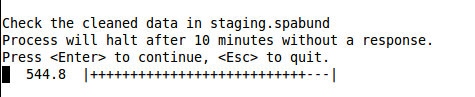
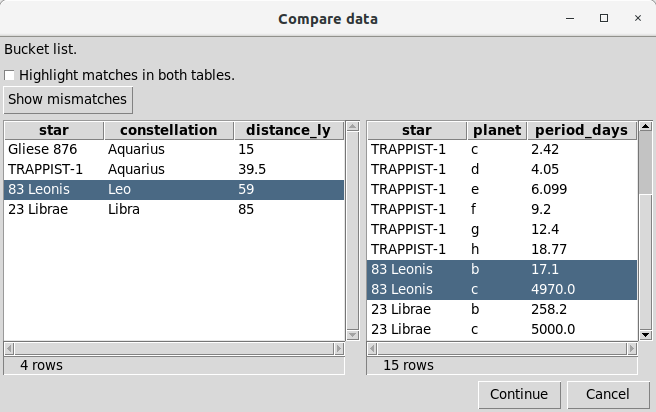
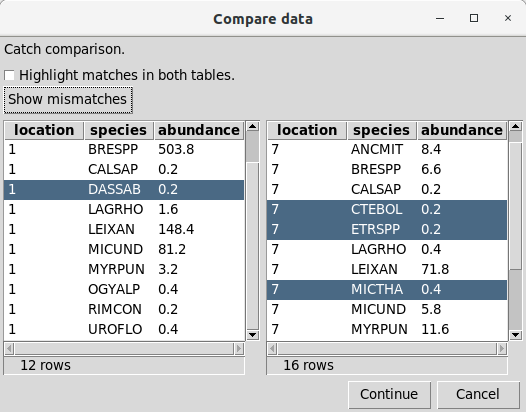
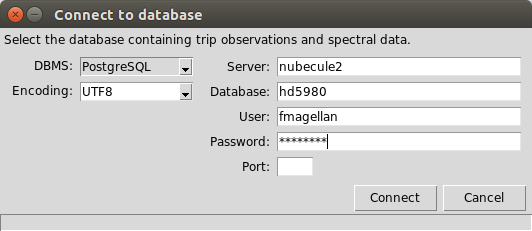
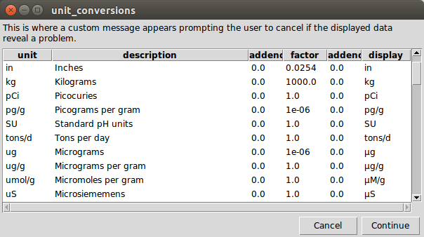

# Metacommands

The *execsql* program supports several special commands — metacommands — that import and export data, conditionally execute parts of the script, report status information, and perform other actions. Some of the things that can be done with metacommands are:

> - Include the contents of another SQL script file.
> - Import data from a text file or spreadsheet to a new or existing table.
> - Export data to the terminal or a file in a variety of formats.
> - Connect to multiple databases and copy data between them.
> - Write text out to the console or to a file.
> - Stop or pause script processing.
> - Display a data table for the user to review.
> - Display a pair of data tables for the user to compare.
> - Prompt the user to respond to a question or enter a value.
> - Prompt for the names of files or directories to be used.
> - Create sub-scripts that can be executed repeatedly.
> - Conditionally execute SQL or metacommands based on data values or user input.
> - Execute an operating system command.

Whereas SQL is often embedded in programs written in other languages, *execsql* inverts this paradigm through the use of metacommands (and [substitution variables](substitution_vars.md#substitution_vars)). These allow database operations to be interleaved with user interactions and file system access in a way that may be easier to develop, easier to [re-use](../guides/using_scripts.md#scripting), and more accessible to multiple users than embedded SQL in a high-level programming language.

Metacommands recognized by *execsql* are embedded in SQL comments, and are identified by the token "`!x!`" immediately following the comment characters at the beginning of the line. Each metacommand must be completely on a single line. An example metacommand is:

```
-- !x! IMPORT TO staging.weather FROM butte_data_2012.csv
```

This metacommand ([IMPORT](#import)) imports data from a text file or spreadsheet into a database table, and can automatically create the table with appropriate data types.

Other illustrations of metacommand usage are in the [examples](../guides/examples.md#examples).

Because metacommands are embedded in comments, they are hidden from other SQL script processors such as *psql* for Postgres, *mysql* for MySQL/MariaDB, and *sqlcmd* for SQL Server. Thus, a script containing *execsql* metacommands can potentially also be run using a DBMS's own native script processor. Scripts that make extensive use of *execsql*'s features, however, may not run satisfactorily with other script processors. Scripts that use metacommands such as [IF](#if_cmd), [IMPORT](#import), [INCLUDE](#include), [EXECUTE SCRIPT](#executescript), [LOOP](#loop), or [USE](#use), or that use [substitution variables](substitution_vars.md#substitution_vars) in SQL statements, are not likely to run properly with other script processors.

Metacommands can appear anywhere in a SQL script except embedded inside a SQL statement.

The metacommands are described in the following sections. Metacommand names are shown here in all uppercase, but *execsql* is not case-sensitive when evaluating the metacommands. The syntax descriptions for the metacommands use angle brackets to identify required replaceable elements, and square brackets to identify optional replaceable elements.


## ASK

```
ASK "<question>" SUB <match_string>
```

Prompts the user to provide a yes or no response to the specified question, presenting the prompt on the console, and assigns the result, as either "Yes" or "No", to the substitution variable specified. The "Y" and "N" keys will select the corresponding response. The \<Esc\> key will cancel the script. The selection is also [logged](../guides/logging.md#logging). If the prompt is canceled, script processing is halted, and the system exit value is set to 2.

Double quotes (as shown above), apostrophes, or square brackets can be used to delimit the text of the question.

See the [PROMPT ASK](#prompt_ask) metacommand for a version of this command that uses a GUI window and that can display a data table with the prompt.

## ASSERT { #assert }

```
ASSERT <condition>
ASSERT <condition> "<failure message>"
ASSERT <condition> '<failure message>'
```

Evaluates `<condition>` using the same expression engine as [IF](#if_cmd). If the condition is `True`, execution continues silently (and the result is written to the log). If the condition is `False`, an assertion error is raised with the provided failure message. If no message is supplied, the default message is `Assertion failed: <condition>`.

A failed assertion produces `**** Assertion failed.` (not `**** Error in metacommand.`) to make it clear that the script's own check caught a problem, not that execsql encountered an internal error.

When [HALT_ON_METACOMMAND_ERROR](#config) is `ON` (the default), a failed assertion halts the script. When it is `OFF`, execution continues after the failure is logged.

The `<condition>` supports all [conditional tests](metacommands.md#conditional_tests) available to `IF`, including:

- `TABLE_EXISTS(<table>)` / `NOT TABLE_EXISTS(<table>)`
- `COLUMN_EXISTS(<table>, <column>)` / `NOT COLUMN_EXISTS(<table>, <column>)`
- `HAS_ROWS(<table>)` / `NOT HAS_ROWS(<table>)`
- `EQUAL(<val1>, <val2>)` / `NOT EQUAL(<val1>, <val2>)`
- `IS_GT(<val1>, <val2>)`, `IS_GTE(<val1>, <val2>)`, `IS_ZERO(<val>)`
- `ROW_COUNT_GT(<table>, N)`, `ROW_COUNT_GTE(<table>, N)`, `ROW_COUNT_EQ(<table>, N)`, `ROW_COUNT_LT(<table>, N)`
- `DBMS(<type>)`, `SCHEMA_EXISTS(<schema>)`, `VIEW_EXISTS(<view>)`
- Boolean combinators: `AND`, `OR`, `NOT`

Substitution variables in the condition are expanded before evaluation. Use the `!!varname!!` syntax (e.g., `!!$myvar!!`).

ASSERT is silently skipped inside a `False` [IF](#if_cmd) block.

**Examples:**

```sql
-- Halt with a custom message if the staging table is missing.
-- !x! ASSERT TABLE_EXISTS(staging) "staging table must exist before running this script"

-- Halt with the default message if the table has no rows.
-- !x! ASSERT HAS_ROWS(staging)

-- Verify a substitution variable has the expected value.
-- !x! SUB env prod
-- !x! ASSERT EQUAL(!!env!!, prod) 'expected production environment'

-- Combine conditions with AND/OR/NOT.
-- !x! ASSERT TABLE_EXISTS(orders) AND HAS_ROWS(orders) "orders table missing or empty"
```

## AUTOCOMMIT

```
AUTOCOMMIT OFF
```

```
AUTOCOMMIT ON [WITH COMMIT|ROLLBACK]
```

By default, *execsql* automatically and immediately commits each SQL statement. If AUTOCOMMIT is set to OFF, SQL commands will instead be sent to the database but will not be committed.

If AUTOCOMMIT is set to ON without using the WITH clause, the next SQL statement will be automatically committed, and that commit will also commit all SQL statements that were issued while AUTOCOMMIT was set to OFF. Alternatively, if the WITH COMMIT clause is used when AUTOCOMMIT is turned back ON, all previously issued SQL statements will be committed immediately.

If the WITH ROLLBACK clause is used when AUTOCOMMIT is turned back on, all SQL statements issued since AUTOCOMMIT was turned OFF will be rolled back.


SQL statements that were issued while AUTOCOMMIT is OFF can also be committed using a SQL "COMMIT;" statement. This approach should be avoided with SQL Server, however, because *execsql* connects with SQL Server using ODBC, and Microsoft warns that SQL statements to manage transactions should not be used ["because this can cause indeterminate behavior in the driver"](https://docs.microsoft.com/en-us/sql/relational-databases/native-client/odbc/performing-transactions-in-odbc?view=sql-server-2017). For example, two "COMMIT;" statements may be needed the first time that SQL statements are committed this way.

The AUTOCOMMIT metacommand is database-specific, and affects only the database in use when the metacommand is used. This contrasts with the [BATCH](#batch) metacommand, which affects all databases.


The [IMPORT](#import) and [COPY](#copy) metacommands do not commit data changes while AUTOCOMMIT is off (except when the NEW or REPLACEMENT clauses are used with Firebird; in those cases the 'create table' statement that *execsql* generates and runs will be committed). The SQL statements generated by the [IMPORT](#import) and [COPY](#copy) metacommands are sent to the database, however. Therefore the AUTOCOMMIT metacommand is recommended when explicit transaction control is to be applied to the [IMPORT](#import) and [COPY](#copy) metacommands.


## BREAKPOINT { #breakpoint }

```
BREAKPOINT
```

Pauses script execution and drops into an interactive debug REPL (read-eval-print loop) on the console. Use this to inspect state and step through a script interactively while debugging.

**Non-interactive safety:** If `sys.stdin` is not a TTY (e.g. CI pipelines, piped input, batch execution) the metacommand is silently skipped. Scripts will never hang in automation.

All REPL commands are dot-prefixed to avoid ambiguity with variable names and SQL. Anything without a dot prefix is treated as a variable lookup or SQL.

**REPL commands (dot-prefixed):**

| Command | Description |
|---------|-------------|
| `.continue` or `.c` | Resume script execution |
| `.abort` or `.q` | Halt the script with exit status 1 |
| `.vars` | List user, system, local, and counter variables (grouped by type) |
| `.vars all` | Include environment variables (`&`) in the listing |
| `.next` or `.n` | Execute the next script statement, then pause again (step mode) |
| `.stack` | Show the command-list stack: script name, cursor index, and nesting depth |
| `.scripts` | List all registered SCRIPT definitions with parameters and source locations |
| `.scripts NAME` | Show detail for a specific SCRIPT (parameters, source file/line range) |
| `.help` | Show the list of available REPL commands |

**Variable inspection and SQL (no dot prefix):**

| Input | Description |
|-------|-------------|
| `logfile` | Print the value of the `logfile` variable |
| `$ARG_1` | Print the value of a system/built-in variable |
| `&HOME` | Print the value of an environment variable |
| `SELECT ...;` | Run ad-hoc SQL against the current database and pretty-print results |

Pressing Ctrl-D (EOF) or Ctrl-C (KeyboardInterrupt) at the `execsql debug>` prompt resumes execution, the same as typing `.continue`.

**Example:**

```sql
INSERT INTO staging SELECT * FROM raw_data;
-- !x! BREAKPOINT
-- Script pauses here. Inspect variables, run queries, then continue.
SELECT count(*) FROM staging;
```

BREAKPOINT is silently skipped inside a `False` [IF](#if_cmd) block.

!!! tip
    Use `execsql --debug script.sql` to start in step-through mode without adding a `BREAKPOINT` metacommand to your script. The REPL pauses before each statement.


## BEGIN BATCH and END BATCH { #batch }

```
BEGIN BATCH
```

```
END BATCH
```

```
ROLLBACK [BATCH]
```


The BATCH commands provide transaction control at the script level, as an alternative to using the [AUTOCOMMIT](#autocommit) metacommands (and possibly the DBMS's own transaction commands). By default, *execsql* automatically and immediately commits each SQL statement. The BATCH commands allow you to alter this behavior so that SQL statements are not committed until a batch is completed. This allows *execsql* to emulate tools that operate in batch mode by default (e.g., *sqlcmd*, though the functionality does not exactly correspond).

BEGIN BATCH marks the beginning of a set of SQL statements to be executed in a single operation, and in effect turns off *execsql*'s autocommit behavior. END BATCH marks the end of that set of statements and sends a commit statement to the database. ROLLBACK BATCH sends a rollback command to the database to revert the action of all previous SQL statements in the batch, but does not terminate the batch.


Metacommands may be included inside a batch, but note that the [IMPORT](#import) and [COPY](#copy) metacommands always commit the changes they make, unless [AUTOCOMMIT](#autocommit) is OFF, so if IMPORT or COPY metacommands are used inside a batch, any preceding SQL statements in the batch will also be committed unless AUTOCOMMIT is OFF.

When the END BATCH metacommand is processed by *execsql*, a commit command is sent to all databases that have been used inside the batch. Multiple databases may be used inside a batch if the [USE](#use) metacommand is used inside the batch. The BATCH metacommands therefore provide a limited sort of cross-database transaction control — note, however, that the commit statements are issued sequentially, and if a later commit statement fails, this will not roll back changes to databases for which the commit has already succeeded.

The BEGIN/END BATCH metacommands can be nested. However, the inner END BATCH metacommand will ordinarily commit all changes to the databases that have been used, which may include databases used in the outer batch as well. (This behavior may be DBMS-specific, and also depend on whether any additional explicit transaction control is being used.) Therefore completion of a nested batch may result in premature commitment of some or all SQL statements in the outer batch. Similarly, a ROLLBACK BATCH metacommand within the inner batch will also roll back any SQL commands sent to the same databases in the outer batch. Thus, although the BATCH commands can be nested, database transactions may not be, depending on the DBMS in use. Nesting of BATCH metacommands allows a script file or a [SCRIPT](#beginscript) containing a batch to be [INCLUDEEd](#include) or [EXECUTEEd](#executescript), respectively, within another batch.


Alternatives to using batches to control the execution time of SQL statements are:

> - The [AUTOCOMMIT](#autocommit) metacommand, which provides a different method of integrating [IMPORT](#import) and [COPY](#copy) metacommands with a sequence of SQL statements
> - The [IF](#if_cmd) metacommand, which provides a way of conditionally executing SQL statements and metacommands such as [IMPORT](#import) and [COPY](#copy)
> - The [BEGIN/END SCRIPT](#beginscript) and [EXECUTE
>   SCRIPT](#executescript) metacommands, which allow both SQL statements and metacommands to be grouped together and executed as a group, with AUTOCOMMIT either on or off.


The END BATCH metacommand is analogous to the "GO" command of the T-SQL language used with SQL Server utilities such as *sqlcmd*. There is no explicit equivalent to BEGIN BATCH in *sqlcmd* or other SQL Server utilities. In *sqlcmd* a new batch is automatically begun at the beginning of the script or immediately after a GO statement. execsql only starts a new batch when a BEGIN BATCH statement is encountered.

If the end of the script file is encountered while a batch of statements is being compiled, but there is no END BATCH metacommand, the SQL statements in that incomplete batch will not be committed.


## BEGIN SCRIPT and END SCRIPT { #beginscript }

```
BEGIN SCRIPT <script_name>
```

```
BEGIN SCRIPT <script_name> WITH PARAMETERS (param1[, param2[,..]])
```

```
BEGIN SCRIPT <script_name>(param1, param2=default_value)
```

```
END SCRIPT [script_name]
```


The BEGIN SCRIPT and END SCRIPT metacommands define a block of statements (SQL statements and metacommands) that can be subsequently executed (repeatedly, if desired) using the [EXECUTE SCRIPT](#executescript) metacommand.

The statements within the BEGIN/END SCRIPT block are not executed within the normal flow of the script in which they appear, and, unlike the BEGIN/END BATCH commands, neither are they executed when the END SCRIPT metacommand is encountered. These statements are executed only when the corresponding script is named in an [EXECUTE SCRIPT](#executescript) metacommand.

If the WITH PARAMETERS clause is used, the parameter names specified must be assigned values within a WITH ARGUMENTS clause of any [EXECUTE SCRIPT](#executescript) metacommand that runs this script.

The "WITH" and "PARAMETERS" keywords are both optional.

### Default parameter values

Parameters can have default values using `param=value` syntax. Parameters with defaults are optional at the call site — if omitted, the default value is used. Required parameters (no default) must precede optional parameters.

```sql
-- !x! BEGIN SCRIPT load_data(schema, table, batch_size=1000, dry_run=false)
INSERT INTO !!#table!! SELECT * FROM staging LIMIT !!#batch_size!!;
-- !x! END SCRIPT

-- All of these are valid:
-- !x! EXECUTE SCRIPT load_data(schema=public, table=users)
-- !x! EXECUTE SCRIPT load_data(schema=public, table=users, batch_size=500)
-- !x! EXECUTE SCRIPT load_data(schema=public, table=users, batch_size=500, dry_run=true)
```

A required parameter after an optional parameter is a parse error:

```sql
-- Parse error: required parameter 'table' after optional parameter 'batch'
-- !x! BEGIN SCRIPT bad(schema, batch=1000, table)
```

### Docstrings

Comments (`--` or `/* */`) immediately following the BEGIN SCRIPT line are captured as the script's docstring. A blank line terminates the docstring. Docstrings are displayed by [SHOW SCRIPT](#show_script), [SHOW SCRIPTS](#show_scripts), and the `.scripts` REPL command.

```sql
-- !x! BEGIN SCRIPT load_data(schema, table)
-- Load data from staging into the target table.
-- Parameters:
--   schema - Target schema name
--   table  - Target table name

-- !x! SUB ~batch 1000
INSERT INTO !!#table!! SELECT * FROM staging;
-- !x! END SCRIPT
```

Block comments are also valid:

```sql
-- !x! BEGIN SCRIPT load_data(schema, table)
/* Load data from staging into the target table. */

INSERT INTO !!#table!! SELECT * FROM staging;
-- !x! END SCRIPT
```

### Other notes

If a script name is provided with the END SCRIPT metacommand, it must match the name used in the corresponding BEGIN SCRIPT metacommand. If it does not, *execsql* will halt with an error message.

A BEGIN/END SCRIPT block can be used in ways similar to a separate script file that is included with the [INCLUDE](#include) metacommand. Both allow the same code to be executed repeatedly, either at different locations in the main script or recursively to perform looping.


The BEGIN SCRIPT and END SCRIPT metacommands are executed when a script file is read, not while the the script is being executed. As a consequence:

> - Substitution variables should ordinarily not be used as script names because they will not have been defined yet, unless they were defined in the variables section of a [configuration
>   file](configuration.md#configuration); and
> - The BEGIN/END SCRIPT commands are not ordinarily subject to conditional execution.


However, the BEGIN SCRIPT and END SCRIPT metacommands can be used in a separate script file that is [INCLUDEEd](#include) in the main script. In this case, both of the previous restrictions are eliminated. In addition the [EXECUTE SCRIPT](#executescript) metacommand can be included in a conditional statement.

"CREATE SCRIPT" can be used as an alias for "BEGIN SCRIPT".


## BEGIN SQL and END SQL

```
BEGIN SQL
```

```
END SQL
```

The BEGIN SQL and END SQL metacommands define a block of lines in the script file that will be treated as a single SQL statement. Within the block of lines defined by these metacommands, a semicolon at the end of the line will *not* be treated as the end of a SQL statement.

The primary intended use case for these metacommands is to bracket procedure and function definitions. A function definition may contain multiple SQL statements, each of which is ended by a semicolon, but which should all be sent to the DBMS as a single statement, not as a series of individual SQL statements.

The BEGIN SQL and END SQL metacommands are an alternative to the use of [line continuation characters](../guides/usage.md#continuationchars).

Metacommands that appear within a BEGIN/END SQL block will be treated as comments and will be ignored: they will not be executed when the SQL statement is run, and no error message will be produced.


## BREAK

```
BREAK
```

This metacommand will cause an immediate exit from any [LOOP](#loop), [SCRIPT](#beginscript) or [INCLUDEEd](#include) file. If there are multiple levels of these structures active, only the latest level will be exited.

If this metacommand is used when none of these structures are active, a warning will be issued.


## CANCEL_HALT

```
CANCEL_HALT ON|OFF
```

When CANCEL_HALT is set to ON, which is the default, if the user presses the "Cancel" button on a dialog (such as is presented by the [PROMPT DISPLAY](#prompt) metacommand), *execsql* will halt script processing. If CANCEL_HALT is set to OFF, then *execsql* will not halt script processing, and it is the script author's responsibility to ensure that adverse consequences do not result from the lack of a response to the dialog. The [DIALOG_CANCELED](#dialog_canceled) conditional can be used to determine whether a dialog has been canceled. [Example 10](../guides/examples.md#example10) illustrates a condition in which setting CANCEL_HALT to OFF is appropriate.


## CD

```
CD <directory>
```

Changes the current working directory.


## CONFIG

Several of the configuration settings that can be specified either with [command-line options](../getting-started/syntax.md#syntax) or in [configuration files](configuration.md#configuration) can also be dynamically altered using metacommands.


```
CONFIG BOOLEAN_INT YES|NO
```


Controls whether integer values of 0 and 1 are considered to be Booleans when the [IMPORT](#import) and [COPY](#copy) metacommands scan data to determine data types to use when creating a new table (i.e, when either the "NEW" or "REPLACEMENT" keyword is used with the [IMPORT](#import) and [COPY](#copy) metacommands.) The argument should be "Yes", "No", "On", or "Off". *execsql*'s default behavior is to consider a column with only integer values of 0 and 1 to have a Boolean data type. By setting this value to "No" or "Off", such a column will be considered to have an integer data type. This is equivalent to the "-b" command-line option and the `boolean_int` [configuration
parameter](configuration.md#config_input).


```
CONFIG BOOLEAN_WORDS YES|NO
```


Controls whether *execsql* will recognize only full words as Booleans when the [IMPORT](#import) and [COPY](#copy) metacommands scan data to determine data types to use when creating a new table (i.e, when either the "NEW" or "REPLACEMENT" keyword is used with the [IMPORT](#import) and [COPY](#copy) metacommands.). The argument should be "Yes", "No", "On", or "Off". *execsql*'s default behavior is to recognize values of "Y", "N", "T", and "F" as Booleans. By setting BOOLEAN_WORDS to "Yes" or "On", then only "Yes", "No", "True", and "False" will be recognized as Booleans.


<a id="clean_column_headers"></a>
```
CONFIG CLEAN_COLUMN_HEADERS YES|NO
```

If set to Yes (the default is No), non-alphanumeric characters in column headers of IMPORTed data will replaced with an underscore character, and the column header will be prefixed with an underscore character if it starts with a digit. This may eliminate characters that are illegal for the DBMS in use, or eliminate the need for column names to be double-quoted.

This setting is also applied to the conversion of spreadsheet names to table names when multiple worksheets are [IMPORTed](#import).


```
CONFIG CONSOLE WAIT_WHEN_DONE YES|NO
```

Controls the persistence of any [console window](#console) at the completion of the script when the script either completes normally or exits prematurely as a result of the user's response to a prompt. If the value is set to "Yes" or "On" (the default value is "No"), the console window will remain open until explicitly closed by the user. The message "Script complete; close the console window to exit execsql." will be displayed in the status bar. This metacommand has the same action as the `console_wait_when_done` configuration setting. The value of this setting can be evaluated with the "\$console_wait_when_done_state" [system variable](substitution_vars.md#system_vars).


```
CONFIG CONSOLE WAIT_WHEN_ERROR YES|NO
```

Controls the persistence of any [console window](#console) at the completion of the script if an error occurs. If the value is set to "Yes" or "On" (the default value is "No"), the console window will remain open until explicitly closed by the user after an error occurs. This metacommand has the same action as the `console_wait_when_error_halt` configuration setting. The value of this setting can be evaluated with the "\$console_wait_when_error_state" [system variable](substitution_vars.md#system_vars).


<a id="config_create_column_headers"></a>
```
CONFIG CREATE_COLUMN_HEADERS YES|NO
```

Whether or not to create column headers if they are missing from an input file. The default value is "No". If this is set to "Yes", missing column headers will be created as "Col" followed by the column number. This metacommand has the same action as the `create_column_headers` [configuration setting](configuration.md#create_column_headers).

A [CONFIG DELETE_EMPTY_COLUMNS](#config_delete_empty_columns) setting of "Yes" takes priority over this setting. That is, if columns with missing headers are entirely deleted, new headers for those columns will not be created.


```
CONFIG DAO_FLUSH_DELAY_SECS <seconds>
```

Specifies the number of seconds that *execsql* should wait between the time that a query is created in Access (which uses DAO) and the time that the next statement is executed using ODBC. This value must be greater than or equal to 5.0. This is equivalent to the `dao_flush_delay_secs` configuration setting.


```
CONFIG DEDUP_COLUMN_HEADERS YES|NO
```

Controls whether or not to make repeated column headers unique by appending an underscore and the column number. Evaluation of the equivalence of column headers is case-insensitive.

Deduplication of column headers is performed after any cleaning and trimming of column headers.


<a id="config_delete_empty_columns"></a>
```
CONFIG DELETE_EMPTY_COLUMNS YES|NO
```

Specifies whether or not entire columns in an [IMPORTed](#import) data set should be deleted when the column headers are missing. The default value is "No". If columns with empty headers are not deleted, headers may be created instead with the [CREATE_COLUMN_HEADERS](#config_create_column_headers) setting.

A column header is considered to be missing if it is either absent or consists entirely of spaces.

This metacommand has the same action as the `delete_empty_columns` [configuration setting](configuration.md#setting_del_empty_cols).


```
CONFIG EMPTY_ROWS YES|NO
```

Controls whether empty rows are allowed in data that is saved using either the [IMPORT](#import) or [COPY](#copy) metacommands. The default is to allow empty rows. A metacommand of CONFIG EMPTY_ROWS NO will cause all empty rows to be omitted. A row containing only empty strings is not considered to be empty unless the [CONFIG EMPTY_STRINGS](#empty_strings) configuration setting is also set to NO.


<a id="empty_strings"></a>
```
CONFIG EMPTY_STRINGS YES|NO
```

Controls whether empty (zero-length) strings are allowed in data that is saved using either the [IMPORT](#import) or [COPY](#copy) metacommands. The default is to allow empty strings. A metacommand of EMPTY_STRINGS NO will cause all empty strings to be replaced by NULL. A string containing only space characters is considered to be an empty string.


```
CONFIG EXPORT_ROW_BUFFER <n>
```

Specifies the number of data rows that will be read from the database at one time and buffered when data are exported using the [EXPORT](#export) metacommand. The default value is 1000 rows. Larger values will lead to faster exports for large data sets, up to a point, and with a diminishing rate of return. Larger values will also require more memory, and excessively large values could result in a memory error.


<a id="config_fold_column_headers"></a>
```
CONFIG FOLD_COLUMN_HEADERS NO|LOWER|UPPER
```

Specifies whether or not to fold (convert) the case of all column headers to lowercase or uppercase, or to leave them unchanged when data are [IMPORTed](#import). Valid values are "No" (the default), "Lower", and "Upper". Case does not matter in the specification.

This setting is also applied to the conversion of spreadsheet names to table names when multiple worksheets are [IMPORTed](#import).


```
CONFIG GUI_LEVEL <n>
```

The level of interaction with the user that should be carried out using GUI dialogs. The numeric value *n* must be 0, 1, 2, or 3. The meanings of these values are:

> - 0: Do not use any optional GUI dialogs.
> - 1: Use GUI dialogs for password prompts and for the [PAUSE](#pause) metacommand.
> - 2: Also use a GUI dialog if a message is included with the [HALT](#halt) metacommand, and prompt for the initial database to use if no database connection parameters are specified in a configuration file or on the command line.
> - 3: Additionally, open a GUI console when *execsql* starts.

This is equivalent to the `gui_level` [configuration setting](configuration.md#gui_level).


<a id="config_hdf5"></a>
```
CONFIG HDF5_TEXT_LEN <n>
```

The width of the column to be used in an HDF5 export file when the data have a 'text' data type.


```
CONFIG IMPORT_COMMON_COLUMNS_ONLY YES|NO
```

Controls whether the [IMPORT](#import) metacommand will import CSV files with more columns than the target table. This has the same action as the `import_only_common_columns` [configuration setting](configuration.md#config_input). The argument should be either "Yes" or "No". The default value is "No", in which case the [IMPORT](#import) metacommand will halt with an error message if the target table does not have all of the columns that are in the file to be imported.

In addition to reducing the amount of data imported, this setting can also be used to work around some types of malformed input files.


```
CONFIG IMPORT_ROW_BUFFER <n>
```

Specifies the number of data rows that will be read from an input data source at one time and buffered when data are imported using the [IMPORT](#import) metacommand and when a DBMS-specific fast import routine is not used. The default value is 1000 rows. Different buffer sizes may lead to faster imports, depending on the DBMS and data source. Larger values will require more memory, and excessively large values could result in a memory error.


```
CONFIG LOG_DATAVARS YES|NO
```

Controls whether data variables that are created by the [SELECT_SUB](#select_sub), [PROMPT SELECT_SUB](#prompt_selsub) and [PROMPT ACTION](#prompt_action) metacommands are written to *execsql*'s [log file](../guides/logging.md#logging). By default, all data variable assignments are logged. The performance of scripts that make extensive use of these metacommands (e.g., [Example 27](../guides/examples.md#example27)) can be improved by changing this setting to 'No'.


```
CONFIG LOG_SQL YES|NO
```

Enable or disable SQL query audit logging at runtime. When enabled, each SQL statement executed against the database is written to *execsql*'s [log file](../guides/logging.md#logging) as a `sql` record containing the database name, source line number, and query text. This is equivalent to the `log_sql` [configuration setting](configuration.md#config_logging). The default value is "No".


```
CONFIG LOG_WRITE_MESSAGES YES|NO
```

Controls whether output of the [WRITE](#write) metacommand will also be written to *execsql*'s log file. When this is set to "Yes" or "On" (the default value is "No"), all output of the [WRITE](#write) metacommand will also be written to *execsql*'s [log file](../guides/logging.md#logging). This behavior can also be controlled with the `log_write_messages` configuration option.


```
CONFIG MAKE_EXPORT_DIRS YES|NO
```

Controls whether the [EXPORT](#export) and [WRITE](#write) metacommands will automatically create any directories that are named in an output filename and that do not already exist. The user must have appropriate permissions to create those directories.


```
CONFIG MAX_INT <integer_value>
```

Specifies the threshold between integer and bigint data types that is used by the [IMPORT](#import) and [COPY](#copy) metacommands when creating a new table. Any column with integer values less than or equal to this value (max_int) and greater than or equal to -1 × max_int - 1 will be considered to have an integer type. Any column with values outside this range will be considered to have a bigint type. The default value for max_int is 2147483647. The max_int value can also be altered using a configuration option.


```
CONFIG ONLY_STRINGS YES|NO
```

Controls whether data imported with the [IMPORT](#import) metacommand and the "NEW" or "REPLACEMENT" keywords will have their data types evaluated (the default) or whether all the data columns will be treated as text (character, character varying, or text). The default value is "No"; if this is set to "Yes", data will be imported as text.


```
CONFIG QUOTE_ALL_TEXT YES|NO
```

Controls whether the [EXPORT](#export) metacommand will automatically quote all text values that are written to a delimited text file. When this is set to "Yes" or "On" (the default is "No"), all text data values will be enclosed in the specified quote characters. This behavior can also be controlled with the `quote_all_text` [configuration setting](configuration.md#config_output).


```
CONFIG REPLACE_NEWLINES YES|NO
```

Controls whether newline characters embedded in strings are replaced during [IMPORT](#import). Newline characters and any surrounding whitespace will be replaced with a single space.


```
CONFIG SCAN_LINES <n>
```

The number of lines of a data file to scan during [IMPORT](#import) to determine the quoting character and delimiter character used. This is equivalent to the "-s" command-line option and the `scan_lines` [configuration setting](configuration.md#scan_lines).


```
CONFIG SHOW_PROGRESS YES|NO
```

Enable or disable the Rich progress bar for [IMPORT](#import) operations at runtime. When enabled, a progress bar is displayed showing the number of rows imported. This is equivalent to the `show_progress` [configuration setting](configuration.md#config_input) and the `--progress` CLI option. The default value is "No".


```
CONFIG TRIM_COLUMN_HEADERS NONE|BOTH|LEFT|RIGHT
```

Whether or not to remove leading and/or trailing spaces and underscores from column headers when data are [IMPORTed](#import). The default value is "NONE". Trimming is done after any cleaning of column headers. Trimming a leading underscore may invalidate a cleaned, and valid, column header that would otherwise start with a digit.


```
CONFIG TRIM_STRINGS YES|NO
```

Controls whether leading and trailing whitespace is removed from text values on [IMPORT](#import).


```
CONFIG WRITE_PREFIX <text>
```

and

```
CONFIG WRITE_PREFIX CLEAR
```

Specifies text that will be prefixed to all subsequent output of the [WRITE](#write) metacommand. A single space will be inserted between the prefix and the custom text. Substitution variables may be used in the prefix. [Deferred substitution](substitution_vars.md#deferred_substitution) may be appropriate when substitution variables are used.

If the CLEAR keyword is used, the prefix will be removed and no longer applied to subsequent WRITE metacommands.


```
CONFIG WRITE_SUFFIX <text>
```

and

```
CONFIG WRITE_SUFFIX CLEAR
```

Specifies text that will be appended to all subsequent output of the [WRITE](#write) metacommand. A single space will be inserted between the custom text and the suffix. Substitution variables may be used in the suffix. [Deferred substitution](substitution_vars.md#deferred_substitution) may be appropriate when substitution variables are used.

If the CLEAR keyword is used, the suffix will be removed and no longer applied to subsequent WRITE metacommands.


```
CONFIG WRITE_WARNINGS YES|NO
```

Controls whether warning messages are written to the console as well as to the log file. When this is set to "Yes" or "On" (the default is "No"), warning messages will be displayed on the console. This behavior can also be controlled with the `write_warnings` [configuration setting](configuration.md#write_warnings).


```
CONFIG ZIP_BUFFER_MB <n>
```

The size of the internal buffer used when the [EXPORT](#export) metacommand exports data to a zipfile, in Mb. The default value is 10. The buffer should be at least as large as the largest data row to be exported. This value typically has little effect on performance, and only affects memory usage. This is equivalent to the `zip_buffer_mb` [configuration setting](configuration.md#zip_buffer_mb).


## CONNECT

For PostgreSQL:

```
CONNECT TO POSTGRESQL(SERVER=<server_name>, DB=<database_name>
      [, USER=<user>, NEED_PWD=TRUE|FALSE] [, PORT=<port_number>]
      [, PASSWORD=<password>] [, ENCODING=<encoding>] [, NEW])
      AS <alias_name>
```

```
CONNECT USER TO POSTGRESQL(SERVER=<server_name>, DB=<database_name>
      [, PORT=<port_number>] [, ENCODING=<encoding>]) AS <alias_name>
```

For SQLite:

```
CONNECT TO SQLITE(FILE=<database_file> [, NEW]) AS <alias_name>
```

For MS-Access:

```
CONNECT TO ACCESS(FILE=<database_file> [, NEED_PWD=TRUE|FALSE]
      [, PASSWORD=<password>] [, ENCODING=<encoding>]) AS <alias_name>
```

For SQL Server:

```
CONNECT TO SQLSERVER(SERVER=<server_name>, DB=<database_name>
      [, USER=<user>, NEED_PWD=TRUE|FALSE]  [, PORT=<port_number>]
      [, PASSWORD=<password>] [, ENCODING=<encoding>]) AS <alias_name>
```

```
CONNECT USER TO SQLSERVER(SERVER=<server_name>, DB=<database_name>
      [, PORT=<port_number>] [, ENCODING=<encoding>]) AS <alias_name>
```

For MySQL:

```
CONNECT TO MYSQL(SERVER=<server_name>, DB=<database_name>
      [, USER=<user>, NEED_PWD=TRUE|FALSE]  [, PORT=<port_number>]
      [, PASSWORD=<password>] [, ENCODING=<encoding>]) AS <alias_name>
```

```
CONNECT USER TO MYSQL(SERVER=<server_name>, DB=<database_name>
      [, PORT=<port_number>] [, ENCODING=<encoding>]) AS <alias_name>
```

For MariaDB:

```
CONNECT TO MARIADB(SERVER=<server_name>, DB=<database_name>
      [, USER=<user>, NEED_PWD=TRUE|FALSE]  [, PORT=<port_number>]
      [, PASSWORD=<password>] [, ENCODING=<encoding>]) AS <alias_name>
```

```
CONNECT USER TO MARIADB(SERVER=<server_name>, DB=<database_name>
      [, PORT=<port_number>] [, ENCODING=<encoding>]) AS <alias_name>
```

For DuckDB:

```
CONNECT TO DUCKDB(FILE=<database_file> [, NEW]) AS <alias_name>
```

For Firebird:

```
CONNECT TO FIREBIRD(SERVER=<server_name>, DB=<database_name>
      [, USER=<user>, NEED_PWD=TRUE|FALSE]  [, PORT=<port_number>]
      [, ENCODING=<encoding>]) AS <alias_name>
```

```
CONNECT USER TO FIREBIRD(SERVER=<server_name>, DB=<database_name>
      [, PORT=<port_number>] [, ENCODING=<encoding>]) AS <alias_name>
```

For Oracle:

```
CONNECT TO ORACLE(SERVER=<server_name>, DB=<service_name>
      [, USER=<user>, NEED_PWD=TRUE|FALSE]  [, PORT=<port_number>]
      [, PASSWORD=<password>] [, ENCODING=<encoding>]) AS <alias_name>
```

```
CONNECT USER TO ORACLE(SERVER=<server_name>, DB=<service_name>
      [, PORT=<port_number>] [, ENCODING=<encoding>]) AS <alias_name>
```

For a DSN:

```
CONNECT TO DSN(DSN=<DSN_name>,
      [, USER=<user>, NEED_PWD=TRUE|FALSE] [,
      PASSWORD=<password>] [, ENCODING=<encoding>]) AS <alias_name>
```

Establishes a connection to another database. The keyword values are equivalent to arguments and options that can be specified on the command line when *execsql* is run.


The CONNECT metacommands, without the "USER" keyword, for Postgres, MySQL/MariaDB, Access, Oracle, and DSN connections allow a password to be specified. If a password is needed for any database but is not provided, *execsql* will display a prompt for the password. Embedding a password in a SQL script is a security weakness, but may be needed when a script is to be run regularly as a system job. This risk can be minimized by either:

> - Using the [PROMPT ENTER_SUB](#prompt_enter) metacommand to prompt for the password when the script starts and using the [PAUSE...CONTINUE](#pause) metacommand to control the timing of successive runs of a subscript; or
> - Storing an encrypted copy of the password in a substitution variable and decrypting it before passing it to the [CONNECT
>](#connect) metacommand.

If the command form with the "USER" keyword is used, the user name that is used for the connection will be that of the current user, and the password used will be that which was provided when *execsql* last prompted for a password (e.g., when making the initial database connection). This also eliminates the need to include a password in the script, although its use is limited to cases where the current user and previously-entered password are to be used for a new database connection.


The alias name that is specified in this command can be used to refer to this database in the [USE](#use) and [COPY](#copy) metacommands. Alias names can consist only of letters, digits, and underscores, and must start with a letter. The alias name "initial" is reserved for the database that is used when *execsql* starts script processing, and cannot be used with the [CONNECT](#connect) metacommand. If you re-use an alias name, the connection to the database to which that name was previously assigned will be closed, and the database will no longer be available. Using the same alias for two different databases allows for mistakes wherein script statements are run on the wrong database, and so is not recommended.

If the "NEW" keyword is used with PostgreSQL, SQLite, or DuckDB, a new database of the given name will be created. There must be no existing database of that name, and (for Postgres) you must have permissions assigned that allow you to create databases.


## CONSOLE

```
CONSOLE ON|OFF
```

Creates (ON) or destroys (OFF) a GUI console to which subsequent [WRITE](#write) metacommands will send their output. Data tables exported as text will also be written to this console. The console window includes a status line and progress bar indicator that can each be directly controlled by metacommands listed below.

Only one console window can be open at a time. If a "CONSOLE ON" metacommand is used while a console is already visible, the same console will remain open, and no error will be reported.

A GUI console can be automatically opened when *execsql* is started by using the "-v3" option.

When the GUI console is turned OFF, subsequent output will again be directed to standard output (the terminal window, if there is one open).

If an error occurs while the console is open, the error message will be written on standard error (typically the terminal), and the console will be closed as *execsql* terminates.

```
CONSOLE HIDE|SHOW
```

Hides or shows the console window. Text will still be written to the console window while it is hidden, and will be visible if the console is shown again.

```
CONSOLE HEIGHT <lines>
```

Changes the height of any existing console window, and specifies the height of any console window that is subsequently created with CONSOLE ON. The resulting height will be approximately *lines* lines tall.

```
CONSOLE WIDTH <chars>
```

Changes the width of any existing console window, and specifies the width of any console window that is subsequently created with CONSOLE ON. The resulting width will be approximately *chars* characters wide.

```
CONSOLE STATUS "<message>"
```

The specified message is written to the status bar at the bottom of the console window. Use an empty message ("") to clear the status bar.

```
CONSOLE PROGRESS <number> [/ <total>]
```

The progress bar at the bottom of the console window will be updated to show the specified value. Values should be numeric, between zero and 100. If the number is followed by a slash and then another number, the two numbers will be taken as a fraction and converted to a percentage for display. Use a value of zero to clear the progress bar.


```
CONSOLE SAVE [APPEND] TO <filename>
```

Saves the text in the console window to the specified file. If the "APPEND" keyword is used, the console text will be appended to any existing file of the same name; otherwise, any existing file will be overwritten.

```
CONSOLE WAIT ["<message>"]
```

Script processing will be halted until the user responds to the console window with either the \<Enter\> key or the \<Esc\> key, or clicks on the window close button. If an (optional) message is included as part of the command, the message will be written into the status bar. If the user responds with the \<Enter\> key, the console window will remain open and script processing will resume. The user can close the console window either with the \<Esc\> key or by clicking on the window close button.

The console window has a single menu item, 'Save as\...', that allows the entire console output to be saved as a text file.


## COPY

```
COPY <table1_or_view> FROM <alias_name_1>
  TO [NEW|REPLACEMENT] <table2> IN <alias_name_2>
```


Copies the data from a data table or view in one database to a data table in a second database. The two databases between which data are copied are identified by the alias names that are established with the [CONNECT](#connect) metacommand. The alias "initial" can be used to refer to the database that is used when *execsql* starts script processing. Neither the source nor the destination database need be the initial database, or the database currently in use.

The second (destination) table must have column names that are identical to the names of the columns in the first (source) table. The second table may have additional columns; if it does, they will not be affected and their names don't matter. The data types in the columns to be copied must be compatible, though not necessarily identical. The order of the columns in the two tables does not have to be identical.

If the "NEW" keyword is used, the destination table will be automatically created with column names and data types that are compatible with the first (source) table. The data types used for the columns in the newly created table will be determined by a scan of all of the data in the first table, but may not exactly match those in the first table. If the destination table already exists when the "NEW" keyword is used, an error will occur.

If the "REPLACEMENT" keyword is used, the destination table will also be created to be compatible with the source table, but any existing destination table of the same name will be dropped first. *execsql* uses a "drop table" statement to drop an existing destination table, and this statement may not succeed if there are dependencies on that table (see the discussion of [implicit drop table
statements](../guides/sql_syntax.md#implicit_drop)). If the destination table is not dropped, then data from the source table will be added to the existing table, or an error will occur if the table formats are not compatible.

If there are constraints on the second table that are not met by the data being added, an error will occur. If an error occurs at any point during the data copying process, no new data will be added to the second table.

The data addition to the target table is always committed unless [AUTOCOMMIT](#autocommit) is OFF. Therefore, the COPY metacommand should be used with care within transactions that are managed with explicit SQL statements or with or [BATCHes](#batch).


## COPY QUERY

```
COPY QUERY <<query>> FROM <alias_name_1>
  TO [NEW|REPLACEMENT] <table> IN <alias_name_2>
```

Copies data from one database to another in the same manner as the [COPY](#copy) metacommand, except instead of specifying the source table (or view), a SQL query statement is used instead. The SQL statement must be terminated with a semicolon and enclosed in double angle brackets.

Like all metacommands, this metacommand must appear on a single line, although the SQL statement may be quite long. To facilitate readability, the SQL statement may be saved in a [substitution
variable](substitution_vars.md#substitution_vars) and that substitution variable referenced in the COPY QUERY metacommand.

The data addition to the target table is always committed unless [AUTOCOMMIT](#autocommit) is OFF. Therefore, the COPY metacommand should be used with care within transactions that are managed with explicit SQL statements or with or [BATCHes](#batch).


## DISCONNECT

```
DISCONNECT [[FROM] <alias>]
```

Closes the current database connection, or the connection associated with the alias *alias*, if specified. Aliases are defined by the [CONNECT](#connect) metacommand.

Attempting to disconnect from the initial database connection will result in an error, and *execsql* will halt.

Attempting to disconnect from a database that is still in use in a [BATCH](#batch) will result in an error, and *execsql* will halt.

Explicitly disconnecting from a database is not necessary before re-using that alias. The [CONNECT](#connect) metacommand will automatically disconnect from a database if its alias is re-used.


## EMAIL

```
EMAIL FROM <from_address> TO <to_addresses>
      SUBJECT "<subject>" MESSAGE "<message_text>"
      [MESSAGE_FILE "<filename>"]
      [ATTACH_FILE "<attachment_filename>"]
```

Sends an email. The *from_address* should be a valid email address (though not necessarily a real one). The *to_addresses* should also be a valid email address, or a comma- or semicolon-delimited list of email addresses. If none of the destination email addresses are valid, an exception will occur and *execsql* will halt. If at least one of the email addresses is valid, the command will succeed.

The subject and the message_text should both be enclosed in double quotes and should not contain a double quote. Multiline messages can be used if the message text is contained in a [substitution variable](substitution_vars.md#substitution_vars).

If the "MESSAGE_FILE" keyword is used, the contents of that file will be inserted into the body of the email message in addition to whatever message_text is specified. The filename may be unquoted, but must be quoted if it contains any space characters.

If the "ATTACH_FILE" keyword is used, the specified file will be attached to the email message. The attachment_filename may be unquoted, but must be quoted if it contains any space characters.

The SMTP host and any other connection information that is necessary must be specified in the ["email" section of a configuration file](configuration.md#config_email).


## ERROR_HALT

```
ERROR_HALT ON|OFF
```


When ERROR_HALT is set to ON, which is the default, any errors that occur as a result of executing a SQL statement will cause an error message to be displayed immediately, and *execsql* will exit. When ERROR_HALT is set to OFF, then SQL errors will be ignored, but can be evaluated with the [IF SQL_ERROR](#sqlerror) conditional.

When ERROR_HALT is set to OFF inside a transaction, any SQL error will ordinarily cause the entire transaction to fail.


## EXECUTE

```
EXECUTE <procedure_name>
```

Executes the specified stored procedure (or function, or query, depending on the DBMS). Conceptually, the EXECUTE metacommand is intended to be used to execute stored procedures that do not require arguments and do not return any values. The actual operation of this command differs depending on the DBMS that is in use.


Postgres has stored functions. Functions with no return value are equivalent to stored procedures. When using Postgres, *execsql* treats the argument as the name of a stored function. It appends an empty pair of parentheses to the function name before calling it, so you should not include the parentheses yourself; the reason for this is to maintain as much compatibility as possible in the metacommand syntax across DBMSs.


Access has only stored queries, which may be equivalent to either a view or a stored procedure in other DBMSs. When using Access, the query referenced in this command should be an INSERT, UPDATE, or DELETE statement---executing a SELECT statement in this context would have no purpose.


SQL Server has stored procedures. When using SQL Server, execsql treats the argument as the name of a stored procedure.


SQLite does not support stored procedures or functions, and (unlike Access queries), views can only represent SELECT statements. When using SQLite, *execsql* cannot treat the argument as a stored procedure or function, so it treats it as a view and carries out a SELECT \* FROM \<procedure_name\>; statement. This is unlikely to be very useful in practice, but it is the only reasonable action to take with SQLite.


MySQL and MariaDB support stored procedures and user-defined functions. User-defined functions can be invoked within SQL statements, so *execsql* considers the argument to the EXECUTE metacommand to be the name of a stored procedure, and calls it after appending a pair of parentheses to represent an empty argument list.


Firebird supports stored procedures, and *execsql* executes the procedure with the given name, providing neither input parameters nor output parameters.


## EXECUTE SCRIPT { #executescript }

```
EXECUTE SCRIPT [IF EXISTS] <script_name>
```

```
EXECUTE SCRIPT [IF EXISTS] <script_name> WHILE (<conditional expression>)
```

```
EXECUTE SCRIPT [IF EXISTS] <script_name> UNTIL (<conditional expression>)
```

```
EXECUTE SCRIPT [IF EXISTS] <script_name>
               WITH ARGUMENTS (param1=val1 [, param2=val2 [,...]])
```

```
EXECUTE SCRIPT [IF EXISTS] <script_name>
               WITH ARGUMENTS (param1=val1 [, param2=val2 [,...]])
               WHILE (<conditional_expression>)
```

```
EXECUTE SCRIPT [IF EXISTS] <script_name>
               WITH ARGUMENTS (param1=val1 [, param2=val2 [,...]])
               UNTIL (<conditional_expression>)
```


`EXEC SCRIPT` and `RUN SCRIPT` are accepted as aliases for `EXECUTE SCRIPT`.

This metacommand will execute the set of SQL statements and metacommands that was previously defined and named using the [BEGIN/END SCRIPT](#beginscript) metacommands.

If the IF EXISTS clause is included, the script will be executed only if it has been defined.

If the WITH ARGUMENTS clause is included, the specified argument names and values will be available within the script as script-specific substitution variables, or argument variables. Each argument name must be prefixed with the hash character ("#") when it is used as a substitution variable reference (i.e., within doubled exclamation points) within the script. No direct assignments can be made to argument variables with the [SUB](#subcmd) metacommand or any other metacommand; they are read-only, and only available within the script where they are used as arguments.

If the WITH PARAMETERS clause was used with the [BEGIN SCRIPT](#beginscript) metacommand that was used to define this script, the argument list must include all of those parameters. If it does not, *execsql* will issue an error message and halt. The argument list may also include parameter names and values that were not defined in the WITH PARAMETERS clause.

The "WITH" and "ARGUMENTS" keywords are both optional.

If the WHILE clause is included, the script will be executed repeatedly as long as the specified conditional expression is true. The conditional expression is tested before each execution of the script. Therefore, if the conditional expression is initially false, the script will not be executed at all.

If the UNTIL clause is included, the script will be executed repeatedly until the specified conditional expression becomes true. The conditional expression is tested after each execution of the script (similar to Pascal's "repeat\...until" loop construct), so the script will always be executed at least once.

Conditional expressions that can used with the WHILE and UNTIL clauses are the same as those that can be used with the [IF](#if_cmd) metacommand.

When a WHILE or UNTIL clause is used, the conditional expression will be evaluated at two different times. First, the entire metacommand, including the conditional expression, will be evaluated and substitution variables replaced. Second, the conditional expression will be evaluated again during every iteration of the loop.

If the conditional expression includes tests that use substitution variables, the time of evaluation of those substitution variables should be considered, because [deferred substitution](substitution_vars.md#deferred_substitution) may need to be used for some of them. For example, a script that is intended to be run 10 times, using a [counter variable](substitution_vars.md#counter_vars) in the UNTIL clause, should use [deferred substitution](substitution_vars.md#deferred_substitution) like this:

```
EXECUTE SCRIPT do_me_over UNTIL (EQUAL("!!", "10"))
```

If deferred substitution were not used, the value of \$COUNTER_1 would be immediately substituted as a fixed value during the first evaluation of the metacommand, and, presuming that this value does not already equal 10, the loop would then run forever, never finishing.

Regular substitution variables *can* be used in conditional tests, however, if they are not defined at the time that the EXECUTE SCRIPT metacommand is run. For example, this will work:

```
BEGIN SCRIPT do_me_over
    SUB loop_ctr !!$COUNTER_1!!
    WRITE "Doing over."
END SCRIPT do_me_over

RM_SUB loop_ctr
EXECUTE SCRIPT do_me_over UNTIL (EQUAL("!!loop_ctr!!", "10"))
```

Because the variable 'loop_ctr' is initially undefined (a 'phantom variable'), it will not be substituted before the first iteration of the loop. The 'loop_ctr' variable comes into existence when it is first defined within the 'do_me_over' script, so thereafter, when the conditional expression is evaluated after the first time through the loop (and all subsequent times), the variable will be defined, and will then be substituted and evaluated as intended. Using phantom variables in this way should be done with care because, particularly for WHILE loops, The first evaluation of the EQUAL test will be performed using the literal string "!!loop_ctr!!" rather than the substituted value of that (still phantom) variable. The number of iterations of the loop may therefore be different than expected, depending on the test used.

Additionally, when using phantom variables, if the [write_warnings](configuration.md#write_warnings) configuration setting is set to True, *execsql* will display a warning about an unsubstituted variable during the first evaluation of the metacommand.


## EXPORT

```
EXPORT <table_or_view> [TEE] [APPEND] TO <filename>|stdout
    [IN ZIPFILE <zipfilename>]
    AS <format> [DESCRIPTION "<description>"]
```

```
EXPORT <table_or_view> [TEE] [APPEND] TO <filename>|stdout
    [IN ZIPFILE <zipfilename>]
    WITH TEMPLATE <template_file>
```

Exports data to a file. The data set named in this command must be an existing table or view. The output filename specified will be overwritten if it exists unless the "APPEND" keyword is included. If the output name is given as "stdout", the data will be sent to the console instead of to a file. If specified by the "-d" command-line option or the [make_export_dirs](configuration.md#config_output) configuration option, *execsql* will automatically create the output directories if needed.

If the "TEE" keyword is used, the data will be exported to the terminal in the TXT format (as described below) in addition to whatever other type of output is produced.

The "APPEND" keyword has different meanings depending on whether the data file is being written into a zipfile:

- When no zipfile is used, the data will be appended to any existing file with the specified filename.
- When a zipfile is used, the data file will be added to any existing zipfile with the specified zipfile name.

If the file is written into a zipfile, "stdout" may not be used as the output name. Some data formats can not be written directly into a zipfile, as noted below. When using Python versions lower than 3.3, data will be stored in the zipfile without compression. When using later versions of Python, bzip2 compression will be used.

The EXPORT metacommand has two forms, as shown above, with different actions:

- The first form will export the data in a variety of formats. The format to be used is determined by the *format* keyword. These formats and the types of output produced are described in the next section below.
- The second form will use one of several different template processors with a template specification file. Template specifications can be designed to produce either tabular or non-tabular output. The template processors that can be used are described in the second section below.

The first form is more convenient if any of the supported formats is suitable, and the second form allows more flexible customization of the output.

Several settings may be specified in the ['output' section](configuration.md#config_output) of a configuration file, or as [CONFIG](#config) metacommands to customize the operation of the EXPORT metacommand.

### Using Specific Formats

The format specification in the first form of the EXPORT metacommand controls how the data table is written. The allowable format specifications and their meanings are:


B64

:   Data decoded from a base64-encoded format with no headers, quotes, or delimiters between either columns or rows. This is similar to the RAW export option except that base64-decoding is performed. This format is intended to be used for export of base64-encoded binary data such as images, and ordinarily should be used to export a single value. No description text will be included in the output even if it is provided.


CGI-HTML

:   Hypertext markup language, consisting of a Content-Type header followed by the data in an HTML table. No header or body sections are included. This format supports the use of *execsql* as a Common Gateway Interface (CGI) script when the export is sent to stdout. The output may alternatively be sent to a file. If the "APPEND" keyword is used with an existing file, the table will be written at the end of the file without the Content-Type header. If the "DESCRIPTION" keyword is used, the given description will be used as the table's caption.


CSV

:   Comma-delimited with double quotes around text that contains a comma or a double quote. Column headers will not be written if the "APPEND" keyword is used. No description text will be included in the output even if it is provided.


DUCKDB

:   A [DuckDB](https://duckdb.org/) file-based database. If the specified database file does not exist, it will be created. If the database file already exists and has a table of the same name as the table or view that is exported, then the existing table will be replaced unless the "APPEND" keyword is used. When "APPEND" is used and the table already exists, an error will occur. The "DESCRIPTION" keyword is ignored when this format is used. DuckDB database files cannot be created in a zipfile; if the "ZIPFILE" keyword is used, an error will occur.


FEATHER

:   The Feather binary file format established by the [Apache Arrow](https://arrow.apache.org/) project. The "APPEND" and "DESCRIPTION" keywords are ignored when this format is used. Exporting data in this format requires that the entire data set be first converted to a [pandas](https://pandas.pydata.org/) data frame in memory, so there is a system-specific limit to the size of the data set that can be exported in this format. The *feather* and *pandas* libraries must be installed to export data in the Feather format. Not all data types that may be present in a database can necessarily be exported to a Feather data file, so some data types, like timestamps, may have to be converted to character data before export. Data exported in feather format cannot be written into a zipfile.


HDF5

:   Hierarchical Data Format (v5). The HDF format is a binary format designed for large volumes of data. It is supported by the [HDF Group](https://www.hdfgroup.org/). Data types supported for export to HDF5 are more limited than typical database data types, and include only strings, integers, floating-point numbers, and Boolean values. Date and time types are converted to strings. Data that are stored in a 'text' data type (i.e., with unspecified length) must have a length specified when exported; the default length is 1,000 characters; this is a [configurable](#config_hdf5) setting. Non-ASCII encodings are not supported. Each exported data table is placed in its own group under the root of the tree structure in the HDF5 file. Both the group and the table have the table (or view) name given in the EXPORT metacommand. If a descriptions is provided, it is used as the group description. The *tables* library must be installed to export data in HDF5 format. Data exported in HDF5 format cannot be written into a zipfile.


HTML

:   Hypertext markup language. If the "APPEND" keyword is not used, a complete web page will be written, with meta tags in the header to identify the source of the data, author, and creation date; simple CSS will be defined in the header to format the table. If the "APPEND" keyword is used, only the table will be written to the output file. If the "APPEND" keyword is used and the output file contains a \</body\> tag, the table will be written before that tag rather than at the physical end of the file. The HTML tags used to create the table have no IDs, classes, styles, or other attributes applied. Custom CSS can be specified in [configuration files](configuration.md#config_output). If the "DESCRIPTION" keyword is used, the given description will be used as the table's caption.


JSON

:   [Javascript Object Notation](http://www.json.org/). The data table is represented as an array of JSON objects, where each object represents a row of the table. Each row is represented as a set of key:value pairs, with column names used as the keys. No description text will be included in the output even if it is provided.


JSON_TS or JSON_TABLESCHEMA

:   [JSON Table Schema](https://frictionlessdata.io/specs/table-schema/). The data themselves are not exported. Ordinarily this form would be used in conjunction with an additional export of the data to a CSV file. The column type descriptions in the output are derived by scanning the entire table to evaluate the data type of each column. If a "NOTYPE" keyword is included before the "DESCRIPTION" keyword, this scanning is not done, and no type information is included in the output file.:

    ```
    EXPORT <table_or_view> [TEE] [APPEND] TO <filename>|stdout
        AS JSON_TS [NOTYPE] [DESCRIPTION "<description>"]
    ```


LATEX

:   Input for the [LaTeX](https://www.latex-project.org/) typesetting system. If the "APPEND" keyword is not used, a complete document (of class article) will be written. If the "APPEND" keyword is used, only the table definition will be written to the output file. If the "APPEND" keyword is used and an existing output file contains an \\end directive, the table will be written before that directive rather than at the physical end of the file. Wide or long tables may exceed LaTeΧ's default page size. If the "DESCRIPTION" keyword is used, the given description will be used as the table's caption. Data exported in LaTeX format cannot be written into a zipfile.


MARKDOWN or MD

:   [GitHub-Flavored Markdown](https://github.github.com/gfm/) pipe table. Column values are aligned and pipe (`|`) and backslash (`\`) characters in data are escaped. If the "DESCRIPTION" keyword is used, the description is written as an HTML comment (`<!-- ... -->`) before the table. If the "APPEND" keyword is used, only the table is appended (no repeated headers). No optional dependencies required.


XLSX

:   [Excel](https://www.microsoft.com/en-us/microsoft-365/excel) workbook in the Office Open XML format. One or more tables (or views) can be exported to an XLSX workbook. Each table will be exported to a separate worksheet within the workbook, with the first row containing bold column headers. To export multiple tables, their names must be separated by commas. The "APPEND" keyword can be used to add worksheets to an existing workbook. The name of the view or table exported will be used as the worksheet name; if this conflicts with a sheet already in the workbook, a number will be appended to make the sheet name unique. A "Datasheets" inventory sheet is created with author, date, description, and source information for each data sheet. Data types are preserved natively (integers, floats, dates, datetimes, booleans). The `openpyxl` library must be installed (`pip install execsql2[excel]`). Data exported in XLSX format cannot be written into a zipfile.


YAML

:   [YAML](https://yaml.org/) sequence of mappings. Each row is represented as a mapping (dictionary) with column names as keys. Python data types are preserved — integers remain integers, floats remain floats, and `None` becomes YAML `null`. If the "APPEND" keyword is used, a new YAML document is appended to the file (multi-document stream). The `PyYAML` library must be installed (`pip install execsql2[formats]`). No description text is included in the output even if provided.


SQLITE

:   A [SQLite](https://www.sqlite.org/index.html) file-based database. If the specified database file does not exist, it will be created. If the database file already exists and has a table of the same name as the table or view that is exported, then the existing table will be replaced unless the "APPEND" keyword is used. When "APPEND" is used and the table already exists, an error will occur. The "DESCRIPTION" keyword is ignored when this format is used. SQLite database files cannot be created in a zipfile; if the "ZIPFILE" keyword is used, an error will occur.


ODS

:   [OpenDocument](http://www.opendocumentformat.org/) workbook. One or more tables (or views) can be exported to an ODS workbook. Each table will be exported to a separate worksheet within the workbook. To export multiple tables, their names must be separated by commas. Table (and schema) names may be double-quoted or unquoted; all table and schema names must be quoted (or not) the same way. The "APPEND" keyword can also be used to add one or more worksheets to an existing workbook. The name of the view or table exported will be used as the worksheet name. If this conflicts with a sheet already in the workbook, a number will be appended to make the sheet name unique. A sheet named "Datasheets" will also be created, or updated if it already exists, with information to identify the author, creation date, description, and data source for each data sheet in the workbook. If multiple tables are exported and a description is provided, and the description contains the same number of comma-separated components as the tables, those components will be separately assigned to the tables in the list of datasheets. Data exported in ODS format cannot be written into a zipfile.


PLAIN

:   Text with no header row, no quoting, and columns delimited by a single space. This format is appropriate when you want to export text---see [Example 11](../guides/examples.md#example11) for an illustration of its use. No description text will be included in the output even if it is provided.


RAW

:   Data exactly as stored with no headers, quotes, or delimiters between either columns or rows. This format is most suitable for export of binary data, and ordinarily should be used to export a single value. No description text will be included in the output even if it is provided.


TAB or TSV

:   [Tab-delimited](https://en.wikipedia.org/wiki/Tab-separated_values) with no quoting. Column headers will not be written if the "APPEND" keyword is used. No description text will be included in the output even if it is provided.


TABQ or TSVQ

:   Tab-delimited with double quotes around any text that contains a tab or a double quote. Column headers will not be written if the "APPEND" keyword is used. No description text will be included in the output even if it is provided.


TXT

:   Text with data delimited and padded with spaces so that values are aligned in columns. Column headers are underlined with a row of dashes. Columns are separated with the pipe character (\|). Column headers are always written, even when the "APPEND" keyword is used. This output is compatible with Markdown pipe tables---see [Example 8](../guides/examples.md#example8). If the "DESCRIPTION" keyword is used, the given description will be written as plain text on the line before the table. If any columns of the table contain binary data, a message identifying the size, in bytes, of the data will be displayed instead of the data itself.


TXT-AND

:   This is the same as the TXT format, except that table cells where data are missing are filled with "AND" instead of being blank. Some tables with blank cells are not parsed correctly by [pandoc](https://pandoc.org/), and this format ensures that no cells are blank. If the "DESCRIPTION" keyword is used, the given description will be written as plain text on the line before the table.


US

:   Text with the unit separator (Unicode 001F) as the column delimiter, and no quoting. Column headers will not be written if the "APPEND" keyword is used. No description text will be included in the output even if it is provided.


VALUES

:   Data are written into the output file in the format of a SQL INSERT\...VALUES statement. The name of the target table is specified in the form of a substitution variable named target_table; the format of the complete statement is:

    ```
    insert into !!target_table!!
        (<list of column headers>)
    values
        (<Row 1 data>),
        (<Row 2 data>),
        ...
        (<Row N data>)
        ;
    ```

    If the "DESCRIPTION" keyword is used, the description text will be included as a SQL comment before the INSERT statement. The [INCLUDE](#include) metacommand can be used to include a file written in this format, and the target table name filled in with an appropriately-named substitution variable. This output format can also be used to copy data between databases when it is not possible to use *execsql*'s [CONNECT](#connect) and [COPY](#copy) metacommands.


XML

:   Data are written as an Extensible Markup Language (XML) document. If the "DESCRIPTION" keyword is used, the description text will be included as an XML comment before the table data.


### Using a Template

Template-based exports provide a simple form of report generation or mail-merge capability. The template used for this type of export is a freely-formatted text file containing placeholders for data values, plus whatever additional text is appropriate for the purpose of the report. The exported data will therefore not necessarily be in the form of a table, but may be presented as lists, embedded in paragraphs of text, or in other forms.

*execsql* supports two template processors, each with its own syntax. The template processor that will be used is controlled by the `template_processor` [configuration](configuration.md#config_output) property. These processors and the syntax they use to refer to exported data values are:

The default (no template processor specified)

:   Data values are referenced in the template by the column name prefixed with a dollar sign or enclosed in curly braces prefixed with a dollar sign. For example if an exported data table contains a column named "vessel", that column could be referred to in either of these ways:

    ```
    Survey operations were conducted from $vessel.
    The $'s crew ate biscuits for a week.
    ```

    The default template processor does not include any features that allow for conditional tests or iteration within the template. The entire template is processed for each row in the exported data table, and all of the output is combined into the output file.


[Jinja](http://jinja.pocoo.org/)

:   Data values are referenced in the template within pairs of curly braces. The Jinja template processor allows conditional tests and iteration, as well as other features, within the template. The entire exported data set is passed to the template processor as an iterable object named "datatable". The names of the column headers are passed as a separate iterable object named "headers". For example, if an exported data table contains a column named "hire_date", that column could be referred to, while iterating over the entire data set, as follows:

    ```

    Hire date: }
    . . .

    ```

    The template syntax used by Jinja is very similar to that used by [Django](https://www.djangoproject.com/). Jinja's [Template Designer Documentation](http://jinja.pocoo.org/docs/2.9/templates/) provides more details about the template syntax.

The Jinja template processor is more powerful than the default but also more complex.


## EXPORT_METADATA

```
EXPORT_METADATA [APPEND] [ALL] TO <filename>|stdout
    [IN ZIPFILE <zipfilename>] AS <format>
```

```
EXPORT_METADATA [ALL] INTO [NEW|REPLACEMENT] TABLE <table_name>
```

When the [EXPORT](#export) metacommand is used, *execsql* records metadata such as the name of the table or view that is exported, the output filename, the description, the date of export, and the user. The two forms of the EXPORT_METADATA metacommand allows this metadata itself to be either a) exported to a text or delimited file, or b) inserted into a database table.

The only file output formats supported by this metacommand are text ("TXT"), CSV ("CSV"), and tab-delimited ("TSV" or "TAB").

See the [IMPORT](#import) metacommand for a description of the use of the NEW and REPLACEMENT keywords when the export metadata are inserted into a table.

If the "ALL" keyword is not used, each time this metacommand is run, it will export only the new metadata that has been recorded since the previous time that this metacommand was run. If the "ALL" keyword is used, all metadata will be exported.

The columns in the metadata table that is produced are:

- `query`: The name of the table or query, or the select statement, that was the source of data.
- `filename`: The name of the datafile that was created.
- `zipfilename`: The name of the zipfile in which the data file is stored, if applicable.
- `file_path`: The path to the datafile, or to the zipfile if applicable.
- `description`: Any description provided as part of the [EXPORT](#export) metacommand.
- `script`: The name of the script containing the EXPORT metacommand.
- `script_path`: The path to the script file.
- `script_line`: The line number in the script file of the EXPORT metacommand.
- `script_date`: The modification time of the script file.
- `database`: The name of the database, or the database file, that was the source of the data.
- `server`: The name of the database server, for client-server databases.
- `username`: The database user name, if applicable, or the system name for the user who ran the script.


## EXPORT QUERY

```
EXPORT QUERY <<query>> [TEE] [APPEND] TO <filename>|stdout
    [IN ZIPFILE <zipfilename>]
    AS <format> [DESCRIPTION "<description>"]
```

```
EXPORT QUERY <<query>> [TEE] [APPEND] TO <filename>|stdout
    [IN ZIPFILE <zipfilename>]
    WITH TEMPLATE <template_file>
```

Exports data in the same manner as the [EXPORT](#export) metacommand, except that the data source is a SQL query statement that is contained in the metacommand rather than a database table or view. The SQL query statement must be terminated with a semicolon and enclosed in double angle brackets (i.e., literally "`<<`" and "`>>`").

The EXPORT QUERY metacommand does not support export to XML, HDF5, SQLITE, or DUCKDB because there is no table name specified. It does support all other formats including PARQUET, FEATHER, YAML, and MARKDOWN. Export to ODS supports only a single query, rather than a list as for the [EXPORT](#export) metacommand.

Like all metacommands, this metacommand must appear on a single line, although the SQL statement may be quite long. To facilitate readability, the SQL statement may be saved in a [substitution
variable](substitution_vars.md#substitution_vars) and that substitution variable referenced in the EXPORT QUERY metacommand.


## EXTEND SCRIPT

The EXTEND SCRIPT metacommand allows a script that has previously been created with the [BEGIN SCRIPT](#beginscript) metacommand to be modified by the addition of more commands.

This may be useful, for example, if a cleanup script is named in an [ON ERROR_HALT EXECUTE SCRIPT](#error_halt_exec) or [ON CANCEL_HALT EXECUTE SCRIPT](#cancel_halt_exec) metacommand, and additional steps should later be added to the cleanup script based on actions taken in the main script.

```
EXTEND SCRIPT <script> WITH SQL <sql_statement>
```

Appends the SQL statement to the end of the specified script. The SQL statement must end with a semicolon.

Substitution variables will be evaluated twice: once when the EXTEND SCRIPT metacommand is run, and a second time when the SQL statement itself is run. [Deferred substitution](substitution_vars.md#deferred_substitution) may be needed to ensure that some substitution variables are replaced when the SQL statement is run.

```
EXTEND SCRIPT <script> WITH METACOMMAND <metacommand>
```

Appends the metacommand statement to the end of the specified script. The metacommand should not start with either "-- !x!" or "!x!".

Substitution variables will be evaluated twice: once when the EXTEND SCRIPT metacommand is run, and a second time when the metacommand statement itself is run. [Deferred substitution](substitution_vars.md#deferred_substitution) may be needed to ensure that some substitution variables are replaced when the metacommand is run.

```
EXTEND SCRIPT <script_1> WITH SCRIPT <script_2>
```

Merges two scripts, appending the lines of *script_2* to the end of *script_1*. Both scripts must have already been defined using the [BEGIN SCRIPT](#beginscript) metacommand. Parameters for *script_2* are also added to *script_1*.

The alternative syntax `APPEND SCRIPT <script_2> TO <script_1>` is also accepted and performs the same operation.


## HALT

```
HALT [[MESSAGE] "<error_message>" [TEE TO <outfile>]]
    [DISPLAY <table_or_view>] [EXIT_STATUS <n>]
```

Script processing is halted, and the *execsql* program terminates. If an error message is provided, it is written to the console, unless the "-v2" or "-v3" option is used, in which case the message is displayed in a dialog. If the TEE clause is used, the error message will be appended to the specified file. If the DISPLAY clause is used, the specified table or view will be displayed in a GUI dialog. If an EXIT_STATUS value is specified, the [system exit status](https://en.wikipedia.org/wiki/Exit_status) is set to that value, otherwise, the system exit status is set to 3.

!!! warning
    A backward-incompatible change to HALT MESSAGE was made in version 1.26.1.0 (2018-06-13): the default exit status was changed from 2 to 3.

The text to be written may be enclosed in double quotes (as shown above), or in single quotes, matching square brackets, backticks, tildes, or hash marks (#).


## IF { #if_cmd }

The IF metacommand performs tests for certain conditions and controls which script statements are subsequently executed. There are two forms of the IF metacommand:

> - A single-line IF statement that will conditionally run a single metacommand.
> - A multi-line IF statement that must be terminated with an ENDIF metacommand. The multi-line form supports ELSE, ELSEIF, ANDIF, and ORIF clauses.

The syntax for the single-line IF metacommand is:

```
IF(<conditional expression>)
```

The conditional tests that can be used in conditional expressions are listed below. For the single-line form of the IF metacommand, the metacommand to be executed must be enclosed in curly braces following the conditional test.

The syntax for the multi-line IF metacommand can take several forms, depending on whether the additional ELSE, ELSEIF, ANDIF, and ORIF clauses are used. The simplest form of the multi-line IF metacommand is:

```
IF(<conditional expression>)
    <SQL statements and metacommands>
ENDIF
```

Multi-line IF metacommands can be nested within one another, and single-line IF metacommands can appear within a multi-line IF metacommand.

The ELSE metacommand allows you to conditionally execute either of two sets of script commands. The form of this set of statements is:

```
IF(<conditional expression>)
    <SQL statements and metacommands>
ELSE
    <SQL statements and metacommands>
ENDIF
```

The ELSEIF metacommand combines the actions of the ELSE metacommand with another IF metacommand---effectively, nesting another IF metacommand within the ELSE clause, but not requiring a second ENDIF statement to terminate the nested conditional test. The form of this set of statements is:

```
IF(<conditional expression>)
    <SQL statements and metacommands>
ELSEIF(<conditional expression>)
    <SQL statements and metacommands>
ENDIF
```

Multiple ELSEIF clauses can be used within a single multi-line IF metacommand. An ELSE clause can be used in combination with ELSEIF clauses, but this is not recommended because the results are not likely to be what you expect---the ELSE keyword only inverts the current truth state, it does not provide an alternative to all preceding ELSEIF clauses. To achieve the effect of a case or switch statement, use only ELSEIF clauses without a final ELSE clause.

The ANDIF metacommand allows you to test for the conjunction of two conditional expressions using two separate metacommands instead of one. This may be beneficial for clarity. ANDIF and ORIF can follow either an IF or an ELSEIF metacommand. The simplest form of usage of the ANDIF clause is:

```
IF(<conditional expression>)
ANDIF(<conditional expression>)
    <SQL statements and metacommands>
ENDIF
```

The ANDIF metacommand does not have to immediately follow the IF metacommand. It could instead follow an ELSEIF statement. Usage patterns other than those illustrated here may be difficult to interpret, however, and nested IF metacommands may be preferable to complex uses of the ANDIF clause.

The ORIF metacommand is similar to the ANDIF clause, but allows you to test for the disjunction of two conditional expressions using two different metacommands. The simplest form of usage of the ORIF clause is:

```
IF(<conditional expression>)
ORIF(<conditional expression>)
    <SQL statements and metacommands>
ENDIF
```

ANDIF and ORIF can also compound an ELSEIF condition:

```
IF(<conditional expression>)
    <SQL statements and metacommands>
ELSEIF(<conditional expression>)
ANDIF(<conditional expression>)
    <SQL statements and metacommands>
ENDIF
```

The IF metacommands can be used not only to control a single stream of script commands, but also to loop over sets of SQL statements and metacommands, as shown in [Example 6](../guides/examples.md#example6).

The IF metacommands cannot be used within a SQL statement (nor can any other metacommands). This restriction prohibits constructions such as:

```
select * from d_labresult
where
    lab = '!!selected_lab!!'
-- !x! IF(SUB_DEFINED(selected_sdg))
    and sdg = '!!selected_sdg!!'
-- !x! ENDIF
    ;
```

This will not work because metacommands are not executed at the time that SQL statements are read from the script file, but are run after the script has been parsed into separate SQL statements and metacommands. Instead, SQL statements can be dynamically constructed using substitution variables to modify them at runtime, like this:

```
-- !x! SUB whereclause lab = '!!selected_lab!!'
-- !x! IF(SUB_DEFINED(selected_sdg))
-- !x!     SUB whereclause !!whereclause!! and sdg = '!!selected_sdg!!'
-- !x! ENDIF
select * from d_labresult
where !!whereclause!!;
```

Conditional expressions used in IF metacommands are composed of one or more Boolean literals and conditional tests. Boolean literals are the words "True", "False", "Yes", "No", "1, and "0"; they are case-insensitive and may be unquoted or quoted with double quotes. Conditional tests are listed in the following subsections. Conditional tests can be negated by preceding them with the NOT keyword. Boolean literals and conditional tests can be combined to create conditional expressions through the use of the AND and OR keywords. The AND keyword has precedence over the OR keyword. Parentheses can be used to establish or clarify the order of evaluation.

Short-circuit evaluation is used for tests combined with AND and OR. If the first of two tests combined with AND is false, the second test will not be evaluated; if the first of two tests combined with OR is true, the second test will not be evaluated.

The following subsections describe all available conditional tests. Each one evaluates to true or false and can be used wherever a conditional expression is accepted: IF, EXECUTE SCRIPT ... WHILE/UNTIL, LOOP ... WHILE/UNTIL, and WAIT_UNTIL metacommands.


### *ALIAS_DEFINED*

```
ALIAS_DEFINED(<alias>)
```

Evaluates whether a database connection has been made using the specified alias. Database aliases are defined using the [CONNECT](#connect) and [PROMPT CONNECT](#prompt_connect) metacommands.


### *COLUMN_EXISTS*

```
COLUMN_EXISTS(<column_name> IN <table_name>)
```

Evaluates whether there is a column of the given name in the specified database table. The table name may include a schema. *execsql* queries the information schema tables for those DBMSs that have information schema tables. You must have permission to use these system tables. If you do not, an alternative approach is to try to select data from the specified column table and determine if an error occurs.


### *CONSOLE_ON*

```
CONSOLE_ON
```

Evaluates whether or not *execsql*'s [CONSOLE](#console) is on.


### *CONTAINS*

```
CONTAINS("<string1>", "<string2>" [, I])
```

Evaluates whether *string2* is contained within *string1*. The comparison is case-sensitive unless the optional argument "I" is used. The strings may be unquoted if they do not contain any spaces, or may be quoted with double quotes ("), apostrophes (') or backticks (\`).


### *DATABASE_NAME*

```
DATABASE_NAME(<database_name>)
```

Evaluates whether the current database name matches the one specified. Database names used in this conditional test should exactly match those contained in the "\$CURRENT_DATABASE" [substitution variable](substitution_vars.md#system_vars).


### *DBMS*

```
DBMS(<dbms_name>)
```

Evaluates whether the current DBMS matches the one specified. DBMS names used in this conditional test should exactly match those contained in the "\$CURRENT_DBMS" [substitution variable](substitution_vars.md#system_vars).


### *DIALOG_CANCELED* { #dialog_canceled }

```
DIALOG_CANCELED()
```

Returns True or False depending on whether the previous GUI dialog was canceled by either clicking on a 'Cancel' button, hitting the Escape key, or closing the window.


### *DIRECTORY_EXISTS*

```
DIRECTORY_EXISTS(<directory_name>)
```

Evaluates whether there is an existing directory with the given name.


### *ENDS_WITH*

```
ENDS_WITH("<string1>", "<string2>" [, I])
```

Evaluates whether *string1* ends with *string2*. The comparison is case-sensitive unless the optional argument "I" is used. The strings may be unquoted if they do not contain any spaces, or may be quoted with double quotes ("), apostrophes (') or backticks (\`).


### *EQUAL* { #equals }

```
EQUAL("<string_1>", "<string_2>")
```

Evaluates whether the two values are equal. The two string representations of the values first are converted to a normalized Unicode form ([Normal Form C](http://unicode.org/reports/tr15/)) and then are compared as integers, floating-point values, date/time values with a time zone, date/time values, dates, Boolean values, and strings. String comparisons are case insensitive. The first of these data types to which both values can be successfully converted is the basis for determining whether the values are equal. This test is as forgiving as possible, and returns True whenever the two values are plausibly the same. See also [IDENTICAL](#identical).

The double quotes around the strings may be omitted if they are not needed.


### *FILE_EXISTS*

```
FILE_EXISTS(<filename>)
```

Evaluates whether there is a disk file of the given name.


### *HASROWS*

```
HASROWS(<table_or_view)
```

Evaluates whether the specified table or view has a non-zero number of rows.


### *IDENTICAL* { #identical }

```
IDENTICAL("<string_1>", "<string_2>")
```

Evaluates whether the two quoted strings are exactly identical. No Unicode normalization is done, and the comparison is case-sensitive. This test is as unforgiving as possible, and returns False whenever the two values are not exactly the same. See also [EQUAL](#equals).

The double quotes around the strings may be omitted if they are not needed.


### *IS_GT*

```
IS_GT(<value1>, <value2>)
```

Evaluates whether or not the first of the specified values is greater than the second value. If the values are not numeric, an error will occur, and script processing will halt.


### *IS_GTE*

```
IS_GTE(<value1>, <value2>)
```

Evaluates whether or not the first of the specified values is greater than or equal to the second value. If the values are not numeric, an error will occur, and script processing will halt.


### *ROW_COUNT_GT* { #row_count_gt }

```
ROW_COUNT_GT(<table_name>, <N>)
```

Evaluates whether the number of rows in the specified table or view is strictly greater than the integer *N*. Issues a `SELECT count(*)` query against the current database. An error will occur if the table does not exist or is not accessible.


### *ROW_COUNT_GTE* { #row_count_gte }

```
ROW_COUNT_GTE(<table_name>, <N>)
```

Evaluates whether the number of rows in the specified table or view is greater than or equal to the integer *N*.


### *ROW_COUNT_EQ* { #row_count_eq }

```
ROW_COUNT_EQ(<table_name>, <N>)
```

Evaluates whether the number of rows in the specified table or view is exactly equal to the integer *N*.


### *ROW_COUNT_LT* { #row_count_lt }

```
ROW_COUNT_LT(<table_name>, <N>)
```

Evaluates whether the number of rows in the specified table or view is strictly less than the integer *N*.

**Examples:**

```sql
-- Halt if the orders table is empty.
-- !x! ASSERT ROW_COUNT_GT(orders, 0) "orders table must not be empty"

-- Only process if staging has at least 1000 rows.
-- !x! IF (ROW_COUNT_GTE(staging, 1000))
-- !x!   WRITE "staging is ready"
-- !x! ENDIF

-- Verify exactly 12 monthly records were loaded.
-- !x! ASSERT ROW_COUNT_EQ(monthly_totals, 12) "expected 12 monthly rows"

-- Skip cleanup if the temp table already has fewer than 100 rows.
-- !x! IF (ROW_COUNT_LT(temp_work, 100))
-- !x!   WRITE "temp_work is small, skipping truncate"
-- !x! ENDIF
```


### *IS_NULL*

```
IS_NULL("<value>")
```

Evaluates whether or not the specified value is null---that is, whether it is a zero-length string.


### *IS_TRUE*

```
IS_TRUE(<value>)
```

Evaluates whether or not the specified value represents a Boolean value of True. Values of "Yes", "Y", "True", "T", and "1" are considered to represent True values; anything else is considered to represent a False value. The values are not case-sensitive and may be quoted or unquoted. This test is similar to the use of a Boolean literal, but additionally recognizes the single-character values of "T", "F", "Y", and "N".

The IS_TRUE test should also be used where the use of a single undefined substitution variable as the entire Boolean expression causes a problem for the logical expression parser. Alternatively, initialize the substitution variable before it is used.


### *IS_ZERO*

```
IS_ZERO(<value>)
```

Evaluates whether or not the specified value is equal to zero. If the value is not numeric, an error will occur, and script processing will halt.


### *METACOMMAND_ERROR* { #metacommanderror }

```
METACOMMAND_ERROR()
```

Evaluates whether the previous metacommand generated an error. This test for SQL errors will only be effective if the [METACOMMAND_ERROR_HALT OFF](#metacommanderrorhalt) metacommand has previously been issued. This conditional must be used in the first metacommand after any metacommand that might have encountered an error.


### *NEWER_DATE*

```
NEWER_DATE(<filename>, <date>)
```

Evaluates whether the specified file was last modified after the given date. This can be used, for example, to compare the date of an output file to the latest revision date of all the data rows that should be included in the output; if the data have been revised after the output file was created, the output file should be regenerated.


### *NEWER_FILE*

```
NEWER_FILE(<filename1>, <filename2>)
```

Evaluates whether the first of the specified files was last modified after the second of the files. This can be used, for example, to compare the date of an output file to the date of the script file that produces that output; if the script is newer, it may be [INCLUDEEd](#include) to run it again.


### *ROLE_EXISTS*

```
ROLE_EXISTS(<role_name>)
```

Evaluates whether or not the specified role name or user name exists in the current database (and is visible to the current user). For SQLite and MS-Access, which do not support roles, an error message will be issued and *execsql* will halt.


### *SCHEMA_EXISTS*

```
SCHEMA_EXISTS(<schema_name>)
```

Evaluates whether or not the specified schema already exists in the database. For DBMSs that do not support schemas (SQLite, MySQL, MariaDB, Firebird, and MS-Access), this will always return a value of False. *execsql* queries the information schema tables, or analogous tables, for this information. You must have permission to use these system tables.


### *SCRIPT_EXISTS*

```
SCRIPT_EXISTS(<script_name>)
```

Evaluates whether a script with the specified name has been created with the [BEGIN SCRIPT](#beginscript) metacommand.


### *SQL_ERROR* { #sqlerror }

```
SQL_ERROR()
```

Evaluates whether the previous SQL statement generated an error. Errors will result from badly-formed SQL, reference to non-existent database objects, lack of permissions, or database locks. A query (e.g., an update query) that does not do exactly what you expect it to will not necessarily cause an error to occur that can be identified with this statement. This test for SQL errors will only be effective if the [ERROR_HALT OFF](#error_halt) metacommand has previously been issued.

Errors in metacommands and some other errors encountered by *execsql* will cause the program to halt immediately, regardless of the setting of [ERROR_HALT](#error_halt) or the use of the IF(SQL_ERROR()) test.


### *STARTS_WITH*

```
STARTS_WITH("<string1>", "<string2>" [, I])
```

Evaluates whether *string1* starts with *string2*. The comparison is case-sensitive unless the optional argument "I" is used. The strings may be unquoted if they do not contain any spaces, or may be quoted with double quotes ("), apostrophes (') or backticks (\`).


### *SUB_DEFINED* { #sub_defined }

```
SUB_DEFINED(<match_string>)
```

Evaluates whether a replacement string has been defined for the specified substitution variable (matching string).


### *SUB_EMPTY*

```
SUB_EMPTY(<match_string>)
```

Evaluates whether the specified substitution variable is empty (i.e., is a zero-length string). The specified substitution variable must be defined.


### *TABLE_EXISTS* { #tableexists }

```
TABLE_EXISTS(<tablename>)
```

Evaluates whether there is a database table of the given name. *execsql* queries the information schema tables, or analogous tables, for this information. You must have permission to use these system tables. If you do not, an alternative approach is to try to select data from the table and determine if an error occurs; for example:

```
-- !x! error_halt off
select count(*) from maybe_not_a_real_table;
-- !x! error_halt on
-- !x! if(sql_error())
```

The table name may include a schema name, for those DBMSs that support schemas. If a schema name is specified, this test will return True only if the table exists in that schema. If no schema name is specified, this test will return True if the table exists in any schema, except for Postgres, where the test will return True only if the table exists in the temporary schema or in any of the schemas on Postgres's *search_path* for the database in use.


### *VIEW_EXISTS*

```
VIEW_EXISTS(<viewname>)
```

Evaluates whether there is a database view of the given name. For Access, this tests for the existence of a query of the given name. *execsql* queries the information schema tables, or analogous tables, for this information. You must have permission to use these system tables. If you do not, the alternative approach described for the [TABLE_EXISTS](#tableexists) conditional can be used.

The view name may include a schema name, for those DBMSs that support schemas. If a schema name is specified, this test will return True only if the view exists in that schema. If no schema name is specified, this test will return True if the view exists in any schema, except for Postgres, where the test will return True only if the view exists in the temporary schema or in any of the schemas on Postgres's *search_path* for the database in use.


## IMPORT

Imports tabular data from a file into a new or existing database table. Data can be imported from text files, spreadsheets, [Parquet](https://parquet.apache.org/) files, or [Feather](https://arrow.apache.org/docs/python/feather.html) files.

The syntax of the IMPORT metacommand for importing data from a text file is:

```
IMPORT TO [NEW|REPLACEMENT] <table_name> FROM <file_name>
    [WITH [QUOTE <quote_char> DELIMITER <delim_char>]
    [ENCODING <encoding>]] [SKIP <lines>]
```

The syntax for importing data from a single OpenDocument spreadsheet is:

```
IMPORT TO [NEW|REPLACEMENT] <table_name> FROM <file_name>
    SHEET <sheet_name> [SKIP <rows>]
```

The syntax for importing data from multiple sheets within an OpenDocument workbook is:

```
IMPORT TO [NEW|REPLACEMENT] TABLES IN [SCHEMA] <schema_name>
    FROM <file_name> SHEETS MATCHING <regular_expression> [SKIP <rows>]
```

The syntax for importing data from a single Excel spreadsheet is:

```
IMPORT TO [NEW|REPLACEMENT] <table_name> FROM EXCEL <file_name>
    SHEET <sheet_name> [SKIP <rows>] [ENCODING <encoding>]
```

The syntax for importing data from multiple sheets within an Excel workbook is:

```
IMPORT TO [NEW|REPLACEMENT] TABLES IN [SCHEMA] <schema_name>
    FROM EXCEL <file_name> SHEETS MATCHING <regular_expression>
    [SKIP <rows>] [ENCODING <encoding>]
```

The syntax for importing data from a data file in [Parquet](https://parquet.apache.org/) format is:

```
IMPORT TO [NEW|REPLACEMENT] <table_name> FROM PARQUET <file_name>
```

The syntax for importing data from a data file in [Feather](https://arrow.apache.org/docs/python/feather.html) format is:

```
IMPORT TO [NEW|REPLACEMENT] <table_name> FROM FEATHER <file_name>
```

The syntax for importing data from a [JSON](https://www.json.org/) file is:

```
IMPORT TO [NEW|REPLACEMENT] <table_name> FROM JSON <file_name>
```

The JSON file must contain either a JSON array of objects (`[{…}, …]`) or newline-delimited JSON (NDJSON, one object per line). Nested objects are flattened with dot-separated column names (e.g., an object `{"address": {"city": "Portland"}}` produces column `address.city`). Nested arrays within objects are stored as JSON strings. Records with different keys produce a superset of columns — missing keys become NULL.

Column names in the input must be valid for the DBMS in use.

If the "WITH QUOTE \<quote_char\> DELIMITER \<delim_char\>" clause is not used with text files, *execsql* will scan the text file to determine the quote and delimiter characters that are used in the file. By default, the first 100 lines of the file will be scanned. You can control the number of lines scanned with the "-s" option on *execsql*'s command line and with the *scan_lines* setting in a [configuration file](configuration.md#scan_lines). If the "WITH\..." clause is used, the file will not be scanned to identify the quote and delimiter characters regardless of the setting of the "-s" option.

*execsql* will read CSV files containing newlines embedded in delimited text values. Scanning of a CSV file to determine the quote and delimiter characters may produce incorrect results if most of the physical lines scanned consist of text that makes up only part of a logical data column.

The quoting characters that will be recognized in a text file, and that can be specified in the "WITH\..." clause are the double quote (`"`) and the single quote (`'`). If no quote character is used in the file, this can be specified in the metacommand as "WITH QUOTE NONE".

The delimiter characters that will be recognized in a text file, and that can be specified in the "WITH\..." clause are the comma (`,`), semicolon (`;`), vertical rule (`|`), tab, and the unit separator (Unicode 001F). To specify that the tab character is used as a delimiter, use "WITH\...DELIMITER TAB", and to specify that the unit separator is used as a delimiter, use "WITH\...DELIMITER US".

The SKIP key phrase specifies the number of lines (or rows) at the beginning of the file (or worksheet) to discard before evaluating the remainder of the input as a data table.

If the NEW keyword is used, the input will be scanned to determine the data type of each column, and a CREATE TABLE statement run to create a new table for the data. Scanning of the file to determine data formats is separate from the scanning that may be done to determine the quote and delimiter characters. If the table already exists when the NEW keyword is used, a fatal error will result and *execsql* will halt. If the REPLACEMENT keyword is used, the result is the same as if the NEW keyword were used, except that an existing table of the given name will be deleted first. *execsql* uses a "drop table" statement to drop an existing table, and the "drop table" statement may not succeed if there are dependencies on that table (see the discussion of [implicit drop table
statements](../guides/sql_syntax.md#implicit_drop)). If the table to be dropped does not exist, an informational message will be written to the log.

If neither the NEW or REPLACEMENT keywords are used, the table must exist, must have column names identical to those in the input data, and columns must have data types that are compatible with (though not necessarily identical to) those in the input data. If neither the NEW or REPLACEMENT keywords are used, the input data is not scanned to determine the data type of each column.

If a table is scanned to determine data types, any column that is completely empty (all null) will be created with the text data type. This provides the greatest flexibility for subsequent addition of data to the table. However, if that column ought to have a different data type, and a WHERE clause is applied to that column assuming a different data type, the DBMS may report an error because of incomparable data types.

When data are imported from Parquet, Feather, or JSON data formats, and either the NEW or REPLACEMENT keywords are used, these data will be scanned to identify data types to use in the table-creation statement, regardless of the data types identified in the input file.

The handling of Boolean data types when data are imported depends on the capabilities of the DBMS in use. See the relevant section of the [SQL syntax notes](../guides/sql_syntax.md#boolean_data_types).

If a column of imported data contains only numeric values, but any non-zero value has a leading digit of "0", that column will be imported as a text data type (character, character varying, or text).


When *execsql* generates a CREATE TABLE statement, it will quote column names that contain any characters other than letters, digits, or the underscore ("\_"). A mixture of uppercase and lowercase letters in a column name is not taken as an indication that a quoted identifier should be used for the column name, and *execsql* does not fold column names to either uppercase or lowercase. Case sensitivity and case-folding behavior [varies between DBMSs](http://www.alberton.info/dbms_identifiers_and_case_sensitivity.html), and *execsql* leaves it to the user to manage these differences.

Column names can be folded to either uppercase or lowercase on import using the [CONFIG FOLD_COLUMN_HEADERS](#config_fold_column_headers) metacommand or the corresponding [configuration file setting](configuration.md#setting_fold_column_headers).

The case-folding behavior of the DBMS should also be considered when specifying the table name in the IMPORT metacommand. When *execsql* checks to see if a table exists, it queries the information schema using the table name exactly as given (i.e., *execsql* does not do any case folding); if the actual table name differs because of case folding by the DBMS, the check will fail and an error will occur.

If the NEW or REPLACEMENT keywords are used, the target table will be created without a primary key or other constraints. If data are imported to an existing table, they must meet any constraints already in place on that table. If data are imported to an existing table, the imported data will be added to any already-existing data. If existing data are to be replaced, they should be deleted before the IMPORT metacommand is run.

If multiple worksheets are imported at once, using the SHEETS MATCHING clause, the [clean_column_headers](#clean_column_headers) and [fold_column_headers](#config_fold_column_headers) settings are used when creating table names from worksheet names.

When the SHEETS MATCHING clause is used, the system variable \$SHEETS_IMPORTED will be set to a comma-delimited list of the names of the sheets that are imported, as they appear in the workbook, and the \$SHEETS_TABLES system variable will be set to a comma-delimited list of the names of the tables created. The \$SHEETS_TABLES_VALUES system variable will contain the single-quoted table names, including any schema name, and individually parenthesized, as might be used in an INSERT\...VALUES statement. This is illustrated in [example 34](../guides/examples.md#example34).


The NEW and REPLACEMENT keywords should not be used within a [batch](#batch) with Firebird. Firebird requires that the CREATE TABLE statement be committed---the table actually created---before data can be added. There is only one commit statement for a batch, at the end of the batch, and therefore the CREATE TABLE statement is not committed before data are added.


If the ENCODING clause is not used when importing a text file, the character encoding of the text file is as specified with the "-i" command-line option or the corresponding [configuration file
option](configuration.md#config_encoding). If not specified in either of these ways, the encoding is assumed to be UTF-8. If a UTF byte order mark is found at the start of a data file, the encoding indicated by that marker will be taken as definitive regardless of the ENCODING clause or the "-i" option.

If the ENCODING clause is not used when importing an Excel file, an attempt will be made to automatically diagnose the encoding used in the file. This may not be correct in some cases (for example, if the file uses unusual or multiple mutually-incompatible encodings). In those cases, the ENCODING clause may be useful.

By default, the target table must have all of the columns that are present in the text file to be imported. If it does not, an error will result. The `import_common_columns_only` [configuration
parameter](configuration.md#import_only_common) can be used to allow import of data from text files with more columns than the target table. In either case, the target table may have more columns than the text file being imported.

Data handling during import can be modified in several ways through the use of settings in the ['input' sections of a configuration file](configuration.md#config_input) or through corresponding [CONFIG metacommands](#config). Data handling options include:

- Cleaning of column headers to remove potentially invalid characters
- Removal of leading and trailing spaces and underscores from column headers
- Deletion of columns with missing column headers
- Creation of column headers when they are missing
- Deduplication of repeated column headers
- Import of only columns that exist in both the input data set and the target table
- Elimination of empty data rows
- Use of a text data type for all columns in newly-created target tables
- Removal of leading and trailing spaces from text data values
- Replacement of empty strings with null values
- Replacement of newlines with spaces
- Interpretation of digits and letters as Boolean values.


Under some circumstances, import of data from text files to Postgres and MySQL/MariaDB uses the fast file reading features provided by both of those databases: Postgres' COPY command and MySQL's LOAD DATA LOCAL INFILE command. The text file and the target table must have exactly the same columns, in the same order, for the fast file reading routines to be used. Also, all of the data handling settings (listed above) must have their default values. If these conditions are not satisfied, or, for Postgres, if the file encoding is of a type that is not recognized by Postgres (see <https://www.postgresql.org/docs/current/static/multibyte.html>), a slower loading routine will be used, with encoding conversion handled by *execsql*.

Performance will be better when importing data to an existing table rather than using the NEW or REPLACEMENT keywords to have the table created automatically. The time required for *execsql* to scan an entire file to determine data types can be much greater than the time required to import the file, particularly if a fast file loading routine can be used.

The sheet name used when importing data from a spreadsheet can be either the sheet name, as it appears on the tab at the bottom of the sheet, or the sheet number. Comparison of the actual sheet names to the value given is case-insensitive. Sheet numbers start at 1.

When MS-Excel saves an OpenDocument spreadsheet, it may create an additional empty column to the right of all data columns. This spurious column is not eliminated by opening and re-saving the spreadsheet using [LibreOffice Calc](https://www.libreoffice.org/) (as of version 5.0.2 at least). The IMPORT metacommand will report an error with such a file because of the absence of a column header on the extra column. To address this problem, configuration settings should be used to either delete columns without a header or to create headers where they are missing. (Occasionally Excel will fill an entire spreadsheet with empty columns. To avoid such problems entirely, as well as other issues related to incorrect implementation of the [OpenDocument standard](https://blog.documentfoundation.org/blog/2015/07/17/open-document-format-odf-1-2-published-as-international-standard-263002015-by-isoiec/) in Excel, and the data corruption that can occur when Excel imports and exports CSV files, and the ambiguous representation of dates in Excel, Excel should not be used for data that may be transferred to or from databases or other formats. Import of data from Excel may also take 10-100 times longer---or more---than import from a text file.)

Because the data addition to the target table is always committed except when [AUTOCOMMIT](#autocommit) is off, the IMPORT metacommand should be used with care within transactions that are managed with explicit SQL statements or with [BATCHes](#batch).


In general, if an error occurs while importing data, none of the new data should be in the target table (the operation is not committed). However, MySQL/MariaDB may issue messages about data type incompatibility to the standard error device (ordinarily the terminal), yet load some or all of the data. If the NEW or REPLACEMENT keywords are used, depending on the DBMS and where the error occurred, the target table may be created even if the data are not loaded.

The name, size, and date of the IMPORTed file are written to the [execsql.log](../guides/logging.md#logging) file.


## IMPORT_FILE

Imports an entire file into a single column, on a new row, of an existing database table. The syntax of the IMPORT_FILE metacommand is:

```
IMPORT_FILE TO TABLE <table_name> COLUMN <column_name> FROM <file_name>
```

The data type of the column must allow insertion of binary data. If the table contains any other columns that must be non-null, those columns must have default values.


## INCLUDE

```
INCLUDE [IF EXISTS] <filename>
```

The specified file should be a script that contains SQL statements and/or metacommands. Those SQL statements and metacommands will be inserted into the script at the point where the INCLUDE metacommand occurs.

If the optional `IF EXISTS` clause is used, no error message will be displayed and the script will continue to run even if the file does not exist.


## LOG

```
LOG "<message>"
```

Writes the specified message to *execsql*'s [log file](../guides/logging.md#logging).


## LOOP

```
LOOP WHILE (<conditional expression>)
```

```
LOOP UNTIL (<conditional expression>)
```

```
END LOOP
```

Repeats the commands between the LOOP and END LOOP metacommands either while or until the specified conditional expression is true.

If the WHILE keyword is used, the statements within the loop will be executed repeatedly as long as the specified conditional expression is true. The conditional expression is tested before each execution of the loop. Therefore, if the conditional expression is initially false, the loop will not be executed at all.

If the UNTIL keyword is included, the statements within the loop will be executed repeatedly until the specified conditional expression becomes true. The conditional expression is tested after each execution of the loop, so the loop will always be executed at least once.

Conditional expressions that can used with the WHILE and UNTIL clauses are the same as those that can be used with the [IF](#if_cmd) metacommand.

The conditional expression will be evaluated at two different times. First, the entire metacommand, including the conditional expression, will be evaluated and substitution variables replaced. Second, the conditional expression will be evaluated again during every iteration of the loop.

If the conditional expression includes tests that use substitution variables, the time of evaluation of those substitution variables should be considered, because [deferred substitution](substitution_vars.md#deferred_substitution) may need to be used for some of them. For example, a script that is intended to be run 10 times, using a [counter variable](substitution_vars.md#counter_vars) in the UNTIL clause, should use [deferred substitution](substitution_vars.md#deferred_substitution) like this:

```
LOOP UNTIL (EQUAL("!!", "10"))
```

If deferred substitution were not used, the value of \$COUNTER_1 would be immediately substituted as a fixed value during the initial evaluation of the metacommand, and, presuming that this value does not already equal 10, the loop would then run forever, never finishing.

The [BREAK](#break) metacommand can be used to exit from a loop at any time.


## METACOMMAND_ERROR_HALT { #metacommanderrorhalt }

```
METACOMMAND_ERROR_HALT ON|OFF
```

When METACOMMAND_ERROR_HALT is set to ON, which is the default, any errors that occur during execution of a metacommand will cause an error message to be displayed immediately, and *execsql* to halt. When METACOMMAND_ERROR_HALT is set to OFF, then metacommand errors will be ignored, but can be evaluated with the [IF METACOMMAND_ERROR](#metacommanderror) conditional.

The METACOMMAND_ERROR_HALT metacommand does not itself set or reset the internal flag that indicates whether a metacommand has encountered an error. This is so that a "METACOMMAND_ERROR_HALT Off" command can be used immediately after a potentially-failing metacommand and not alter the error flag that is set by the previous command. Specifically, constructions like this:

```
-- !x! metacommand_error_halt off
-- !x! connect to postgresql(server=none, db=imaginary, user=nobody, need_pw=False) as pg
-- !x! metacommand_error_halt on
-- !x! if(metacommand_error())
```

can be used. If the CONNECT metacommand fails, the following IF metacommand will identify that error despite the intervening "METACOMMAND_ERROR_HALT On" command.


## ON CANCEL_HALT EMAIL

```
ON CANCEL_HALT EMAIL FROM <from_address> TO <to_addresses>
      SUBJECT "<subject>" MESSAGE "<message_text>"
      [MESSAGE_FILE "<filename>"]
      [ATTACH_FILE "<attachment_filename>"]
```

```
ON CANCEL_HALT EMAIL CLEAR
```

Sends the specified email only if the user cancels the script at a prompt. This command operates similarly to the [EMAIL](#email) metacommand, except for its deferred operation.

The form of the metacommand with the "CLEAR" keyword will eliminate any email specification that was previously established.

The email specification is scanned for [substitution variables](substitution_vars.md#substitution_vars) at two different times: first, when the ON CANCEL_HALT EMAIL metacommand is invoked, and second, when the specified email is going to be sent. Substitution variables that are to be replaced when the email is sent, not when the metacommand is first evaluated, should be initially [deferred](substitution_vars.md#deferred_substitution) by bracketing them with the markers "!!" instead of by "!!".

This metacommand sends email after any action triggered by an [ON CANCEL_HALT WRITE](#cancel_halt_write) metacommand has completed. This allows any output file created by the [ON CANCEL_HALT WRITE](#cancel_halt_write) metacommand to be included in the email message or attached to the message.

If an error occurs during the sending of email (for example, if no SMTP port is defined in a [configuration file](configuration.md#configuration)), then the email will not be sent and no error message describing this failure will be issued. An error message describing the error that triggered the sending of email will be issued, as it would be if the ON CANCEL_HALT EMAIL metacommand had not been used. The *execsql* [log
file](../guides/logging.md#logging) will contain a message describing the failure of the ON CANCEL_HALT EMAIL metacommand.


## ON CANCEL_HALT EXECUTE SCRIPT { #cancel_halt_exec }

```
ON CANCEL_HALT EXECUTE SCRIPT <script_name> WITH ARGUMENTS (param1=val1 [, param2=val2 [,...]])
```

```
ON CANCEL_HALT EXECUTE SCRIPT CLEAR
```

Executes the specified script only if the user cancels the currently executing script at a prompt. This command operates similarly to the [EXECUTE SCRIPT](#executescript) metacommand, except for its deferred operation; also, the WHILE and UNTIL clauses are not supported.

The form of the metacommand with the "CLEAR" keyword will eliminate any specification that was previously established.

If the specified script runs after the user cancels the main script, it will clear its own specification to eliminate the possibility of an infinite loop of re-executions of the same script.

The intended use of this metacommand is to allow cleanup of staging tables and any other database objects that should be removed when the main script terminates.


## ON CANCEL_HALT WRITE { #cancel_halt_write }

```
ON CANCEL_HALT WRITE "<text>" [[TEE] TO <output>]
```

```
ON CANCEL_HALT WRITE CLEAR
```

Writes the specified text only if the user cancels the script in response to a prompt. The given text is written immediately before the standard error message is displayed. This command operates similarly to the [WRITE](#write) metacommand, except for its deferred operation.

The text to be written may be enclosed in double quotes (as shown above), in single quotes, or in matching square brackets.

The form of the metacommand with the "CLEAR" keyword will eliminate any message that was previously established.

The text to be written is scanned for [substitution variables](substitution_vars.md#substitution_vars) at two different times: first, when the ON CANCEL_HALT WRITE metacommand is invoked, and second, when the specified text is actually written. Substitution variables that are to be replaced when the text is written should be initially [deferred](substitution_vars.md#deferred_substitution) by bracketing them with the markers "!!" instead of "!!".

If an error occurs when the text is written (for example if an attempt is made to write to a read-only file), then the text will not be written and no error message describing this failure will be issued. An error message describing the error that triggered the CANCEL_HALT WRITE action will be issued, as it would be if the ON CANCEL_HALT WRITE metacommand had not been used. The *execsql* [log file](../guides/logging.md#logging) will contain a message describing the failure of the ON CANCEL_HALT WRITE metacommand.


## ON ERROR_HALT EMAIL

```
ON ERROR_HALT EMAIL FROM <from_address> TO <to_addresses>
      SUBJECT "<subject>" MESSAGE "<message_text>"
      [MESSAGE_FILE "<filename>"]
      [ATTACH_FILE "<attachment_filename>"]
```

```
ON ERROR_HALT EMAIL CLEAR
```

Sends the specified email only if an error occurs in the definition or processing of a SQL statement or metacommand. This command operates similarly to the [EMAIL](#email) metacommand, except for its deferred operation.

The form of the metacommand with the "CLEAR" keyword will eliminate any email specification that was previously established.

The email specification is scanned for [substitution variables](substitution_vars.md#substitution_vars) at two different times: first, when the ON ERROR_HALT EMAIL metacommand is invoked, and second, when the specified email is going to be sent. Substitution variables that are to be replaced when the email is sent should be initially [deferred](substitution_vars.md#deferred_substitution) by bracketing them with the markers "!!" instead of "!!".

This metacommand sends email after any action triggered by an [ON ERROR_HALT WRITE](#error_halt_write) metacommand has completed. This allows any output file created by the [ON ERROR_HALT WRITE](#error_halt_write) metacommand to be included in the email message or attached to the message.

If an error occurs during the sending of email (for example, if no SMTP port is defined in a [configuration file](configuration.md#configuration)), then the email will not be sent and no error message describing this failure will be issued. An error message describing the error that triggered the sending of email will be issued, as it would be if the ON ERROR_HALT EMAIL metacommand had not been used. The *execsql* [log
file](../guides/logging.md#logging) will contain a message describing the failure of the ON ERROR_HALT EMAIL metacommand.


## ON ERROR_HALT EXECUTE SCRIPT { #error_halt_exec }

```
ON ERROR_HALT EXECUTE SCRIPT <script_name> WITH ARGUMENTS (param1=val1 [, param2=val2 [,...]])
```

```
ON ERROR_HALT EXECUTE SCRIPT CLEAR
```

Executes the specified script only if an error occurs in the definition or processing of a SQL statement or metacommand. This command operates similarly to the [EXECUTE SCRIPT](#executescript) metacommand, except for its deferred operation; also, the WHILE and UNTIL clauses are not supported.

The form of the metacommand with the "CLEAR" keyword will eliminate any specification that was previously established.

If the specified script runs after an error occurs, it will clear its own specification to eliminate the possibility of an infinite loop of re-executions of the same script.

The intended use of this metacommand is to allow cleanup of staging tables and any other database objects that would be removed if the main script terminated normally.


## ON ERROR_HALT WRITE { #error_halt_write }

```
ON ERROR_HALT WRITE "<text>" [[TEE] TO <output>]
```

```
ON ERROR_HALT WRITE CLEAR
```

Writes the specified text only if an error occurs in the definition or processing of a SQL statement or metacommand. The given text is written immediately before the standard error message is displayed. This command operates similarly to the [WRITE](#write) metacommand, except for its deferred operation.

The text to be written may be enclosed in double quotes (as shown above), in single quotes, or in matching square brackets.

The form of the metacommand with the "CLEAR" keyword will eliminate any message that was previously established.

The text to be written is scanned for [substitution variables](substitution_vars.md#substitution_vars) at two different times: first, when the ON ERROR_HALT WRITE metacommand is invoked, and second, when the specified text is actually written. Substitution variables that are to be replaced when the text is written should be initially [deferred](substitution_vars.md#deferred_substitution) by bracketing them with the markers "!!" instead of "!!".

If an error occurs when the text is written (for example if an attempt is made to write to a read-only file), then the text will not be written and no error message describing this failure will be issued. An error message describing the error that triggered the ERROR_HALT WRITE action will be issued, as it would be if the ON ERROR_HALT WRITE metacommand had not been used. The *execsql* [log file](../guides/logging.md#logging) will contain a message describing the failure of the ON ERROR_HALT WRITE metacommand. The *execsql* log file will contain a message describing the failure of the ON ERROR_HALT WRITE metacommand.


## PAUSE

```
PAUSE "<text>" [HALT|CONTINUE AFTER <n> MINUTES|SECONDS]
```

Displays the specified text and pauses script processing. You can continue script processing with the \<Enter\> key, or halt script processing with the \<Esc\> key. The message will be displayed on the console by default; if the "-v" command-line option is used, the message will be displayed in a GUI dialog.

If the "HALT\|CONTINUE\..." clause is used, the PAUSE prompt will disappear after the specified time, regardless of whether the \<Enter\> or \<Esc\> keys were struck. If the PAUSE prompt times out in this way, script processing will be either halted or continued, as specified. The prompt with a timeout limit will look like this on the console:



The countdown of time remaining is always displayed in seconds.

If the "-v1", "-v2", or "-v3" command-line option is used, the prompt will appear in a GUI dialog instead of on the console.

If the "HALT" action is taken, either as a result of user input or as a result of a timeout, the effect on the script depends on the CANCEL_HALT setting. If script processing is halted, the system exit value will be set to 2.

Double quotes (as shown above), apostrophes, or square brackets can be used to delimit the text.


## PG_UPSERT { #pg_upsert }

```
PG_UPSERT FROM <staging_schema> TO <base_schema> TABLES <table1>, <table2> [options]
PG_UPSERT QA FROM <staging_schema> TO <base_schema> TABLES <table1>, <table2> [options]
PG_UPSERT CHECK FROM <staging_schema> TO <base_schema> TABLES <table1>, <table2>
```

Performs QA-checked, FK-dependency-ordered upserts from a staging schema to a base schema on PostgreSQL. Integrates [pg-upsert](https://pg-upsert.readthedocs.io/) as an optional dependency.

**Requires:** `pip install execsql2[upsert]`

**Requires:** A PostgreSQL connection. Raises an error if the current DBMS is not PostgreSQL.

### Modes

- **Full pipeline** (`PG_UPSERT FROM ... TO ... TABLES ...`): Runs all QA checks, then upserts data (update + insert by default), with optional commit.
- **QA only** (`PG_UPSERT QA FROM ... TO ... TABLES ...`): Runs all QA checks without upserting. Never commits.
- **Schema check** (`PG_UPSERT CHECK FROM ... TO ... TABLES ...`): Checks column existence and type compatibility only. Never commits.

### Optional keywords

Keywords can appear in any order after the table list.

| Keyword | Description |
|---------|-------------|
| `METHOD upsert\|update\|insert` | Upsert strategy. `upsert` (default) updates existing + inserts new rows. `update` only updates. `insert` only inserts. Full mode only. |
| `COMMIT` | Commit changes if QA passes. Without it, changes are rolled back (dry-run). Full mode only. |
| `EXCLUDE col1, col2` | Columns to skip during upsert. |
| `EXCLUDE_NULL col1, col2` | Columns to skip in null QA checks. |
| `INTERACTIVE` | Enable pg-upsert's interactive UI dialogs (tkinter or textual) for reviewing QA failures. Without it, runs non-interactively. |
| `COMPACT` | Use compact grid format for QA summary instead of detailed per-table panels. |
| `LOGFILE <path>` | Append pg-upsert's plain-text log output to the given file. Supports quoted paths for spaces: `LOGFILE "path/to/log.txt"`. |
| `CLEANUP` | Drop all `ups_*` temporary tables and views after execution. Without it, temp objects persist for inspection (default). |
| `EXPORT_FAILURES <dir>` | Write a "fix sheet" of failing QA rows into `<dir>` (directory is created if missing). One row per unique violating staging row, with an `_issues` column summarizing every problem on that row. Supports quoted paths for spaces. Export runs even when QA fails — that is the whole point. A confirmation message (`PG_UPSERT: exported QA failures to <dir> (<format>)`) is written to the terminal, the execsql log, and the `LOGFILE` target if one is given. |
| `EXPORT_FORMAT csv\|json\|xlsx` | Fix sheet format when `EXPORT_FAILURES` is given. `csv` (default) writes one file per table; `json` writes a single nested file; `xlsx` writes a single workbook with one sheet per table (requires `openpyxl`). |
| `EXPORT_MAX_ROWS <n>` | Maximum rows to capture per check per table for the fix sheet. Default `1000`. Only meaningful with `EXPORT_FAILURES`. |

### Substitution variables

Set after every `PG_UPSERT` execution:

| Variable | Type | Description |
|----------|------|-------------|
| `$PG_UPSERT_QA_PASSED` | TRUE/FALSE | Did all QA checks pass? |
| `$PG_UPSERT_ROWS_UPDATED` | integer | Total rows updated across all tables |
| `$PG_UPSERT_ROWS_INSERTED` | integer | Total rows inserted across all tables |
| `$PG_UPSERT_COMMITTED` | TRUE/FALSE | Were changes committed? |
| `$PG_UPSERT_STAGING_SCHEMA` | string | Staging schema name used |
| `$PG_UPSERT_BASE_SCHEMA` | string | Base schema name used |
| `$PG_UPSERT_TABLES` | string | Comma-separated list of table names processed |
| `$PG_UPSERT_METHOD` | string | Upsert method used |
| `$PG_UPSERT_DURATION` | float | Elapsed time in seconds |
| `$PG_UPSERT_STARTED_AT` | string | ISO 8601 start timestamp |
| `$PG_UPSERT_FINISHED_AT` | string | ISO 8601 end timestamp |
| `$PG_UPSERT_RESULT_JSON` | JSON string | Full result for detailed inspection |
| `$PG_UPSERT_CURRENT_TABLE` | string | Last table processed (updated per table during execution) |
| `$PG_UPSERT_TABLE_QA_PASSED` | TRUE/FALSE | QA result for the current table (updated per table) |
| `$PG_UPSERT_TABLE_ROWS_UPDATED` | integer | Rows updated for the current table (updated per table) |
| `$PG_UPSERT_TABLE_ROWS_INSERTED` | integer | Rows inserted for the current table (updated per table) |
| `$PG_UPSERT_EXPORT_PATH` | string | Directory path that the QA fix sheet was written to, or empty if `EXPORT_FAILURES` was not given or nothing was exported. |

!!! note "Using `$PG_UPSERT_RESULT_JSON` with WRITE"
    The JSON value is stored as compact single-line JSON. Because it contains double quotes (`"`), square brackets (`[]`), and apostrophes may appear in data, use tilde or backtick delimiters with WRITE:

    ```sql
    -- !x! WRITE ~!!$PG_UPSERT_RESULT_JSON!!~
    -- !x! WRITE `!!$PG_UPSERT_RESULT_JSON!!`
    ```

### Temporary objects

pg-upsert creates temporary tables and views (all prefixed `ups_`) that persist after the metacommand completes. Users can query these for debugging and inspection — for example, `SELECT * FROM ups_control` shows per-table QA results and row counts.

For the full list of temporary objects and their schemas, see the [pg-upsert Temporary Objects Reference](https://pg-upsert.readthedocs.io/en/latest/architecture/#temporary-objects-reference).

### Examples

```sql
-- Full pipeline: QA + upsert + commit
-- !x! PG_UPSERT FROM staging TO public TABLES books, authors COMMIT

-- Dry run (no commit) with update-only method
-- !x! PG_UPSERT FROM staging TO public TABLES books METHOD update

-- QA only with interactive review
-- !x! PG_UPSERT QA FROM staging TO public TABLES books, authors INTERACTIVE

-- Schema check only
-- !x! PG_UPSERT CHECK FROM staging TO public TABLES books, authors

-- Log pg-upsert output to a file
-- !x! PG_UPSERT FROM staging TO public TABLES books, authors LOGFILE "upsert.log" COMMIT

-- Use substitution variables after upsert
-- !x! PG_UPSERT FROM staging TO public TABLES books COMMIT
-- !x! WRITE "Updated !!$PG_UPSERT_ROWS_UPDATED!! rows, inserted !!$PG_UPSERT_ROWS_INSERTED!! in !!$PG_UPSERT_DURATION!! seconds"

-- Inspect pg-upsert's control table after a run
-- !x! PG_UPSERT FROM staging TO public TABLES books, authors, genres COMMIT
-- !x! EXPORT ups_control TO stdout AS txt

-- Export QA results to a CSV file for review
-- !x! PG_UPSERT QA FROM staging TO public TABLES books, authors
-- !x! EXPORT ups_control TO "qa_results.csv" AS csv

-- Check for type mismatches between schemas and display them
-- !x! PG_UPSERT CHECK FROM staging TO public TABLES books, authors
-- !x! EXPORT ups_type_mismatches TO stdout AS txt

-- Conditional logic based on QA results
-- !x! PG_UPSERT FROM staging TO public TABLES books, authors
-- !x! IF !!$PG_UPSERT_QA_PASSED!! = TRUE
-- !x!   WRITE "All QA checks passed — proceeding with commit"
-- !x! ELSE
-- !x!   WRITE "QA failed — inspect ups_control for details"
-- !x!   EXPORT ups_control TO stdout AS txt
-- !x! ENDIF

-- Write the full JSON result using tilde delimiters (JSON contains " and [])
-- !x! PG_UPSERT FROM staging TO public TABLES books COMMIT
-- !x! WRITE ~!!$PG_UPSERT_RESULT_JSON!!~

-- Export failing QA rows to an Excel fix sheet (one sheet per table)
-- !x! PG_UPSERT QA FROM staging TO public TABLES books, authors EXPORT_FAILURES "qa_failures/" EXPORT_FORMAT xlsx

-- Full pipeline with a CSV fix sheet cap of 50 rows per check per table
-- !x! PG_UPSERT FROM staging TO public TABLES books, authors EXPORT_FAILURES /tmp/fix EXPORT_MAX_ROWS 50 COMMIT
-- !x! WRITE "Fix sheet: !!$PG_UPSERT_EXPORT_PATH!!"
```


## PG_VACUUM

```
PG_VACUUM <vacuum arguments>
```

Runs the 'vacuum' command on the current database if the current DBMS is Postgres. The 'vacuum' command will not execute successfully as a SQL command because it requires a change in the configuration of the (psycopg2) connection. This metacommand makes that change, runs the 'vacuum' metacommand, and restores the connection configuration to its default setting.

This metacommand has no effect if the current DBMS is not PostgreSQL.


!!! note
    The PG_VACUUM metacommand commits all pending transactions when it runs.


## PROMPT ACTION { #prompt_action }

```
PROMPT ACTION <specification_table> MESSAGE "<text>"
    [DISPLAY <table_or_view>] [COMPACT <columns>] [CONTINUE]
    [HELP <url>]
```

Creates a GUI dialog that displays a set of buttons, each of which carries out an action defined by a [named script](#beginscript). The actions to be carried out may use [data variables](substitution_vars.md#data_vars) defined by the selected row in the data table that optionally may also be displayed with the buttons. The button actions are defined in the *specification_table*.

The GUI dialog that is created by this metacommand will show each button on a separate row below the data table. Each button has a label and a longer description of its action.

The following columns in the specification table will be used to construct the dialog:

`label`

:   The text that will appear on the button.

`prompt`

:   Text that further describes the button actions. This text will appear to the right of the button.

`script`

:   The name of the [script](#beginscript) that will be run when the button is pressed. The script must not require any arguments.

`data_required`

:   A Boolean value indicating whether or not the script requires data variables. If True, the button will be disabled until a row is selected from the data table that is displayed.

`sequence`

:   A numeric value used to specify the order in which buttons should appear on the form. This column is optional; if absent, the order of the buttons is indeterminate.

The order of the columns in the specification table does not matter. The specification table may contain additional columns other than those listed above; if it does, those columns will be ignored.

Data variables are assigned, using values from the selected row in the data table, only when a button is clicked, and only if the script for that button requires data variables. Any previously existing data variables with the same names are not deleted or replaced unless such a button is clicked.

After a button is clicked, the button dialog will be closed.

If the COMPACT \<columns\> key phrase is used, the buttons will be displayed in a grid of rows and columns, with up to *columns* buttons on each row. The description of each button's action will not be shown next to each button, but will appear in a status bar at the bottom of the dialog box when the mouse is over the button.

If the CONTINUE keyword is used, the dialog box will include a "Continue" button that allows the script to continue running without requiring any of the user-specified buttons to be clicked. If the *Continue* keyword is not included, then the dialog, and the script, must be canceled if none of the buttons are to be run.

If a URL is provided with the HELP keyword, the dialog box will include a button that will open that URL when clicked. The URL must be double-quoted if it contains spaces.

Use of the PROMPT ACTION metacommand is illustrated in [Example 27](../guides/examples.md#example27).


## PROMPT ASK { #prompt_ask }

```
PROMPT ASK "<question>" SUB <match_string> [HELP <url>]
```

```
PROMPT ASK "<question>" SUB <match_string>
       [DISPLAY <table_or_view>] [HELP <url>]
```

```
PROMPT ASK "<question>" SUB <match_string>
       COMPARE <table1> [IN <alias1>] AND|BESIDE <table2> [IN <alias2>]
       KEY(<col1>[, col2[, col3...]]) [HELP <url>]
```

Prompts for a yes or no response to the specified question, using a dialog box, and assigns the result, as either "Yes" or "No", to the substitution variable specified. The selection is logged. The \<Esc\> key will cancel the script. If the prompt is canceled, script processing is halted, and the system exit value is set to 2.

When the DISPLAY clause is included, a data table or view can be displayed with the question (as shown for the [PROMPT DISPLAY](#prompt) metacommand).

When the COMPARE clause is included, the two specified tables are displayed with the question, and allow interactions as described for the [PROMPT COMPARE](#prompt_compare) metacommand.

Double quotes (as shown above), apostrophes, or square brackets can be used to delimit the text of the question.

If a URL is provided with the HELP keyword, the dialog box will include a button that will open that URL when clicked. The URL must be double-quoted if it contains spaces.

See the [ASK](#ask) metacommand for a version of this command that presents the prompt on the terminal or console.


## PROMPT COMPARE { #prompt_compare }

```
PROMPT COMPARE <table1> [IN <alias1>] AND|BESIDE <table2> [IN <alias2>]
               KEY(<col1>[, col2[, col3...]]) [HELP <url>] MESSAGE "<text>"
```

Displays the two specified tables in a graphical interface. The two tables must have at least one column name in common. Clicking on a row in one of the tables will highlight that row and all matching rows in the other table. The names of all columns that are to be used to match rows must be specified within the parentheses of the `KEY()` phrase. When more than one column name is listed, each additional column name must be preceded by a comma.

When the `AND` keyword is used, the second table is displayed below the first table. When the `BESIDE` keyword is used, the second table is displayed to the right of the first table. A sash between the two tables allows their relative sizes to be adjusted with the mouse.

The alias names used with the `IN <alias>` key phrases should be either an alias name assigned with the [CONNECT](#connect) metacommand, or "initial" to refer to the database that was opened when *execsql* started. If no alias is specified, the database currently in [USE](#use) will be used.

The display looks like this with the `BESIDE` orientation:



The checkbox controls whether or not matching rows in the table that was clicked are also highlighted. When this is not checked (the default), clicking on a row on the 'many' side of a many-to-one relationship will cause only that one row to be highlighted. When the checkbox is checked, clicking on a row on the 'many' side of a many-to-one relationship will cause all matching rows on that side to be highlighted, as well as the matching row(s) in the other table.

The 'Show mismatches' button will highlight all the rows in each table that have values for the key columns that are not present in the other table. The display will look like this (where "species" is the key column for both tables):



The "Highlight Diffs" button toggles row-level coloring (green for matching rows, yellow for changed rows, red for rows only in one table) and cell-level markers — individual cells that differ within a changed row are prefixed with a bullet marker so you can see exactly which columns have different values. A one-line summary of matching, differing, and table-exclusive row counts is shown below the tables. Cell-level diff marking works across all backends (Tkinter, Textual, and console).

If the 'Continue' button is selected, the script will continue to run. If the 'Cancel' button is selected, the script will immediately halt unless [CANCEL_HALT](#cancel_halt) is set to OFF. The Enter key also carries out the action of the 'Continue' button, and the Escape key carries out the action of the 'Cancel' button.

If a URL is provided with the HELP keyword, the dialog box will include a button that will open that URL when clicked. The URL must be double-quoted if it contains spaces.


## PROMPT CONNECT { #prompt_connect }

```
PROMPT [MESSAGE "<text>"] CONNECT AS <alias> [HELP <url>]
```

Prompts for database connection parameters in a dialog box, and assigns that connection to the specified database alias. Any database connection previously associated with this alias will be closed, even if the prompt is canceled.

The connection dialog looks like this:



The prompt provides several common options for the database encoding. If the database uses a different encoding, you can type in the name of that encoding.

If the port is not specified, the default port for the selected DBMS will be used.

If a password is not provided, a connection will be attempted without using any password; there will be no additional prompt for a password.


If a file-based DBMS (MS-Access or SQLite) is selected, the prompt for the server and other information will be replaced by a prompt for a file name.

If a URL is provided with the HELP keyword, the dialog box will include a button that will open that URL when clicked. The URL must be double-quoted if it contains spaces.


## PROMPT CREDENTIALS

```
PROMPT [MESSAGE "<text>"] CREDENTIALS <user_var> <pw_var>
```

Prompts for a user name and password, using a dialog box, and assigns the entered values to the *user_var* and *pw_var* [substitution variables](substitution_vars.md#substitution_vars). If the prompt is canceled, unless [CANCEL_HALT](#cancel_halt) is set to OFF, script processing is halted, and the system exit value is set to 2. If [CANCEL_HALT](#cancel_halt) is set to ON, the specified substitution variables will be undefined.


## PROMPT DIRECTORY

```
PROMPT DIRECTORY SUB <match_string> [FROM <starting_dir>]
```

Prompts for the name of an existing directory, using a dialog box, and assigns the selected directory name (including the full path) to the substitution variable specified. The selection is also [logged](../guides/logging.md#logging). If the prompt is canceled, unless [CANCEL_HALT](#cancel_halt) is set to OFF, script processing is halted, and the system exit value is set to 2. If [CANCEL_HALT](#cancel_halt) is set to ON, the specified substitution variable will be undefined.

If the FROM keyword and directory are specified, the specified directory will be initially displayed in the prompt. If this keyword is not specified, the script's working directory will be initially displayed.

The selection is [logged](../guides/logging.md#logging).


## PROMPT DISPLAY { #prompt }

```
PROMPT DISPLAY <table_or_view_name> MESSAGE "<text>"
    [HELP <url>]
```

Displays the selected view or table in a window with the specified message and both 'Continue' and 'Cancel' buttons. If the 'Continue' button is selected, the script will continue to run. If the 'Cancel' button is selected, the script will immediately halt unless [CANCEL_HALT](#cancel_halt) is set to OFF. The Enter key also carries out the action of the 'Continue' button, and the Escape key carries out the action of the 'Cancel' button.

The prompt display looks like this:



If any columns of the table contain binary data, a message identifying the size, in bytes, of the data will be displayed instead of the data itself.

Clicking on a column header will sort the data table by that column.

If [CANCEL_HALT](#cancel_halt) is set to OFF, the [DIALOG_CANCELED](#dialog_canceled) conditional test can be used to determine whether or not the dialog was canceled.

If a URL is provided with the HELP keyword, the dialog box will include a button that will open that URL when clicked. The URL must be double-quoted if it contains spaces.


## PROMPT ENTER_SUB { #prompt_enter }

```
PROMPT ENTER_SUB <match_string> [PASSWORD] MESSAGE "<text>"
    [DISPLAY <table_or_view>]
    [TYPE INT|FLOAT|BOOL|IDENT]
    [LCASE|UCASE]
    [INITIALLY "<text>"]
    [HELP <url>]
```

Prompts for a replacement string to be assigned to the specified substitution variable (matching string). Entry of a value is not required; the 'OK' button (or 'Enter' key) can be used to continue even when nothing has been entered, and if this is done, an empty string will be returned.

If the "PASSWORD" keyword is included, the characters that are typed in response to the prompt will be displayed as asterisks.

The "TYPE" keyword can be used to limit the type of entry provided. This keyword takes any of the following arguments, and constrains the entry as described:

> - INT: Only digits may be entered, optionally preceded by a minus sign.
> - FLOAT: Only digits and a single decimal point may be entered, optionally preceded by a minus sign.
> - BOOL: Only the values "True" or "False", or any prefix of those words, may be entered. Characters may be entered in upper- or lower-case. If only a prefix of the words is entered, the return value will be forced to an entire word, either "True" or "False" as appropriate.
> - IDENT: Only letters, digits, and the underscore character may be entered, and the first character must be a letter.

The keywords "LCASE" and "UCASE" force the returned value to be all lowercase or all uppercase, respectively.

If the INITIALLY clause is used, the provided text must be double-quoted and must not contain a double quote character.

If a URL is provided with the HELP keyword, the dialog box will include a button that will open that URL when clicked. The URL must be double-quoted if it contains spaces.


## PROMPT ENTRY_FORM

```
PROMPT ENTRY_FORM <specification_table> [HELP <url>] MESSAGE "<text>"
    [DISPLAY <table_or_view>]
```

Dynamically creates a data entry form following the specifications in the specification_table and assigns the entered values to the substitution variables named in the specification table.

The data entry form will have one data entry prompt for every row in the specification table. The following columns in the specification table will be used to construct the data entry form:

`sub_var`

:   The name of the substitution variable to which the entered value will be assigned. This column is required, and must contain non-null text.

`prompt`

:   The text to display on the form as a prompt to the user to indicate what information should be entered. This column is required, and must contain non-null text.

`required`

:   An indicator of whether a non-null value must be provided. This column is optional. If present, it should have a Boolean data type. If the column is missing or the contents are null, the value will not be required.

`initial_value`

:   The initial, or current, value. It will be displayed on the form and may be replaced. This column is optional, and if present, its contents may be null.

`width`

:   An integer specifying the width of the entry area for this value, in characters. This column is optional, and if present, its contents may be null.

`entry_type`

:   Text specifying the type of entry control to use on the form. This may take the values "checkbox", "listbox", "radiobuttons", "textarea", "inputfile", or "outputfile". If this column has any other value, or is null, or is missing, either a text entry control will be used, or a dropdown control will be used if a lookup table is specified. If "checkbox" is specified, the value returned in the substitution variable will always be either "0", indicating that the checkbox was cleared, or "1", indicating that the checkbox was checked. If "listbox" is specified, the `lookup_table` must also be specified; if it is not, a listbox will not be used. If "listbox" is specified, the value returned in the substitution variable will be a comma-separated list of all selected items, where each item is single-quoted, with embedded single quotes doubled — i.e., in the form that would be used in a SQL 'IN' expression, without the enclosing parentheses. If "radiobuttons" is specified, the prompt must be a semicolon-delimited list, of which the first value will be used for the overall prompts and the remaining values will be used as radio button labels. The first button will always be initially selected, regardless of any specification in the [initial_value] column. The *sub_var* variable will be set to the button number as a string. If the "inputfile" or "outputfile" types are specified, the form will contain a text entry control for the filename and a button to allow browsing the file system.

`lookup_table`

:   The name of a table or view containing, in its first column, a set of valid values for this entry. This column is optional, and if present, its contents may be null. If present, the entry will be constrained to only members of the given list.

`height`

:   An integer specifying the height, in rows, of a "listbox" or "textarea" entry. This column is optional, and if present, its contents may be null. If not specified, list boxes will have a height of 4 rows, and text areas will have a height of 5 rows.

`form_column`

:   An integer specifying which column of a multi-column form this entry should appear in. Columns are numbered from left to right, starting with 1, and are filled from top to bottom. This column is optional, and if present, its contents may be null. If not specified, the form will have only one column of entries.

`validation_regex`

:   A regular expression pattern to be used to validate the entry. This validation check will be applied when the entry is about to lose focus; if the entered value does not match the regular expression, the entry will retain focus until it is corrected. This column is optional, and if present, its contents may be null.

`validation_key_regex`

:   A regular expression pattern to be used to validate each keystroke for the entry. This validation check will be applied for each keystroke while the entry has the focus. The entire value, with the additional keystroke applied, must match the regular expression. If it does not match, the keystroke will not change the entry. This column is optional, and if present, its contents may be null.

`sequence`

:   A value used to specify the order in which values should appear on the form. This column is optional; if absent, the order of values on the form is indeterminate.

The order of the columns in the specification table does not matter. The specification table may contain additional columns other than those listed above; if it does, those columns will be ignored.

After data entry is complete and the data entry form is closed with the "Continue" button that appears on the form, the designated substitution variables will be defined to have the corresponding values that were entered. Substitution variables will not be defined for values that were not entered (were left empty on the form) even if they had been defined previously---except for checkboxes, for which the substitution variable is always defined and assigned a value of "0" or "1".

The \<Enter\> key will carry out the action of the "Continue" button except when the focus is on either a checkbox or a multi-line text area. The \<F5\> key will carry out the action of the "Continue" button in all cases. The \<Esc\> key will carry out the action of the "Cancel" button.

If a URL is provided with the HELP keyword, the dialog box will include a button that will open that URL when clicked. The URL must be double-quoted if it contains spaces.

Although the PROMPT ENTRY_FORM metacommand supports validation of individual entries through the use of either a list of valid values or a regular expression, it does not support cross-column validation or foreign key checks (except for single valid values). The primary purpose of *execsql* is to facilitate scripting, and therefore documentation, of data modifications, and interactive data entry runs counter to that purpose. There are nevertheless circumstances in which a data entry form is an appropriate tool to collect user input. Use of a simple custom data entry form is illustrated in [Example 18](../guides/examples.md#example18) and [Example 23](../guides/examples.md#example23).


## PROMPT MESSAGE

```
PROMPT [MESSAGE] "<text>"
```

Displays the specified text in a dialog box with a single 'Close' button.


## PROMPT OPENFILE

```
PROMPT OPENFILE SUB <filepath_var> [filename_var] [path_var] [ext_var] [basefn_var]
        [FROM <starting_dir>]
```

Prompts for the name of an existing file (implicitly, to be opened), using a dialog box, and assigns the selected filename (including the full path) to the substitution variable specified. If a second substitution variable name is also provided, that variable will be set to the filename only, without the full path. If a third substitution variable name is provided, it will be set to the path only, without the filename. If a fourth substitution variable name is provided, it will be set to the filename extension, without a leading period; if the filename has no extension, the variable will be set to an empty string. If a fifth substitution variable name is provided, the variable will be set to the base filename without path or extension.

If the FROM keyword and directory are specified, the specified directory will be initially displayed in the prompt. If this keyword is not specified, the script's working directory will be initially displayed.

The selection is [logged](../guides/logging.md#logging).

If the prompt is canceled, unless [CANCEL_HALT](#cancel_halt) is set to OFF, script processing is halted, and the system exit value is set to 2. If CANCEL_HALT is set to ON, the specified substitution variable(s) will be undefined.


## PROMPT PAUSE

```
PROMPT PAUSE "<text>" [HALT|CONTINUE AFTER <n> MINUTES|SECONDS]
```

Displays the specified text in a GUI dialog and pauses script processing. You can continue script processing with the \<Enter\> key, or halt script processing with the \<Esc\> key.

If the "HALT\|CONTINUE\..." clause is used, the PAUSE prompt will disappear after the specified time, regardless of whether the \<Enter\> or \<Esc\> keys were struck. If the PAUSE prompt times out in this way, script processing will be either halted or continued, as specified.

The countdown of time remaining is always displayed in seconds.

If the "HALT" action is taken, either as a result of user input or as a result of a timeout, the effect on the script depends on the CANCEL_HALT setting. If script processing is halted, the system exit value will be set to 2.

Double quotes (as shown above), apostrophes, or square brackets can be used to delimit the text.


## PROMPT SAVEFILE

```
PROMPT SAVEFILE SUB <filepath_var> [filename_var] [path_var] [ext_var] [basefn_var]
        [FROM <starting_dir>]
```

Prompts for the name of a new or existing file, using a dialog box, and assigns the selected filename (including the full path) to the substitution variable specified. If a second substitution variable name is also provided, that variable will be set to the filename only, without the full path. If a third substitution variable name is provided, it will be set to the path only, without the filename. If a fourth substitution variable name is provided, it will be set to the filename extension, without a leading period; if the filename has no extension, the variable will be set to an empty string. If a fifth substitution variable name is provided, the variable will be set to the base filename without path or extension.

If the FROM keyword and directory are specified, the specified directory will be initially displayed in the prompt. If this keyword is not specified, the script's working directory will be initially displayed. The keywords IN or TO can be used instead of FROM.

The selection is [logged](../guides/logging.md#logging).

If the prompt is canceled, unless [CANCEL_HALT](#cancel_halt) is set to OFF, script processing is halted, and the system exit value is set to 2. If CANCEL_HALT is set to ON, the specified substitution variable(s) will be undefined.


## PROMPT SELECT_ROWS

```
PROMPT SELECT_ROWS FROM <table1> INTO <table2>
    [HELP <url>] MESSAGE "<prompt_text>"
```

Displays the two selected tables, similar to the [PROMPT DISPLAY](#prompt) metacommand, showing *table1* above *table2*. Double-clicking on a row in *table1* will add it to *table2*.

*Table2* must have all of the columns that are in *table1*, with identical column names and compatible data types. *Table2* may have additional columns.

The same row from *table1* may be added to *table2* multiple times. The metacommand does not check for uniqueness or conflicting keys. *Table2* may be partially populated when the metacommand is run, and any conflicts between those existing data and new data to be added will also not be evaluated by the metacommand. If the data to be added to *table2* violates a unique key on that table, the DBMS will cause an error, and *execsql* will halt (unless [ERROR_HALT](#error_halt) is off).

The background color for rows that have been selected from *table1* will be set to grey.

If a URL is provided with the HELP keyword, the dialog box will include a button that will open that URL when clicked. The URL must be double-quoted if it contains spaces.


## PROMPT SELECT_SUB { #prompt_selsub }

```
PROMPT SELECT_SUB <table_or_view> MESSAGE "<prompt_text>" [CONTINUE]
    [HELP <url>]
```

Displays the selected data table or view, similar to the PROMPT DISPLAY metacommand, but allows you to select a single row of data, and then assigns the data values from that row to a set of substitution variables corresponding to the column names, but prefixed with the "@" character. This prefix prevents any conflict between these automatically-assigned substitution variables and any others that you may have created with the SUB command or by any other means---except for the SELECT_SUB metacommand, which uses the same prefix for substitution variables.

Data can be selected from the display either by highlighting the row with a single mouse click and then clicking on the "OK" button, or by double-clicking on a row. If data selection is canceled either with the "Cancel" button or by hitting the Escape key, script processing will be halted and the system exit value will be set to 2, unless [CANCEL_HALT](#cancel_halt) has been set to OFF.

Null values in the selected data row will be represented by substitution variables with zero-length string values.

If the CONTINUE keyword is used, then a "Continue" button will also be displayed in the dialog box. This option allows the user to close the dialog without either selecting an item or canceling the script.

If no data value is selected (i.e., either the "Continue" button has been used, or the "Cancel" button has been used and CANCEL_HALT has been set to OFF), all substitution variables corresponding to column names of the table that was displayed will be undefined, even if they were defined before the table was displayed.

If a URL is provided with the HELP keyword, the dialog box will include a button that will open that URL when clicked. The URL must be double-quoted if it contains spaces.

See [Example 8](../guides/examples.md#example8) for an illustration of the use of this metacommand, and [Example 17](../guides/examples.md#example17) for an illustration of the use of the CONTINUE keyword.


## RESET COUNTER

```
RESET COUNTER <counter_no>
```

```
RESET COUNTERS
```

The first form of this metacommand resets the specified counter variable so that the next reference to it will return a value of 1.

The second form of this metacommand resets all counter variables so that the next reference to any of them will return a value of 1.


## RESET DIALOG_CANCELED

```
RESET DIALOG_CANCELED
```

Sets the internal 'dialog canceled' flag to False. This is useful in cases where the [PROMPT ACTION](#prompt_action) metacommand is run with a statement like "[LOOP](#loop) UNTIL(NOT DIALOG_CANCELED())" and PROMPT ACTION launches a [SCRIPT](#beginscript) action that displays another GUI interface tool, [CANCEL_HALT](#cancel_halt) is OFF so that the second GUI interface does not terminate the entire script, but canceling the second GUI interface should not terminate the PROMPT ACTION loop.


## RM_FILE

```
RM_FILE <file_name>
```

Deletes the specified file. Although *execsql* is not intended to be a file management tool, there are occasions when deletion of a file from within the script may be a useful workflow step---for example, if header information was written to an output file in anticipation of subsequent addition of error messages, but no errors were later encountered. Whereas the [EXPORT](#export) metacommand will automatically overwrite an existing file if it exists, the [WRITE](#write) metacommand always appends text to an existing file. The RM_FILE metacommand is therefore useful to remove an existing output text file that you wish to rewrite.

If the file that is to be deleted does not actually exist, no error will occur.

The file name provided may include wildcards to delete multiple files.


## RM_SUB

```
RM_SUB <match_string>
```

Deletes the specified user-created substitution variable. If the match string is prefixed with `~`, the local variable with that name is deleted from the current script scope instead of the global substitution variable set.


## SELECT_SUB

```
SELECT_SUB <table_or_view>
```

Assigns data values from the first row of the specified table or view to a set of substitution variables corresponding to the column names, but prefixed with the "@" character. This prefix prevents any conflict between these automatically-assigned substitution variables and any others that you may have created with the [SUB](#subcmd) command or by any other means---except for the [PROMPT SELECT_SUB](#prompt_selsub) metacommand, which uses the same prefix for substitution variables.

Null values in the selected data row will be represented by substitution variables with zero-length string values.

If the selected table or view contains no data, an error will occur, and script processing will be halted.


## SERVE

```
SERVE <filename> AS <format>
```

Copies the specified file to stdout with Content-Type and Content-Disposition headers. This metacommand is intended to support the use of *execsql* as a Common Gateway Interface (CGI) script. The *format* argument determines the type of Content-Type header that is used. Recognized values for the *format* value are:

> BINARY, CSV, HTML, JSON, ODS, PDF, TXT, ZIP

The BINARY format should be used for file types that are not otherwise listed.


## SET COUNTER

```
SET COUNTER <counter_no> TO <numeric_expression>
```

Assigns the value of the specified numeric expression to the counter. The next time that this counter is referenced, the value returned will be one larger than the value to which it is set by this metacommand.

The numeric expression may consist of the simple algebraic operations of addition, subtraction, multiplication, and division. Parentheses may be used to control evaluation order. Numeric values used in the expression may be integers or floating-point numbers, but the result will be reduced to an integer before assignment to the counter variable.


## SHOW SCRIPTS { #show_scripts }

```
SHOW SCRIPTS [<name>]
```

Without a name, lists all registered SCRIPT definitions with their parameter signatures and source locations. With a name, shows detail for that script including parameters, source file/line range, and docstring.

This is useful for discovering what scripts are available at runtime, especially when scripts are loaded from INCLUDEEd files whose paths are determined dynamically.

**List all scripts:**

```sql
-- !x! SHOW SCRIPTS
```

```
Registered scripts (3):

  load_data(schema, table, batch_size=1000)    pipeline.sql:15-42
  cleanup()                                    init.sql:10-25
  validate(schema, table)                      pipeline.sql:62-80
```

**Show detail for one script:**

```sql
-- !x! SHOW SCRIPTS load_data
```

```
Script: load_data(schema, table, batch_size=1000)
Source: pipeline.sql:15-42
Parameters:
  schema      (required)
  table       (required)
  batch_size  (optional, default: 1000)

Load data from staging into the target table.
```

If no scripts are registered, prints `No scripts registered.` If the named script is not found, prints `No script named '<name>' is registered.`

!!! tip
    In the debug REPL, use `.scripts` to list all scripts or `.scripts <name>` to show detail for one script.


## SUB { #subcmd }

```
SUB <match_string> <replacement_string>
```

Defines a [substitution variable](substitution_vars.md#substitution_vars) (the \<match_string\>) which, if matched on any line of the script, will be replaced by the specified replacement string. Replacement will occur on all following lines of the script (and all included scripts) before the lines are evaluated in any other way. Every occurrence of the \<match_string\>, when immediately preceded and followed by two exclamation points ("!!"), will be replaced by the replacement string. Substitutions are processed in the order in which they are defined.

If the variable name (\<match_string\>) starts with a tilde, a [local variable](substitution_vars.md#local_vars) will be created. If the variable name starts with a plus, the substitution is assigned to the first (proceeding outward) local variable by the same name found in an enclosing script. The plus prefix may only be used to refer to an existing instance of an outer-scope local variables; it cannot be used to create a new instance. If no corresponding local variable exists in any outer scope, an error will be raised.


## SUB_ADD

```
SUB_ADD <match_string> <numeric_expression>
```

Adds the numeric value that results from evaluating the specified numeric expression to the value of the substitution variable. The pre-existing value of the substitution variable should be numeric.

The numeric expression may consist of the simple algebraic operations of addition, subtraction, multiplication, and division. Parentheses may be used to control evaluation order. Numeric values may be integers or floating-point numbers; if any of the values is a floating-point number, the result will also be a floating-point number.

!!! note
    Division of integers produces floating-point values in Python 3 (e.g. `5 / 2` yields `2.5`). Use integer division (`//`) in SQL if integer results are needed.

If more complex mathematical operations are needed, SQL can be used to perform computations with numeric substitution variables; see [Example 16](../guides/examples.md#example16).

If the substitution variable is not numeric, it will be redefined with a suffix of "+", followed by the value of the numeric expression.


## SUB_APPEND

```
SUB_APPEND <match_string> <new_line>
```

Appends the given *new_line* text to the specified [substitution variable](substitution_vars.md#substitution_vars) (the *match_string*), separated with a newline character. This metacommand allows the creation of multi-line messages that can be used with the [WRITE](#write), [PROMPT](#prompt), and [EMAIL](#email) metacommands.

This metacommand may change the order in which substitution variables are defined. The substitution variable specified in this metacommand will become the most recently defined substitution variable.


## SUB_DECRYPT

```
SUB_DECRYPT <sub_var_name> <encrypted_text>
```

Creates a substitution variable containing an unencrypted version of the given encrypted_text. The encrypted_text must have been produced by the [SUB_ENCRYPT](#sub_encrypt) metacommand. The encryption method used is not of cryptographic quality, and is primarily intended to provide simple obfuscation of email passwords or other sensitive information that may appear in configuration or script files.


## SUB_EMPTY

```
SUB_EMPTY <match_string>
```

Defines a [substitution variable](substitution_vars.md#substitution_vars) containing an empty string.


## SUB_ENCRYPT

```
SUB_ENCRYPT <sub_var_name> <plaintext>
```

Creates a substitution variable containing an encrypted version of the given plaintext. The encryption method used is not of cryptographic quality, and is primarily intended to provide simple obfuscation of email passwords or other sensitive information that may appear in configuration or script files.


## SUB_INI

```
SUB_INI [FILE] <filename> [SECTION] <section>
```

Assigns substitution variables as defined in the specified section of an INI file. This is equivalent to reading the "variables" section of a [configuration file](configuration.md#configuration).

This metacommand can be used to create configuration files that are shared by multiple applications. For example, a process that uses an *execsql* script to summarize data from a database into a CSV file, and uses an *R* script to read and analyze those data, can use the same configuration file to specify the name of the CSV file that is used by both *execsql* and *R*, as well as other common or application-specific configuration items (R can read an INI file with the "configr" package).


## SUB_LOCAL

```
SUB_LOCAL <match_string> <replacement_string>
```

Operates identically to the [SUB](#subcmd) metacommand, but always defines a local substitution variable. The leading tilde may be left off the variable name (\<match_string\>) with this metacommand, whereas the [SUB](#subcmd) metacommand requires that a tilde be used to define a local variable.


## SUB_QUERYSTRING

```
SUB_QUERYSTRING <query_string>
```

Parses out parameters and corresponding values from a query string as is used by an HTTP GET request, and uses them to create a substitution variable for each of the parameters. This is intended to support the use of *execsql* as a Common Gateway Interface (CGI) script, when the query string is stored in the environment variable "QUERY_STRING" and can be referenced by the substitution variable "&query_string".


## SUB_TEMPFILE

```
SUB_TEMPFILE <match_string>
```

Assigns a unique temporary file name to the specified substitution variable (\<match_string\>). The location of (path to) this temporary file is operating-system dependent; the file may not be located in the current working directory. The temporary file will not be created, opened, or used directly by *execsql*. All temporary files will automatically be deleted when *execsql* exits (however, a temporary file will not be deleted if it is in use by another process, and then may persist until manually removed). See [Example 12](../guides/examples.md#example12) and [Example 13](../guides/examples.md#example13) for illustrations of the use of temporary files.


## SUBDATA

```
SUBDATA <match_string> <table_or_view_name>
```

Defines a [substitution variable](substitution_vars.md#substitution_vars) which, if matched on any line of the script, will be replaced by the data value in the first column of the first row of the specified table or view.

If there are no rows in the specified data source, the substitution variable will be undefined. This case can be evaluated with the [SUB_DEFINED](#sub_defined) conditional.

This metacommand creates (or re-creates) a regular substitution variable, not a data variable. The "@" prefix should not be used when referencing the variable after it is created.

!!! warning
    A backward-incompatible change to SUBDATA was made in version 1.24.8.0 (2018-06-03). Previously, if there were no rows in the data source, execsql would halt with an error message.


## SYSTEM_CMD

```
SYSTEM_CMD ( <operating system command line> ) [CONTINUE]
```

The specified command line will be passed to the operating system to execute. This command is executed by the system, not by the command shell, so commands that are processed by the shell can only be used if the shell (e.g. */bin/bash* for Linux or *cmd* for Windows) itself is run. Internal commands for the Bash shell are listed here: <https://www.gnu.org/software/bash/manual/html_node/Bash-Builtins.html> (some Bash internal commands also have analogues as external programs), and internal commands for the Windows command interpreter are listed here: <https://ss64.com/nt/syntax-internal.html>.

Because commands are not processed by the shell, the system path is not searched for executable commands, so full path names must be used for executable files.

Execution of the SQL script does not ordinarily continue until the operating system command has completed. Conditions under which *execsql* will continue immediately after the system command is invoked (i.e., will not wait until the command is completed) include:

- The command invokes an editor or other software that is already open
- The command uses *xdg-open* (on Linux) or *start* (on Windows) to launch an application.
- The CONTINUE keyword is used with the SYSTEM_CMD metacommand.

On non-POSIX operating systems (specifically, Windows), any backslashes in the command line will be doubled before the command line is passed to the operating system. Because backslashes are used as directory separators in Windows paths, this automatic alteration of the command line is meant to eliminate the need to double backslashes in path specifications on Windows.

The command line that is run will be automatically [logged](../guides/logging.md#logging) in `execsql.log`.

The exit status of the command that is invoked will be stored in the [system variable](substitution_vars.md#system_vars) \$SYSTEM_CMD_EXIT_STATUS if the CONTINUE keyword has not been used. When the CONTINUE keyword is used, the process ID of the background process is stored in \$SYSTEM_CMD_PID.


## TIMER

```
TIMER ON|OFF
```

Starts or stops an internal timer. The value of the timer can be obtained with the "\$timer" [system variable](substitution_vars.md#system_vars). Elapsed time is reported in real-time seconds (not CPU time) to at least the nearest millisecond.


## USE

```
USE <alias_name>
```

Causes all subsequent SQL statements and metacommands to be applied to the database identified by the given alias name. The alias name must have been previously established by the [CONNECT](#connect) metacommand, or the alias name "initial" can be used to refer to the database that is used when *execsql* starts script processing.


## WAIT_UNTIL

```
WAIT_UNTIL <conditional_expression> HALT|CONTINUE AFTER <n> SECONDS
```

Suspends execution of the SQL script until the specified conditional expression becomes true. The conditional expressions that can be used with the WAIT_UNTIL metacommand are the same as those that can be used with the [IF](#if_cmd) metacommands.

The condition is tested once per second for up to \<n\> seconds. If the condition has not become true by that time, then the script either halts or continues, as specified.

The primary purpose of the WAIT_UNTIL metacommand is to allow synchronization with a separate process. Checks for table, view, or file existence, or number of rows in a table, are tests that are therefore likely to be used in the conditional expression.

The WAIT_UNTIL metacommand can be used to insert a pause in a script without issuing a message, as the [PAUSE](#pause) metacommand does:

```
WAIT_UNTIL EQUALS("1","0") CONTINUE AFTER 1 SECONDS
```


## WRITE

```
WRITE "<text>" [[TEE] TO <output>]
```

Writes the specified text to the console or a file, or both. The text to be written must be enclosed in double quotes. If no output filename is specified, the text will be written to the terminal. If the "TEE" keyword is included, the text will be written to both the console and the specified file. If the "-v3" command-line option is used, or a GUI console is opened explicitly, the text will be written to the GUI console. If the text is written to a file, it will always be appended to any existing file of the given name. The output file directory will be created if it does not exist and the `make_export_dirs` [configuration setting](configuration.md#config_output) is set to "Yes".

The text to be written may be enclosed in double quotes (as shown above), or in single quotes, matching square brackets, backticks, tildes, or hash marks (#).

When the text is to be written to a file, the file is opened in a separate process to try to avoid access conflicts that may occur if that file has been temporarily opened by some other user or process (such as a backup or syncing process). If the output file cannot immediately be opened, the WRITE process will continue trying to open the file for a period determined by the [outfile_open_timeout](configuration.md#setting_outfile_open_timeout) configuration setting. The WRITE process will buffer multiple output to a blocked file until the file is successfully opened or the timeout period has expired. Text can be written to other output files during the timeout period. If an output file cannot be opened before the timeout expires, or before *execsql* finishes processing the script, all pending WRITE output to that file will be lost, and an error message will be written to *stderr*.


## WRITE CREATE_TABLE

For data in a delimited text file:

```
WRITE CREATE_TABLE <table_name> FROM <file_name>
    [WITH QUOTE <quote_char> DELIMITER <delim_char>]
    [ENCODING <encoding>] [SKIP <lines>]
    [COMMENT "<comment_text>"] [TO <output>]
```

For data in an OpenDocument spreadsheet:

```
WRITE CREATE_TABLE <table_name> FROM <file_name>
    SHEET <sheet_name> [SKIP <rows>] [COMMENT "<comment_text>"]
    [TO <output>]
```

For data in an Excel spreadsheet:

```
WRITE CREATE_TABLE <table_name> FROM EXCEL <file_name>
    SHEET <sheet_name> [SKIP <rows>] [ENCODING <encoding>]
    [COMMENT "<comment_text>"] [TO <output>]
```

For data in a table of an aliased database:

```
WRITE CREATE_TABLE <table_name> FROM <table_name>
    IN <alias> [COMMENT "<comment_text>"] [TO <output>]
```

Generates the CREATE TABLE statement that would be executed prior to [importing](#import) data from the specified file or worksheet, or copying data from the specified aliased database, if the NEW or REPLACEMENT keyword were used with the [IMPORT](#import) or [COPY](#copy) metacommand. The comment text, if provided, will be written as a SQL comment preceding the CREATE TABLE statement. The comment text must be double-quoted; table, file, and worksheet names can be quoted or unquoted. If no output filename is specified, the text will be written to the console. Text will always be appended to any existing file of the given name. The output file directory will be created if it does not exist and the `make_export_dirs` [configuration setting](configuration.md#config_output) is set to "Yes". See [Example 12](../guides/examples.md#example12) for an illustration of the use of this metacommand.

The SKIP key phrase specifies the number of lines at the beginning of the file or worksheet to discard before evaluating the remainder of the file as a data table.

The WRITE CREATE_TABLE command may report an error when used with ODS files that have been created or edited using Excel---see the description of the [IMPORT](#import) metacommand for additional information about this problem.


## WRITE SCRIPT

```
WRITE SCRIPT <script_name> [[APPEND] TO <output_file>]
```

Displays the text of the specified script, which must have been defined with the [BEGIN SCRIPT](#beginscript) metacommand. The lines of the specified script will be written either to the console or to the specified file. The output file directory will be created if it does not exist and the `make_export_dirs` [configuration setting](configuration.md#config_output) is set to "Yes".


## ZIP

```
ZIP <filename> [APPEND] TO ZIPFILE <zipfilename>
```

Adds the specified file to the zipfile. Wildcards may be used in the filename.

When data are [EXPORTed](#export) into a zipfile, other information such as a copy of the data request, a custom logfile, or a data dictionary may be valuable to include with the zipped data. The ZIP metacommand allows addition of such additional documentation from within an *execsql* script.

If the APPEND keyword is not used, the zip file will be created, overwriting any previous file of the same name. If the APPEND keyword is used, the specified file(s) will be added to an existing zipfile, or a new zipfile created if it does not already exist.
