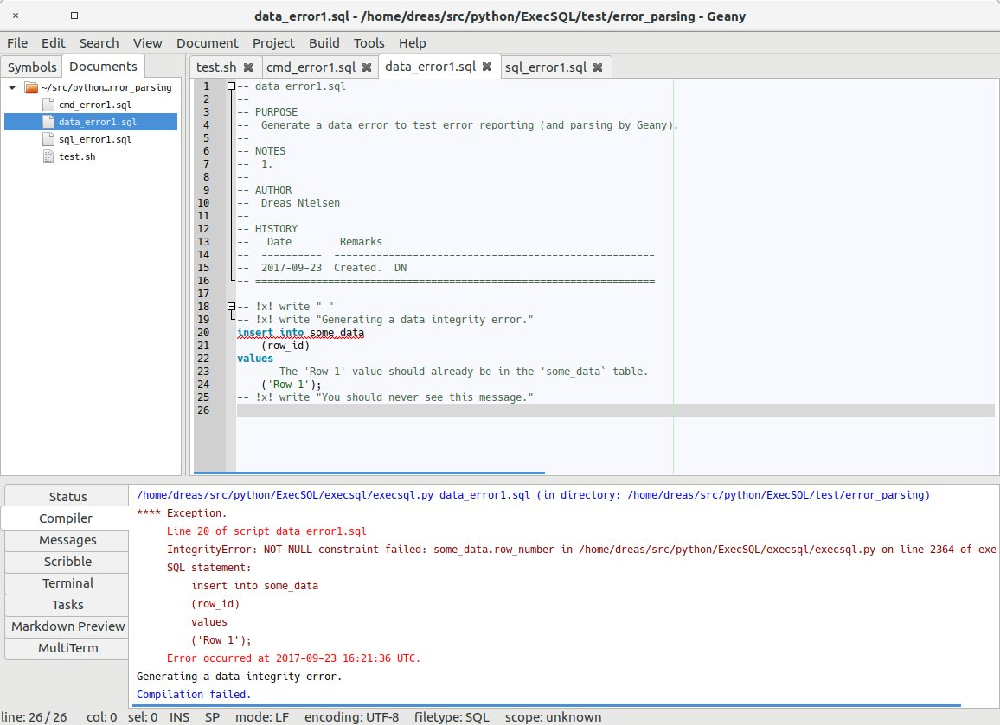
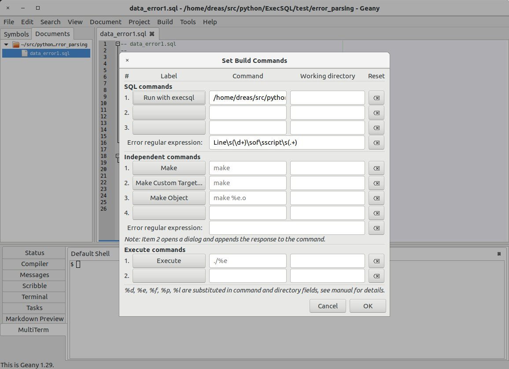
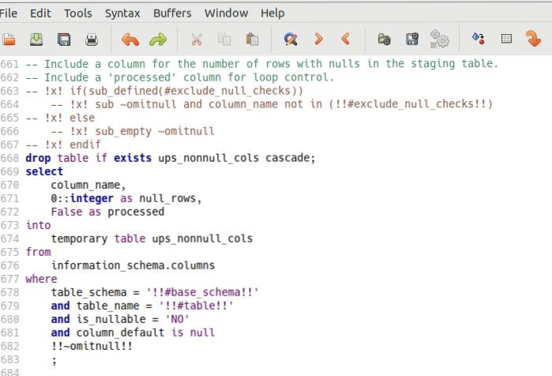

# Usage Notes

This section contains miscellaneous notes on *execsql* usage.

## Required Arguments

If the program is run without any arguments it will print a help message on the terminal, similar to the [syntax description](syntax.md#syntax).

At least one argument, the name of the script file to run, is required. This single argument can be used when the database connection information is specified in one or more [configuration files](configuration.md#configuration).

## SQL Statement Recognition

*execsql* recognizes a SQL statement as consisting of a sequence of non-comment lines that ends with a line ending with a semicolon. A backslash ("\\") at the end of a line is treated as a line continuation character. Backslashes do not need to be used for simple SQL statements, but can be used for procedure and function definitions, where there are semicolons within the body of the definition, and a semicolon appears at the end of lines for readability purposes. The [BEGIN SQL](metacommands.md#beginsql) and [END SQL](metacommands.md#beginsql) metacommands can be used to bracket procedure and function definitions instead of using backslashes. Backslashes may not be used as continuation characters for [metacommands](metacommands.md#metacommands).

With the exception of the "CREATE TEMPORARY QUERY..." statement when used with MS-Access, the *execsql* program does not parse or interpret SQL syntax in any way.

SQL syntax used in the script must conform to that recognized by the DBMS engine in use. Because *execsql* can connect to several different DBMSs simultaneously, a single script can contain a mixture of different SQL syntaxes. To minimize this variation (and possible mistakes that could result), *execsql* metacommands provide some common features of DBMS-specific scripting languages (e.g., pgScript and T-SQL), and *execsql* turns on ANSI-compatible mode for SQL Server and MySQL when it connects to those databases.

## Comments in SQL Scripts

Script files can contain single-line comments, which are identified by two dashes ("`--`") at the start of a line. Script files can also contain multi-line comments, which begin on a line where the first characters are "`/*`" and end on a line where the last characters are "`*/`".

*execsql* strips single-line and multi-line comments from the script file when compiling SQL statements to send to the DBMS. *execsql* does not strip comments that follow part of a SQL statement on the same line, such as:

```sql
select
    scramble(eggs)      -- Use custom aggregate function
from
    refrigerator join stove using (kitchen);
```

The DBMS in use must be able to recognize and ignore any such comments. If any such comment occurs on the last line of the SQL statement, following the semicolon, then *execsql* will not recognize the end of the SQL statement, and an error will result.

## Metacommands

[Metacommands](metacommands.md#metacommands) are directives to *execsql* that can control script processing, import and export data, report status information, and perform other functions. Metacommands are embedded in single-line SQL comments. These metacommands are identified by the token "`!x!`" immediately following the SQL comment characters at the beginning of a line, i.e.:

```sql
-- !x! <metacommand>
```

The special commands that are available are described in the [Metacommands](metacommands.md#metacommands) section.

## Autocommit

SQL statements are ordinarily automatically committed by *execsql*. Consequently, database transactions that are initiated with a "BEGIN TRANSACTION;" SQL statement will not work as expected under default conditions. The [AUTOCOMMIT](metacommands.md#autocommit) and [BATCH](metacommands.md#batch) metacommands provide two different ways to alter *execsql's* default autocommit behavior. Transactions created with SQL statements will work as expected either within a batch or after autocommit has been turned off. Transactions can be managed entirely using the [AUTOCOMMIT](metacommands.md#autocommit) and [BATCH](metacommands.md#batch) metacommands, however, so that transactions need not be managed using SQL statements. In some cases, such as SQL Server, because *execsql* uses ODBC to connect to the DBMS, [SQL statements should not be used to manage transactions](https://docs.microsoft.com/en-us/sql/relational-databases/native-client/odbc/performing-transactions-in-odbc?view=sql-server-2017) and *execsql's* features should be preferred.

One difference between these two approaches is that within transactions inside a batch, changes to data tables are not visible to metacommands such as [PROMPT DISPLAY](metacommands.md#prompt), whereas these data are visible within transactions that follow an [AUTOCOMMIT OFF](metacommands.md#autocommit) metacommand. This difference in data visibility affects what tests can be done to decide whether to commit or roll back a transaction.

## Rollback on Exit

When *execsql* exits, or closes a database connection because the same alias will be used again in a [CONNECT](metacommands.md#connect) metacommand, a rollback command will be sent to the database immediately before each connection is closed. Therefore if, for example, a [PROMPT DISPLAY](metacommands.md#prompt) metacommand is used within a transaction, and the user cancels the display, and thus the script, a rollback command will be sent to the database, thereby terminating the transaction. This prevents transactions from being left open and incomplete, which may cause problems in some circumstances.

## Exit Status

If *execsql* finishes normally, without errors and without being halted either by script conditions or the user, the system exit status will be set to 0 (zero). If an error occurs that causes the script to halt, the exit status will be set to 1. If the user cancels script processing in response to any prompt, the exit status will be set to 2. If the script is halted with the [HALT](metacommands.md#halt) metacommand, the system exit status will be set to 3 unless an alternate value is specified as part of the metacommand.

## Performance

Data import, export, display, and logging all affect the run time of an *execsql* script. Performance of several of these operations can be affected by configuration settings and metacommand usage.

### Importing Data

When the NEW or REPLACEMENT keywords are used with the [IMPORT](metacommands.md#import) metacommand, *execsql* first reads the entire data set to determine the data type for each column. This ensures that the data set will be imported successfully. However, the step of diagnosing the data type of every column can take longer than the step of importing the data and inserting it to the database table. If the structure of the incoming data is known, then creating the table first with a CREATE TABLE statement will result in better performance than using the NEW or REPLACEMENT keywords.

*execsql* will use the fast file reading features of Postgres and MariaDB/MySQL when it can, ordinarily resulting in substantially faster data import than using INSERT statements, as *execsql* does otherwise. Any specific data handling operation that *execsql* is required to perform on the imported data before inserting it to the database will prevent the use of fast file reading features. To allow maximum performance:

- Do not convert [empty strings to null](metacommands.md#empty_strings)
- Do not [exclude empty rows](metacommands.md#empty_rows)
- Ensure that the incoming data and the data table have the same columns, in the same order, and do not use the 'import common columns' [metacommand](metacommands.md#import_common_cols) or [configuration setting](configuration.md#import_only_common).
- Ensure compatibility of the encodings used in the data source and the database.

Changing the size of the import row buffer, using either the appropriate [metacommand](metacommands.md#config_import_row_buffer) or [configuration setting](configuration.md#setting_import_row_buffer) may affect the performance of data imports.

### Exporting Data

Changing the size of the row buffer used for data export, using either the appropriate [metacommand](metacommands.md#config_export_row_buffer) or [configuration setting](configuration.md#setting_export_row_buffer) may affect the performance of data exports. A larger buffer size may be appropriate for large data sets.

### Logging of Data Variables

*execsql* will always create or update a [record of operations that have been carried out](logging.md#logging). That log ordinarily includes all assignments to [data variables](substitution_vars.md#data_vars). However, some scripts may make extensive use of data variables, and logging of large numbers of data variable assignments can reduce a script's performance. Therefore, logging of data variables can be turned off with either a [metacommand](metacommands.md#logdatavars) or a [configuration setting](configuration.md#conf_log_datavars).

## DSN Connections

When a DSN is used as a data source, *execsql* has no information about the features or SQL syntax used by the underlying DBMS. In the expectation that a DSN connection will most commonly be used for Access databases, a DSN connection will use Access' syntax when issuing a CREATE TABLE statement in response to a COPY or IMPORT metacommand. However, a DSN connection does not (and cannot) use DAO to manage queries in a target Access database, so all data manipulations must be carried out using SQL statements. The EXECUTE metacommand uses the same approach for DSN connections as is used for SQL Server.

## PostgreSQL-Compatible Databases

Amazon [Redshift](https://docs.aws.amazon.com/redshift/index.html) is built on PostgreSQL 8.0.3 and [CockroachDB](https://www.cockroachlabs.com/) uses the *psycopg2* library for connections from Python. Both of these databases can therefore potentially be used with *execsql* by specifying the database type as Postgres (i.e., db_type=p).

The following Postgres-specific features that are used by *execsql* may function differently or not at all in other Postgres-compatible databases:

- The [IMPORT](metacommands.md#import) metacommand: This uses PostgreSQL's [COPY](https://www.postgresql.org/docs/12/sql-copy.html) command by default. The use of COPY can be disabled by setting the [CONFIG EMPTY_STRINGS](metacommands.md#empty_strings) setting to NO.
- Redshift does not support Postgres roles, so the [ROLE_EXISTS](metacommands.md#roleexists) conditional should not be used.

## SCRIPTs and CURRENT_SCRIPT System Variables

If any of the $CURRENT_SCRIPT system variables are used in a sub-script that is defined with the [BEGIN SCRIPT](metacommands.md#beginscript) metacommand, the script name, path, and line number that is contained in those variables refers to the script containing the BEGIN SCRIPT metacommand, not the script containing the [EXECUTE SCRIPT](metacommands.md#executescript) metacommand.

## Editor Customization

### Running Execsql From Within the Geany Editor

[Geany](http://www.geany.org/) can be used not only as an editor, but as an integrated development environment, and therefore contains features that allow code to be run from inside the editor, and error messages parsed so that lines containing errors can be highlighted in the editor.

These features can be used to run *execsql* from within the editor, and if an error occurs, have the error line highlighted so that a correction can be easily made. The result of this is illustrated in the following figure.



To enable this capability, use the *Build/Set Build Commands* menu item. A dialog box like that shown below will be displayed. This will allow you to create a new build command to run *execsql* on the script being edited. You should enter a label for this command (e.g., "Run with execsql"); the command to run, using *%f* as a placeholder for the name of the current script (e.g., "execsql.py -v2 %f"); and the regular expression that Geany will use to extract the line number and file name out of *execsql's* error message--this should be "Line\\s(\\d+)\\sof\\sscript\\s(.+)".



After entering this information, a new item ("Run with execsql") will be available on Geany's Build menu. You can also invoke this command with the F8 key.

If *execsql* will be used with multiple databases, then connection parameters and other configuration information should be provided in a configuration file rather than on the command line. Some command-line options may be included on the default command line, as shown by the "-v2" option shown above. The "-v" option with a value of 1 or higher must be used when running *execsql* from within Geany because Geany captures console output and does not allow console input.

### Highlighting Execsql Metacommands in Vim

When using Vim, the standard syntax highlighting for SQL files can be extended with alternate highlighting for the comment lines that contain *execsql* metacommands. The extra syntax highlighting rules should be put in a file named "sql.vim" in the 'syntax' subdirectory of the 'after' directory; on Linux this is:

```
~/.vim/after/syntax/sql.vim
```

To find the 'after' directory on Windows, on the Vim command line, run:

```
echo &rtp
```

This will display Vim's runtime path, which should include an 'after' directory (which may not yet exist).

The lines to add to the "sql.vim" file are:

```
syntax match XSql "^\s*--\s*![xX]!.*$"
highlight XSql ctermfg=Brown guifg=#824E41
```

The first of these lines establishes a group name ("XSql") for metacommand lines, and the second applies a brown foreground (text) color in both the terminal and GUI versions of Vim. Of course, any other formatting could be applied instead of the colors shown above.

An illustration of custom highlighting for *execsql* metacommands is shown below.



The screenshot above uses the *ancient* colorscheme. The same color specification works well with the *desert-night* dark color scheme.

### Highlighting Execsql Metacommands in Bluefish

When using the Bluefish editor, the standard syntax highlighting for SQL files can be extended with alternate highlighting for the comment lines that contain *execsql* metacommands. The extra syntax highlighting rules should be added to the file "sql.bflang2". On Linux this file is located in

```
/usr/share/bluefish/bflang
```

A customized copy may be placed in the user-specific settings directory

```
~/.bluefish
```

to override the default global file.

On Windows, the syntax highlighting definition file is located under the Bluefish installation directory, in the path

```
share\bluefish\bflang
```

Two additions must be made to this file. In the \<header> section, the line

```
<highlight name="execsql_metacommand" style="execsql_metacommand" />
```

should be added. Within the \<context> section, the lines

```
<group case_insens="1" highlight="execsql_metacommand">
    <element pattern="-- *!x![^&#10;&#13;]*" is_regex="1" />
</group>
```

should be added. Assigning visual attributes to this metacommand specification is done within Bluefish. With a SQL file open, open the *Edit/Preferences* dialog and use the *Editor settings/Text styles* section to assign the desired attributes to the "execsql_metacommand" style.

## MS-Access-Specific Considerations

### Temporary Queries

The syntax of the "CREATE TEMPORARY QUERY" DDL supported by *execsql* when used with an MS-Access database is:

```
CREATE [TEMP[ORARY]] QUERY|VIEW <query_name> AS <sql_command>
```

The "TEMPORARY" specification is optional: if it is included, the query will be deleted after the entire script has been executed, and if it is not, the query will remain defined in the database after the script completes successfully. If a query of the same name is already defined in the Access database when the script runs, the existing query will be deleted before the new one is created---no check is performed to determine whether the new and old queries have the same definition, and no warning is issued by *execsql* that a query definition has been replaced. The keyword "VIEW" can be used in place of the keyword "QUERY". This alternative provides compatibility with the "CREATE TEMPORARY VIEW" command in PostgreSQL, and minimizes the need to edit any scripts that are intended to be run against both Access and PostgreSQL databases.

Scripts for Microsoft Access that use temporary queries will result in those queries being created in the Access database, and then removed, every time the scripts are run. This will lead to a gradual increase in the size of the Access database file. If the script halts unexpectedly because of an error, the temporary queries will remain in the Access database. This may assist in debugging the error, but if the temporary queries are not created conditional on their non-existence, you may have to remove them manually before re-running the script.

### Password-Protected Databases

The user name for password-protected Access databases is "Admin" by default (i.e., if no other user name was explicitly specified when the password was applied). To ensure that *execsql* prompts for a password for password-protected Access databases, a user name must be specified either on the command line with the "-u" option or in a configuration file with the `access_username` [configuration item](configuration.md#config_connect). When the user name in Access is "Admin", any user name can be provided to *execsql*.

### ODBC and DAO Connections

With Access databases, an ODBC connection is used for SELECT queries, to allow errors to be caught, and a DAO connection to the Jet engine is used when saved action queries (UPDATE, INSERT, DELETE) are created or modified. Because the Jet engine only flushes its buffers every five seconds, *execsql* will ensure that at least five seconds have passed between the last use of DAO and the execution of a SELECT statement via ODBC. In some cases (possibly related to database size or network speed), a longer delay may be required; a longer delay can be specified with the [dao_flush_delay_secs](configuration.md#dao_delay) configuration setting..

### Boolean Columns

Boolean (Yes/No) columns in Access databases cannot contain NULL values. If you [IMPORT](metacommands.md#import) boolean data into a column having Access' boolean data type, any NULL values in the input data will be converted to *False* boolean values. This is a potentially serious data integrity issue. To help avoid this, when the NEW or REPLACEMENT keywords are used with the [IMPORT](metacommands.md#import) or [COPY](metacommands.md#copy) metacommands, and *execsql* determines that the input file contains boolean data, *execsql* will create that column in Access with an integer data type rather than a boolean data type, and when adding data will convert non-integer *True* values to 1, and *False* values to 0.

### Exporting Access Queries to Script Files

If you have an Access database full of queries and you want to export them all to SQL script files for easier searching, to add documentation, to establish version control, to run them using *execsql*, or for other reasons, create and run the following Visual Basic procedure in the Access database.

```basic
Sub ExportAllQueries(OutputDir)
  Dim db As DAO.Database
  Dim qdf As DAO.QueryDef
  Dim fso As Object
  Dim Outfile As Object

  Set db = CurrentDb()
  Set fso = CreateObject("Scripting.FileSystemObject")

  For Each qdf In db.QueryDefs
    Fname = OutputDir + "\" + qdf.Name + ".sql"
    Set Outfile = fso.CreateTextFile(Fname, True, True)
    Outfile.Write qdf.SQL
    Outfile.Close
  Next qdf
  Set qdf = Nothing
  Set db = Nothing
  Set Outfile = Nothing
  Set fso = Nothing
End Sub
```

## Ensuring That a Script is Run Using execsql.py

*execsql's* metacommands are hidden in SQL comments to allow scripts to be run using other SQL script processors or using GUI tools. However, scripts that make use of [IF](metacommands.md#if_cmd), [EXECUTE SCRIPT](metacommands.md#executescript), [IMPORT](metacommands.md#import), [COPY](metacommands.md#copy), [INCLUDE](metacommands.md#include) or [LOOP](metacommands.md#loop) metacommands are likely to operate incorrectly if they are *not* run using *execsql.py*. The following code will cause a script to fail with a syntax error from the DBMS if it is run using anything other than *execsql.py*:

```sql
-- !x! if(False)
    ERROR: This script must be run using execsql.py;
-- !x! endif
```

Note that the error message must end with a semicolon.

## Running execsql.py from the Windows Command Line

Running the following two commands at the command line will allow you to run *execsql.py* (and any other Python program) at the command line just by entering its name, without preceding the name with the full path to Python:

```sh
assoc .py Python.File
ftype Python.File=C:\Path\to\python.exe "%1" %*
```

## Allowing Multiple Users with Different Logins to Run the Same Script

In a multi-user environment, where more than one person may run a script, and each person has unique database credentials, connection settings should be specified in two different copies of *execsql.conf*:

- One copy of *execsql.conf* should be in the directory that contains the script, or in the directory from which it is run, and should contain all of the connection settings except [username].
- A second copy of *execsql.conf* should be in the user-specific configuration directory (e.g., ~/.config on Linux), and should contain the [username] configuration setting.

## Connecting to SQL Server Using Windows Authentication With a Default Username Configured

If you ordinarily use a DBMS for which a username must be provided, it is convenient to specify your username in an *execsql* configuration file, for example, in your \<home>/.config directory. However, if you need to connect to an instance of SQL Server (or SQL Express) that uses Windows authentication, you must *not* specify a username when connecting. One convenient way to do this is to create a custom *execsql.conf* file in the directory containing the scripts to be run against the SQL Server instance, and to explicitly un-set your username in this configuration file. The \[[connect]\] section of the configuration file would look like this:

```sh
[connect]
db_type=s
server=some-server-name\SQLEXPRESS
db=rasa
username=
```

## Using 'Inner Word' Commands in Vim With Substitution Variables

Vim's 'inner word' command modifier recognizes the exclamation points that delimit *execsql* substitution variables as word delimiters. So, for example, if the cursor is anywhere within a substitution variable name that is delimited by exclamation points, the "ciw" (change inner word) command will remove the word under the cursor and place Vim in 'insert' mode, leaving the exclamation points in place.
